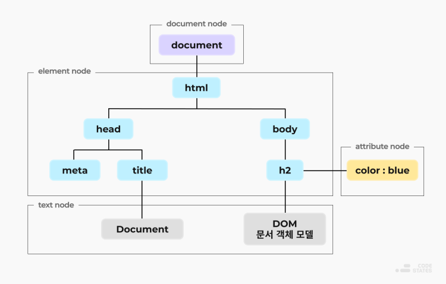

# Learning React

[repository](https://github.com/enshahar/learning-react-kor/tree/seconded)

## 1. 들어가기 전에

### 1-1. Tool
#### Node.js
- 브라우저 없이 JavaScript 실행할 수 있게 해준다.

#### npm
- Node를 설치하면 자동으로 같이 설치되는 노드 패키지 관리자이다.
######
    // pacakge.json 파일이 있는 경로에서
    $ npm install     // npm이 프로젝트에 필요한 모든 패키지 설치

    // 만약 새로운 프로젝트를 밑바닥 부터 시작하려면
    $ npm init -y     // 프로젝트를 초기화하고 package.json 파일 생성
    $ npm install [패키지이름]
    $ npm remove [패키지이름]

#### yarn
    $ npm install -g yarn      // 얀설치
    $ yarn add [패키지이름]      // 패키지 설치
    $ yarn remove [패키지이름]   // 패키지 삭제

#### 리엑트 개발자도구
- 리액트는 컴포넌트 트리를 들여다볼 수 있고, 심지어 프로덕션에서 리액트를 실행하는 경우도 내부를 살펴볼 수 있게 해준다. 
- 이런 도구는 다른 프로젝트에서 리액트가 어떻게 쓰이는지 배우거나 디버깅 할 때 아주 유용하다.

 

## 2. JavaScript

### 2-1. 변수 선언하기
#### var : ES2015 이전에 변수를 선언하는 유일한 방법
- var는 호이스팅(hoisting)을 지원해서 스코프 안에 존재하는 모든 선언들을 해당 스코프의 최상단으로 끌어올린다.  
- 또한 **var는 스코프의 제한을 받지 않아서 조건문 내에서 변경하면 조건문 밖의 변수에도 영향을 미친다.**
######
    // if 블록 안의 topic을 변경하면 if 블록 바깥의 topic도 바뀜 (for문도 마찬가지)
    var topic = "자바스크립트";

    if (topic) {
        var topic = "리액트";
        console.log('블록', topic); // 리전 리액트
    }

    console.log('글로벌', topic);   // 글로벌 리액트

#### const : 변경할 수 없는 변수
- 상수(constant)는 갑을 변경할 수 없는 변수다.
######
    // 상수를 변경하려고할 때 발생하는 오류
    Uncaught TypeError: Assignment to constant variable.

#### let : 구문적인 변수 영역 규칙 지원되는 변수
- 중괄호({}) 내부에서 지역변수로만 사용가능
######
    // if 블록 안의 topic을 변경해도 if 블록 바깥의 topic에는 영향 없음 (for문도 마찬가지)
    var topic = "자바스크립트";

    if (topic) {
        let topic = "리액트";
        console.log('블록', topic); // 리전 리액트
    }

    console.log('글로벌', topic);   // 글로벌 자바스크립트

### 2-2. 함수 만들기
#### 함수 선언
- 함수 선언으로 작성된 함수는 호이스팅 된다.
######
    function funcName1() {
        console.log("함수1");
    }

    // 함수 호출
    funcName1();

#### 함수 표현식(function expression)
- 함수 표현식은 이름없는 함수를 만들며, 변수에 값을 대입할 수 있다.
- 표현식으로 작성된 함수는 호이스팅 되지 않는다.
######
    const funcName2 = function() {
        console.log("함수2");
    }

    // 함수 호출
    funcName2();

#### 디폴트 파라미터
- 함수를 호출하면서 인자값을 지정하지 않으면 디폴트 값이 사용되도록 설정할 수 있다.  
- 문자열 뿐만아니라 어떤 타입의 값이라도 디폴트 값으로 사용할 수 있다.
######
    fucntion funcName3(name="최윤규", activity="유도") {
        console.log(`${name}은 ${activity}를 좋아합니다.`)
    }

#### 화살표 함수(Arrow Function)
- function 키워드 없이 함수 표현식을 작성할 수 있다.
######
    // 파라미터가 1개면 ()를 사용하지 않을 수 있다. (2개 이상부턴 괄호로 파라미터 감싸줘야한다.)
    // 함수 동작이 return 포함 1줄이면 중괄호{}와 return을 생략할 수 있다.
    const funcName4 = name => `${name}아 안녕!`;

#### 객체 반환하기(화살표 함수에서)
- **객체를 반환하려면 객체를 괄호로 둘러싸야 한다.** (중괄호를 객체영역이 아닌 함수 영역으로 착각할 수 있기 때문)
######
    const person = (firstName, lastName) => 
        (
            {
                fist: fistName,
                last: lastName.
            };
        )

#### 화살표 함수와 영역
- **화살표 함수는 새로운 this 영역을 만들어내지 않는다**.
######
    // 일반 함수는 this를 새로 바인딩한다. 예를 들어 다음에서 this는 gangown 객체가 아닌 그 어떤 것이다.
    const gaongwon = {
        resorts: ["용평", "평창", "강촌", "강릉", "홍천"],
        print: function(delay=1000) {
            setTimeout(function() {
                console.log(this.resoprts.join(","));
            }, delay);
        }
    }

    gangwon.print(this);    // Cannot read property 'join' of undefined 라는 오류 발생

- 이 오류는 this.resorts의 join메서드를 호출하려고 했기 때문이다. 
- 이 경우 this를 콘솔에 찍어보면, this가 window 객체임을 알 수 있다.

> function(delay=1000){...} 안에서는 this가 gaongwon인 반면,  
> setTimeout(function(){...}) 안에서는 this가 window 객체이다.  
> 이문제를 해결하기 위해 화살표 함수를 사용하면 this의 영역이 유지된다.

    var gangwon = {
        resorts: ["용평", "평창", "강촌", "강릉", "홍천"],
        print: function(delay=1000) {
            setTimeout(() => {
                console.log(this.resorts.join(","));
            }, delay);
        }
    }

    gangwon.print();    // 용평, 평창, 강촌, 강릉, 홍천

- 만약 function(delay=1000){...} 을 화살표 함수로 만들면 새로운 this 영역을 만들지 않기 때문에 this는 window 객체를 가르키게 된다.

### 2-3. 컴파일하기
- 가장 유명한 자바스크립트 컴파일링 도구는 [바벨](http://www.babeljs.io/)이다.  
- 자바스크립트에서 컴파일링은 바이너리로 변환하는 것이 아니라 더 많은 브라우저가 이해할 수 있도록 다른 버전의 자바스크립트 구문으로 변환하는 것을 뜻한다. 
- 자바스크립트 컴파일은 보통 웹 팩이나 파슬과 같은 자동화된 빌드 도구에 의해서 차리된다.

### 2-4. 객체와 배열
#### 구조 분해(destructuring)
- 객체 안에 있는 필드값을 원하는 변수에 대입할 수 있다.  
- 구조분해로 데이터를 할당 받은 변수를 변경해도 원래의 필드값은 바뀌지 않는다.(call by value 인듯)
######
    const sandwich = {
        bread: "더치 크런치",
        meat: "참치",
        cheese: "스위스",
        toppings: ["상추", "토마토", "머스타드"]
    };

    const { bread, meat } = sandwich;

    console.log(bread, meat);   // 더치 크런치 참치

    // 객체를 분해해서 함수의 인자로 넘길 수 있다.
    const lordify = regularPerson => {
        console.log(`켄터베리의 ${regularPerson.firstname}`)
    };

    var regularPerson = {
        firstname: "윤규",
        lastname: "최",
    };

    lordify(regularPerson); // 켄터베리의 윤규

######
    // 객체 필드에 접근하기 위해 점(.)과 필드 이름을 사용하는 대신, 필요한 값을 구조분해 해서 가져올 수 있다.
    const lordify = {firstname} => {
        console.log(`켄터베리의 ${regularPerson.firstname}`)
    };

    var regularPerson = {
        firstname: "윤규",
        lastname: "최",
    };

    lordify(regularPerson); // 켄터베리의 윤규

######
    // 객체안의 객체의 필드에 접근하기
    const regularPerson = {
        firstname: "윤규",
        lastname: "최",
        spouse: {
            firstname: "지민"
            lastname: "유"
        }
    };

    const lordify = ({ spuse: { firstanme } }) => {
        console.log(`켄터베리의 ${firstname}`);
    };
    lordify(regularPerson); // 켄터베리의 지민

#### 배열 구조 분해
- 배열을 구조분해해서 값을 뽑아낼 수도 있다.
######
    const [firstAnimal] = ["캥거루", "웜뱃", "코알라"];
    console.log(firstAnimal);   // 캥거루

    // 리스트 매칭 : 불필요한 값 콤마(,)를 활용해 생략
    const [,,thirdAnimal] = ["캥거루", "웜뱃", "코알라"];
    console.log(thirdAnimal);   // 코알라

#### 객체 리터럴 개선(object literal enhancement)
- 객체 리터럴 개선은 구조 분해의 반대라 할 수 있다.  
- 객체 리터럴 개선을 사용하면 현재 영역에 있는 변수를 객체의 필드로 묶을 수 있다.
######
    const name = "무등산";
    const elevation = 1187;
    const funHike = {name, elevation}

    console.log(funHike);   //  {name: "무등산", elevation: 1187}

    // 객체 리터럴 개선과 재구축을 통해 객체 메서드를 만드는 것도 가능하다.
    // 이때 객체 메서드는 객체의 key값에 접근하기 위해 this를 사용한다
    const name = "무등산";
    const elevation = 1187;
    const print = function() {
        console.log(`${this.name}의 높이는 ${this.elevation}m 입니다.`)
    }
    const funHike = {name, elevation, print};

    funHike.print();    // 무등산의 높이는 1187m 입니다.

######
    // 객체 메서드를 정의할 때는 function 키워드를 사용하지 않아도 된다.
    // 옛날 방식
    var skier = {
        name: name,
        sound: sound,
        powderYell: function() {
            var yell = this.sound.toUpperCase();
            console.log(`${yell} ${yell}!!!`);
        },
        speed: function(mph) {
            this.speed = mph;
            console.log('속력(mph):', mph);
        }
    }

    // 새로운 방식
    var skier = {
        name: name,
        sound: sound,
        powderYell() {
            var yell = this.sound.toUpperCase();
            console.log(`${yell} ${yell}!!!`);
        },
        speed(mph) {
            this.speed = mph;
            console.log('속력(mph):', mph);
        }
    }

#### 스프레드 연산자(spread operator)
- 3개의 점(...)으로 이뤄진 연산자로 몇가지 역할을 담당한다.
######
    (1) 배열 내용을 조합할 수 있다.
    const peaks = ["대청봉", "중청봉", "소청봉"];
    const canyons = ["천불동계곡". "가야동계곡"];
    const seoraksan = [...peaks, ...cayons];

######
    (2) 원본을 변형시키지 않고 마지막 변수 접근할 수 있다.
    // 위에서 정의한 peaks배열의 마지막 원소를 변수에 담고 싶은 경우,
    // 아래처럼하면 reverse메소드는 inplase 적용되어 원본 배열을 변형시킨다.
    const peaks = ["대청봉", "중청봉", "소청봉"];
    const [last] = peaks.reverse();

    // 스프레드를 사용하면 복사본을 만들어서 뒤집을 수 있다.
    const peaks = ["대청봉", "중청봉", "소청봉"];
    const [last] = [...pekas].reverse();

######
    (3) 배열의 나머지 원소들을 얼을 수 있다.
    const lakes = ["경포호", "화진포", "송지호", "청초호",];
    const [ first, ...rest ] = lakes;

    console.log(rest.join(","));    // 화진포, 송지호, 청초호

######
    (4) 세 점(...) 구문을 사용해 함수의 인자를 배열로 모을 수 있다.
    // 함수 파라미터 정의에서 스프레드 연산자가 쓰인 경우 레스트 파라미터(rest parameters)라고 한다.
    function directions (...args) {
        let [start, ...remaining] = args;
        let [finish, ...stops] = remaining.reverse();

        console.log(`${ args.length } 도시를 운행합니다.`);
        console.log(`${start}에서 출발합니다.`);
        console.log(`목적지는 ${finish}입니다.`);
        console.log(`중간에 ${stops.length} 군데를 들립니다.`)
    }

    directions(
        "서울",
        "수원",
        "천안",
        "대전",
        "대구",
        "부산",
    );

######
    (5) 스프레드 연산자를 객체에도 사용할 수 있다.
    const morning = {
        breakfast: "미역국",
        lunch: "삼치구이와 보리밥"
    };

    const dinner = "스테이크 정식";

    const backpackingMeals = {
        ...morning,
        dinner
    };

    console.log(backpackingMeals);
    // {breakfast: "미역국", lunch: "삼치구이와 보리밥", dinner: "스테이크 정식"}

### 2-5. 비동기(asynchronous) 자바스크립트
#### Ajax 통신
- XMLHttpRequest 라는 객체를 통해 웹페이지 일부를 비동기적으로 통신할 수 있다.  
- 그러나 요즘엔 fetch 함수나 axios 패키지로 비동기통신 많이한다.
######
    const xhr = new XMLHttpRequest();
    xhr.open('GET', 'https://learn.codeit.kr/api/members');
    xhr.onload = function () {
        console.log(xhr.response);
    };
    xhr.onerror = function () {
        alert('Error!');
    };
    xhr.send();

#### 프로미스
- Promise : 작업에 관한 '상태 정보'를 가지고 있는 객체  
- 작업이 성공하면, 프로미스 객체는 그 성공 결과도 함께 가진다.  
- 작업이 실패하면, 프로미스 객체는 작업 실패 이유도 함께 가진다.

  -   pending : 작업 진행중
  -   fulfiled : 작업 성공
  -   rejected : 작업 실패

######
    // randomuser.me API로부터 데이터 가져오기
    console.log(fetch("https://api.randomuser.me/?nat=US&results=1));

-   fetch함수는 Promise 객체를 리턴한다.
-   콘솔 로그를 보면 대기 중인 프로미스(promise)를 볼 수 있다.
-   프로미스는 자바스크립트에서 비동기적인 동작을 잘 처리할 수 있게 해준다.
-   대기중인 프로미스는 데이터가 도착하기 전의 상태를 표현한다.
-   .then()이라는 함수를 대기 중인 프로미스에 연쇄 호출 해야한다.
-   then은 콜백 함수를 인수로 받으며, 바로 앞에 이는 연산(프로미스)이 성공하면 콜백이 호출된다.
-   fetch로 데이터를 가져오면 then이 그 데이터로 다른 일을 하는 것이다.

#### then 메소드

    fetch("https://api.randomuser.me/?nat=US&results=1")
        .then(res => console.log(res.json()));

-   then은 프로미스가 정상적으로 완료되면(pending -> fulfiled) 콜백 함수를 한 번만 호출한다.
-   이 콜백 함수가 반환하는 값은 그다음에 오는 then 함수의 콜백에 전달되는 인자가 된다. (promise chaining)
-   then이 프로미스 객체를 리턴하는 경우 : 콜백이 리턴한 프로미스와 동일한 상태와 결과를 갖게 된다.
-   then이 프로미스 객체가 아닌 것을 리턴하는 경우 : then 메소드가 리턴했던 프로미스 객체는 fulfiled가 되고, 콜백의 리턴값을 작업 성공 결과로 갖게된다.  
    (.json()과 .text()는 프로미스 객체를 리턴하는 메소드이다.)

######
    fetch("https://api.randomuser.me/?nat=US&results=1")
        .then(res => res.json())
        .then(json => json.results)
        .then(console.log)
        .catch(console.error); // fetch가 성공하지 못한 경우 콜백

#### reject
- .then 에 두개의 콜백이 들어 있는 경우,  
- 첫번째 콜백은 프로미스 객체가 fulfiled 되었을 때 실행되고,  
- 두번째 콜백은 프로미스 상태가 rejected 되었을 때 실행된다.
######
    fetch('https://jsonplaceholder.typicode.com/users')
        .then((response) => response.text(), (error) => { console.log(error); })
        .then((result) => { console.log(result); });

#### catch 메소드
- 프로미스 객체가 rejected 상태가 되면 실행할 콜백함수 넣는 메소드이다.
- catch 메소드는 마지막에 써야한다. catch 다음에 있는 then 메소드에서 에러가 발생하면 처리할 수 없기 때문이다.
######
    fetch('https://jsonplaceholder.typicode.com/users')
        .then((response) => response.text())
        .then((result) => { console.log(result); })
        .catch((error) => { console.log(error); });

#### finally 메소드
- 프로미스 상태에 상관없이 항상 실행하고 싶은 코드가 있을때 사용한다.
######
    fetch('https://jsonplaceholder.typicode.com/users')
        .then((response) => response.text())
        .then((result) => { console.log(result); })
        .catch((error) => {
        console.log(error);
        throw new Error('from catch method');
        })
        .finally(() => { console.log('exit'); } );

#### 프로미스 만들기
    const getPeople = count =>
        new Promise((resolves, rejects) => {
            const api = `https://api.randomuser.me/?nat=US&results=${count}`;
            // AJAX : 웹페이지 일부를 비동기 통신하는 것 XMLHttpRequest로 구현
            const request = new XMLHttpRequest();
            request.open("GET", api);
            request.onload= () =>
                requnest.status === 200
                    ? resolves(JSON.parse(request.response).results)
                    : reject(Error(request.statusText));
            request.onerorr = err => rejects(err);
            request.send();
        });

        getPeople(5)
            .then(members => console.log(members))
            .catch(error => console.erros(`getPeople failed: ${error.message}`));

    // 이미 상태가 결정된 프로미스 객체 만들기
    const p = Promise.resolve('success');           // fulfiled 상태의 Promise 객체 만들기
    const p2 = Promise.reject(new Error('fail'));   // rejected 상태의 Promise 객체 만들기

#### 프로미스와 all, race 메소드
- all 메소드 : 배열 안에 있는 모든 Promise 객체가 fulfilled 상태가 될 때까지 기다린 fulfilled 상태가 된다.
######
    const p1 = fetch('https://learn.codeit.kr/api/members/1').then((res) => res.json());
    const p2 = fetch('https://learn.codeit.kr/api/members/2').then((res) => res.json());
    const p3 = fetch('https://learn.codeit.kr/api/members/3').then((res) => res.json());
    Promise
        .all([p1, p2, p3])
        .then((results) => {
            console.log(results); // Array : [p1, p2, p3]
        });

- race 메소드 : race 메소드 내 배열 중 가장 먼저 fulfilled 상태 또는 rejected 상태가 된 Promise 객체와 같은 상태가 된다.
######
    const p1 = new Promise((resolve, reject) => {
        setTimeout(() => resolve('Success'), 1000);
    });
    const p2 = new Promise((resolve, reject) => {
        setTimeout(() => reject(new Error('fail')), 2000);
    });
    const p3 = new Promise((resolve, reject) => {
        setTimeout(() => reject(new Error('fail2')), 4000);
    });
    Promise
        .race([p1, p2, p3])
        .then((result) => {
        console.log(result); // hello 출력
        })
        .catch((value) => {
        console.log(value);
        });

#### async/await
- 비동기 함수를 실행하는 다른 방법
######
    const getFakePerson = async () => {
        try {
            let res = await fetch("https://api.randomuser.me/?nat=US&results=1");
            let { results } = res.json();
            console.log(results);
        } catch(error) {
            console.error(error);
        }
    };

    getFakePerson();

### 2-6. 클래스
- 자바스크립트는 프로토타입을 사용한 상속이라 불리는 방법을 사용한다.  
- 이 기법은 객체지향처럼 느껴지는 구조를 만들어내기 위한 기법이다.
######
    function Vacation(destination, length) {
        this.destination = destination;
        this.length = length;
    }

    Vacation.prototype.print = function() {
        console.log(this.destination + "은(는) " + this.length +" 일 걸립니다.");
    };

    const maui = new Vacation("마우이", 7);

    maui.print();   // 마우이은(는) 7 일 걸립니다.

######
- ES2015에는 클래스 선언이 추가되었다. (하지만 작동 방식은 위와 같다.)
######
    class Vacation {
        constructor(destination, length) {
            this.destination = destination;
            this.length = length;
        }

        print() {
            console.log(this.destination + "은(는) " + this.length +" 일 걸립니다.");
        }
    }

    const trip = new Vacation("칠레 산티아고", 7);

    console.log(trip.print());  // 칠레 산티아고은(는) 7 일 걸립니다.

#### 추상 클래스
    // Expedition은 Vaction 클래스를 상속받는다.
    class Expedition expends Vacation {
        constructor(destination, length, gear) {
            super(destination, length);
            this.gear = gear;
        }

        print() {
            super.print();
            console.log(`당신의 ${this.gear.join("와(과) 당신의 ")}를(을) 가져오십시오.`)
        }
    }

    const trip2 = new Expedition("한라산", 3,
                        ["선글라스", "오색 깃발", "카메라"]);
    tirp2.print();

### 2-7. ES6 모듈
#### export와 import
- 선언문 앞에 export 키워드로 다른 파일에서도 사용가능하게 할 수 있다.
######
    export const 변수명 = 'value';

    // 단, 사용하고자 하는 js 파일에서 import도 해줘야한다.
    import { 변수명, 함수명 } from '경로.js';

    # 이름 바꾸기 : 임포트한 함수나 변수의 이름을 변경하기
    import { 변수명 as 변경할이름, 함수명 } from '경로.js';

    # 한꺼번에 다루기
    export { 변수명, 함수명 }; // export 할 때 as 키워드로 이름 미리 바꿀 수 있다.

    import * as 모듈이름 from '경로.js';
    모듈이름.변수명
    모듈이름.함수명

#### export default
- export 키워드 뒤에 default를 붙이면 반드시 하나의 대상만 내보낼 수 있게 된다.  
- 주의할점은 default 키워드는 js파일 내부에서 단 한번만 사용가능하다는 것이다.
######
    export default 'codeit';

#### 커먼 JS
- 커먼JS(CommonJS)는 모든 버전의 노드에서 지원하는 일반적인 모듈 패턴이다.  
- 커먼JS를 사용하면 module.exports를 사용해 자바스크립트 객체를 익스포트할 수 있다.
######
    const print(message) => log(message, new Data());

    const log(message, timestamp) =>
        console.log(`${timestamp.toString(): ${message}}`);

    module.exports = {print, log};

######
- 커먼JS는 import 문을 지원하지 않는다. 대신 require 함수를 통해 모듈을 임포트 할 수 있다.
######
    const { log, print } = require('./txt-helpers')

 

## 3. JavaScript를 활용한 함수형 프로그래밍

### 3-1. 함수형이란?
- 함수형 프로그래밍을 하기 위해서는 함수가 1급 시민이어야 한다.
  - 해당 언어에서 변수나 객체, 배열에 함수를 넣을 수 있고,
  - 함수를 다른 함수의 인자로 넘길 수 있으며,
  - 함수에서 함수를 만들어서 반환할 수 있어야한다. (고차함수)
- 이제부터는 함수를 선언할 때 사용한 화살표의 개수에 주의를 기울일 필요가 있다.  
- 만약 2개 이상의 화살표가 있다면, 고차함수를 사용하고 있다는 뜻이다.

### 3-2. 명령형 프로그래밍과 선언적 프로그래밍 비교
- **명령형 프로그래밍**: 코드로 원하는 결과를 달성해 나가는 과정에만 관심을 둔다.  
  (조건문과 반복문을 사용해서 목적을 달성해나가는 과정을 볼 수 있다.)
######
- 함수형 프로그래밍은 선언적 프로그래밍이라는 더 넓은 프로그래밍 패러다임의 한가지 이다.
- **선언적 프로그래밍**: 필요한 것이 어떤 것인지를 기술하는 것에 방점을 두고 애플리케이션의 구조를 세운다.
- 함수형 프로그래밍은 함수를 사용해 추상적인 개념을 표현하고 실제 그 작업을 처리하는 방법은 추상화를 통해 아랫단에 감춰진다. 
- 이로 인해 더 깔끔해지고 작성자의 의도를 더 파악하기 쉽다.

### 3-3. 함수형 프로그래밍 개념
- 불변성: Call by Value 처럼 써서 원본 데이터를 유지한다. (inplace=false)
- 순수성: 부수 효과(side effect)가 없다.
- 데이터 변환: 원본을 변경한 복사본을 만들고 순수 함수를 통해 데이터를 변경 한다.
  - **filter()**: 인자로 boolean을 반환하는 함수를 받아 새로운 배열 구성
  - **map()**: 인자로 변환 함수를 받아 모든 원소에 적용해 반환 값으로 새로운 배열 구성  
    (map은 각 원소의 인덱스를 변환함수의 두번째 인자로 넘겨준다.)
  - **Object.keys(객체).map()**: 객체를 배열로 변환하고 싶을 때 사용   
  - **reduce(callback, initialValue)**: 배열을 하나의 값으로 축약, (배열 -> 객체 or 집합)   
    (객체 -> 수, 문자열, 불린, 객체, 함수 등으로 변환 가능)  
    (reduceRight 도 기본 매커니즘은 동일하지만 마지막 원소부터 축약) 
- 고차 함수: 다른 함수를 조작하거나, 함수를 인자로 받거나, 함수를 반환할 수 있다.
- 재귀: 자기 자신을 호출하는 함수 
- 합성: 함수형 프로그램은 로직을 구체적인 작업을 담당하는 여러 작은 순수 함수로 나눈다.  
  그 과정에서 언젠가는 모든 작은 함수를 한데 합칠 필요가 있다. 
  - 체이닝은 가장 낯익은 방법으로 연쇄 호출하는 것이다. 

#### 불변성(immutable), inplace false라는 말
- 함수형 프로그래밍에서는 데이터가 변할 수 없다.
- 원본 데이터 구조를 변경하는 대신에 그 데이터 구조의 복사본을 만들고 그 중 일부를 변경한다.  
- Call by Reference 를 사본을 만들어서 Call by Value 처럼 쓴다.
- 그리고 원본 대신 변경한 복사본을 사용해 필요한 작업을 진행한다.
######
    (예제1) 잔디 색
    let color_lawn = {
        title: "잔디",
        color: "#00FF00",
        rating: 0,
    }:

    // 색에 평점을 메기는 함수, 원본도 같이 바뀜
    function rateColor(color, rating) {
        color.rating = rating;
        return color;
    }

    consolo.log(rateColor(color_lawn, 5).rating); // 5
    console.log(color_lawn.rating);               // 5

- 자바스크립트에서 함수의 인자는 실제 데이터에 대한 참조다.  
- rateColor 함수 안에서 color의 rating을 변경하면 원본 color_lawn객체의 rating도 바뀐다.
######
    // Object.assign을 사용하면 원본은 바뀌지 않음
    var rateColor = function(color, rating) {
        return Object.assign({}, color, {rating:rating});
    };

    console.log(rateColor(color_lawn, 5).rating);   // 5
    console.log(color_lawn.rating);                 // 0

- **Object.assign은 복사기와 같다.** 
- 빈 객체를 받고, color 객체를 그 빈 객체에 복사한 뒤,  
- 복사본에 있는 rating 프로퍼티의 값을 rating 파리미터의 값으로 변경한다.
######
    // 화살표 함수와 스프레드 연산자를 활용해 같은 함수 구현
    const rateColor = (color, rating) => ({
        ...color,
        rating,
    });

######
    (예제2) 색 이름 배열
    let list = [
        { title: "과격한 빨강" },
        { title: "잔디" },
        { title: "파티 핑크" },
    ]

    // 이 배열에 색을 추가하는 push함수는 불변성 함수가 아니다.
    const addColor = function(title, colors) {
        colors.push({ title: title });
        return colors;
    }

    console.log(addColor("화려한 녹색", list).length);  // 4
    console.log(list.length);                        // 4

- **원래의 list 배열을 변화시키지 않고 유지하기 위해서는 Array.concat 을 사용**해야 한다.
######
    const addColor = (title, array) => array.concat({title});

    console.log(addColor("화려한 녹색", list).length);  // 4
    console.log(list.length);                        // 3

- Array.concat은 두 배열을 붙여준다. 여기서는 Array.concat이 새로운 객체를 받는다.  
- 그 객체에는 새로운 색의 이름이 title이라는 이름의 프로퍼티로 들어 있다.  
- Array.concat은 그 객체를 원래의 배열을 복사한 새로운 배열 뒤에 추가한다.
######
    // 화살표 함수와 스프레드 연산자를 활용해 같은 함수 구현
    const addColor = (title, list) => [...list, {title}];

#### 순수성
- 순수 함수(Pure Functions)는 파라미터에 의해서만 반환값이 결정되는 함수를 뜻한다.
- 순수 함수는 최소한 하나 이상의 인수를 받고, 인자가 같으면 항상 같은 값이나 함수를 반환한다.  
- 순수 함수에는 부수 효과(side effect)가 없다. 부수 효과란 전역 변수를 설정하거나, 함수 내부나 애플리케이션에 있는 다른 상태를 변경하거나 입출력하는 것을 말한다.  
- 순수 함수는 인수를 변경 불가능한 데이터로 취급한다.

#### 데이터 변환
- 함수형 프로그래밍은 함수를 사용해 원본을 변경한 복사본을 만들고 순수 함수를 통해 데이터를 변경한다.
- Array.join : 배열의 모든 원소를 인자로 받아서 구분자로 연결한 문자열 반환 (inplace=false)
######
    const schools = ["Yorktown", "Washington & Lee", "Wakefield"];
    console.log( schools.join(",") ); // "Yorktown, Washington & Lee, Wakefield"

- Array.filter : 인자로 술어(boolean반환 하는 함수)를 받아 새로운 배열을 구성한다.
######
    const wSchools = schools.filter(school => school[0] === 'W');
    console.log( wSchools );            // ["Washington & Lee", "Wakefield"]
    // 배열에서 원소를 제거해야한다면 Array.pop이나 Array.slice보다 Array.filter( !== ) 사용 권장

- Array.map : 인자로 변환 함수를 받아 모든 원소에 적용해 반환받은 값으로 새로운 배열을 구성한다.
######
    const highSchools = schools.map(school => `${school} High School`);
    console.log(highSchools.join("\n"));    // Yorktown High School
                                            // Washington & Lee High School
                                            // Wakefield High School

- map 함수는 객체, 값, 배열, 다름 함수등 모든 자바스크립트 타입으로 이뤄진 배열을 만들 수 있다.
######
    const highSchools = schools.map(school => ({name: school}));
    console.log( highSchools );     // [
                                    //  { name : "Yorktown" },
                                    //  { name : "Washington & Lee" },
                                    //  { name : "Wakefield" }
                                    // ]

- 배열의 원소중 하나만 변경하는 순수 함수가 필요할 때도 map을 사용할 수 있다.
######
    let schools = [
        { name: "Yorktown" },
        { name: "Stratford" },
        { name: "Washington & Lee" },
        { name: "Wakefield" }
    ];

    const editName = (oldName, name, arr) =>
        arr.map(item => (item.name === oldName ? { ...item, name} : item)); // {...item, name}은 객체의 속성들을 복사하고 새로운 값으로 객체를 생성하는 방법이다. 원래는 {...item, name: name}인데 key값과 value 값이 같아서 한번만 쓴 것이다.

    let updatedSchools = editName("Stratford", "HB Woodlawn", schools);

    console.log( updatedSchools[1] ); // { name: "HB Woodlawn" }
    console.log( schools[1] ); // { name: "Stratford" }

- map은 각 원소의 인덱스를 변환함수의 두번째 인자로 넘겨준다.
- map 메소드의 콜백 함수 매개 변수(현재값, 현재 인덱스, 원본배열)
######
    const editNth = (n, name, arr) =>
        arr.map((item, i) => (i ===n ? {...item, name} : item))

- 객체를 배열로 변환하고 싶을 때는 Array.map과 Object.keys를 함께 사용하면 된다.  
- Object.keys는 어떤 객체의 키로 이뤄진 배열을 반환하는 메서드다.
######
    const schools = {
        "Yorktown" : 10,
        "Washington & Lee" : 2,
        "Wakefield" : 5
    };

    const schoolArray = Obejct.key(schools).map(key => ({
        name: key,
        wins: schools[key]
    })
    );

    console.log(schoolArray);   // [ { name: 'Yorktown', wins: 10 }
                                //   { name: 'Washington & Lee', wins: 2 }
                                //   { name: 'Wakefield', wins: 5 } ]

- reduce와 reduceRight 함수를 사용하면 객체를 수, 문자열, 불린 값, 객체, 심지어 함수와 같은 값으로 변환할 수 있다. 
- reduce(callback, initialValue)는 배열을 하나의 값으로 축하는 역할을 한다.  
- reduceRight도 기본적인 매커니즘은 동일하지만 배열의 맨 마지막 원소부터 축약을 시작한다는 점이 다르다.
######
    const ages = [21, 18, 42, 40, 64, 63, 34];

    const maxAge = ages.reduce((max, age) => {
        if (age > max) {
            return age;
        } else {
            return max;
        }
    }, 0);  // 초기값 : 0

    // 짧게 쓰기
    const max = ages.reduce((max, age) => (value > max ? value : max), 0);

- 배열을 객체로 변환해야할 때가 있다. 다음 예제는 reduce를 사용해 값이 들어 있는 배열을 해시로 변환한다.  
- reduce 메소드의 콜백 함수 매개변수(이전누산값or초기값, 현재 배열의 요소의 값, 현배 배열 요소의 인덱스, 원본 배열)
######
    const colors = [
        {
            id: 'xekare',
            title: "과격한 빨강",
            rating: 3
        },
        {
            id : 'jbwsof',
            title: "큰 파랑",
            rating: 2
        },
        {
            id : 'prigbj',
            title: "회색곰 회색",
            rating: 5
        },
        {
            id : 'ryhbhsl',
            title: "바나나",
            rating: 1
        },
    ];

    const hashColors = colors.reduce(
        (hash, {id, title, rating}) => {    // {id, title, rating} 이 부분은 구조분해
            hash[id] = {title, rating};
            return hash;
        }, {});

    console.log(hashColors);    // { 'xekare': { title: '과격한 빨강', rating: 3 },
                                //   'jbwsof': { title: '큰 파랑', rating: 2},
                                //   'prigbj': { title: '회색곰 회색', rating: 5},
                                //   'ryhbhsl': { title: '바나나', rating: 1} }

- reduce를 사용해 같은 값이 여럿 들어 있는 배열을 서로 다른 값이 한 번씩만 들어 있는 배열로 바꿀 수 있다.
######
    const colors = ["red", "red", "green", "blue", "green"];

    const distinctColors = colors.reduce(
        (unique, color) =>
        unique.indexOf(color) !== -1 ? unique : [...unique, color], // indexOf는 배열을 처음부터 순회하면서 일치하는 요소를 찾는다. 일치하는 요소르 찾으면 해당 요소의 인덱스를 반환한다. 일치하는 요소가 없거나 검색 범위를 벗어난 경우 -1을 반환한다.
        []
    );

    console.log(distinctColors);    // ["red", "green", "blue"]

- map과 reduce는 함수형 프로그래머가 주로 사용하는 무기이며, 자바스크립트도 예외가 아니다.  
- 한 데이터 집합에서 다른 데이터 집합을 만들어내는 능력은 꼭 필요한 기술이며 프로그래밍 패러다임과 관계없이 유용하다.

#### 고차 함수
- 고차한수는 다른 함수를 조작할 수 있다. 또 다른 함수를 인자로 받을 수 있거나 함수를 반환할 수 있다.
######
    const invokeIf = (condition, fnTrue, fnFalse) =>
        (condition) ? fnTrue() : fnFalse();

    const showWelcome = () ->
        console.log("Welcome!!!");

    const showUnautorized = () =>
        console.log("Unauthorized!!!");

    invokeIf(true, showWelcome, showUnautorized);   // "Welcome"
    invokeIf(false, showWelcome, showUnautorized);  // "Unauthorized"

- 다른 함수를 반환하는 고차 함수는 자바스크립트에서 비동기적인 실행 맥락을 처리할 때 유용하다.

- **커링(Currying)**: 고차 함수 사용법과 관련한 함수형 프로그래밍 기법이다.  
- 어떤 연산을 수행할 때 필요한 값 중 일부를 저장하고 나중에 나머지 값을 전달받는 기법이다.
######
    // 외부함수 : 외부함수 userLogs는 userName이라는 매개변수를 받아서 내부함수를 반환, 이함수가 반환하는 내부함수는 또 다른 매개변수인 message를 받아서 사용자 로그 메세지 출력
    // 내부함수 : 외부함수에서 받은 userName과 내부함수에서 받은 message로 콘솔 출력
    const userLogs = userName => message =>
        console.log(`$(userName) -> ${message}`);

    const log = userLogs("grandpa23");  // 외부 함수(고차함수) 호출

    log("attempted to load 20 fake mebmers");   // 내부 함수 호출
    // userLogs를 호출해 만들어지는 log함수를 호출할 때마다 메시지 맨 앞에 grandpa23이 덧붙여진다.

    getFakePerson(20).then(
        members => log(`successfully loaded ${members.length} members`),
        error => log("encountered an error loading members")
    );

    // grandpa23 -> attempted to load 20 fake members
    // grandpa23 -> successfully loaded 20 members

    // grandpa23 -> attempted to load 20 fake members
    // grandpa23 -> encountered an error loading members

#### 재귀
- 재귀는 자기 자신을 호출하는 함수를 만드는 기법이다.  
- 루프는 모두 재귀로 바꿀 수 있고, 일부 루프는 재귀로 표현하는 쪽이 더 쉽다.
######
    // 10부터 0까지 거꾸로 세는 경우
    const countdown = (value, fn) => {
        fn(value);
        return (value>0) ? countdown(value-1, fn) : value
    };

    countdown(10, value => console.log(value));

#### 합성
- 함수형 프로그램은 로직을 구체적인 작업을 담당하는 여러 작은 순수 함수로 나눈다.  
- 그 과정에서 언젠가는 모든 작은 함수를 한데 합칠 필요가 있다.  
- 합성의 경우 여러 다른 구현과 패턴과 기법이 있다.
######
- **체이닝**: 가장 낯익는 방법으로 (.)을 사용해서 연쇄 호출 하는 것이다.
######
    const template = "hh:mm:ss tt";
    const clockTime = template.replace("hh", "03")
        .replace("mm", "33)
        .replace("ss", "33")
        .replace("tt", "PM");
    console.log(clockTime);     // "03:33:33 PM"
- 여기서 **both 사용자 함수**는 서로 다른 두 함수에 값을 흘려 넣는 함수다.  
- civilianHours의 출력은 appendAMPM의 입력이 된다.  
- 따라서 날짜 값을 이 두 함수를 사용해 처리하는 대신 both를 사용하면 한 함수로 처리할 수 있다.  
- 하지만 이런 구문은 이해하기 어렵고 유지보수나 대규모 확장이 어렵다.
######
    const both = date => appendAMPM(civilianHours(date))
- 여기서 **compose 사용자 함수**는 함수를 더 큰 함수로 조합해준다.  
-또한 원하는 위치에 언제든지 함수를 추가할 수 있으므로 더 쉽게 확장할 수 있다.
######
    const both = compose(
        civilianHours,
        appendAMPM
    );

    both(new Date());

    // 몇 개인지 모를 함수를 받으니까 스프레드 연산자 ...fns 사용, compose는 인자로 받은 함수를 배열로 저장
    const compose = (...fns) => (arg) =>    
        // 함수 배열 fns의 모든 함수를 순차적으로 실행하고 결과를 누적
        fns.reduce((composed, f) => f(composed), arg);  
    // 결과적으로 both는 civilianHours 함수를 먼저 실행하고 그 결과를 appendAMPM 함수에 전달하여 두 함수를 조합한다.

- compose 함수는 여러 함수를 인자로 받아서 한 함수의 결과로 내놓는다.  
- 이 구현은 스프레드 연산자를 사용해 인자로 받은 함수들을 fns라는 배열로 만든다.  
- 그후 compose는 arg라는 인자를 받는 함수를 반환한다.  
- 이렇게 반환된 화살표 함수에 나중에 누군가 인자를 전달해 호출하면,  
- fns 배열의 reduce가 호출되면서 arg로 받은 값이 전달된다.  
- arg값은 reduce의 초기 값이 되고,  
- 각 이터레이션 마다 배열의 각 원소와 이전 값을 변환 함수를 사용해 축약한 값을 전달한다.  
- 이때 reduce의 변환 하무는 이전 이터레이션의 결과값인 composed와 f를 인자로 받아서  
- f에 composed를 적용해 반환한다.  
- 마지막 함수가 호출되면 최종 결과를 반환한다.

 

## 4. 리액트 작동원리
### 4-1. 페이지 설정
- 리액트를 브라우저에서 다루려면 React 와 ReactDOM 라이브러리를 불러와야 한다. 
- React 는 뷰를 만들기 위한 라이브러리이고 ReactDOM 은 UI 를 실제로 브라우저에 렌더링할 때 사용하는 라이브러리이다.
######
    <!DOCTYPE html>
    <html>
      <head>
        <meta charset="utf-8">
        <title> 순수 리액트 예제 </title>
      </head>
      <body>
        <!-- 타겟 컨테이너 -->
        

        
        <!-- React와 ReactDOM 라이브러리(개발 버전) -->
        
        <scropt src="https://unpkg.com/react-dom@16/umd/react-dom.development.js"></script>
      
        
      </body>
    </head>

### 4-2. 리액트 엘리먼트 

- HTML 은 브라우저가 문서 객체 모델(Document Object Model)인 DOM 을 구성하기 위해 따라야하는 절차이다.
- HTML 문서를 이루는 엘리먼트는 브라우저가 HTML 문서를 읽어들이면 DOM 엘리먼트가 되고, 이 DOM이 사용자 인터페이스를 화면에 표시한다.
######
- HTML 에서 엘리먼트는 가계도를 닮은 계층 구조 안에서 서로 관계를 맺는다.
- 전통적으로 웹 사이트는 독립적인 HTML 페이지들로 만들어 졌다.  
  - 사용자가 페이지 사이를 내비게이션 함에 따라 브라우저는 매번 다른 HTML 문서를 요청해서 로딩할 수 있었다.
- AJAX 라는 기술에 의해 SPA 이 가능하게 되었다. 자바스크립트에 의해 UI 를 갱신 할 수 있게 된 것이다.
  - SPA 에서 처음에 브라우저는 HTML 문서를 하나 적재한다. 
  - 자바스크립트는 사용자가 애플리케이션과 상호작용하는 것에 맞춰 표시중이던 인터페이스를 없애고 새로운 UI 를 만든다.
  - 사용자는 사이트를 내비게이션 하지만 실제로는 같은 페이지 안에 계속 머문다.
######
- DOM API 는 브라우저의 DOM 을 변경하기 위해 자바스크립트가 사용할 수 있는 객체 모음이다.  
  (document.createElement 나 document.appendChild 등이 있다.)
- 리액트는 브라우저 DOM을 갱신해주기 위해 만들어진 라이브러리다. 
  - 리액트가 모든 처리를 대신 해주기 때문에 더 이상 SPA 를 더 효율적으로 만들기 위해 여러 복잡한 내용을 신경쓸 필요가 없다.
  - 리액트에서는 DOM API 를 직접 조작하지 않는다.
  - 대신 리액트에게 어떤 UI 를 생성할지 지시하면, 리액트가 우리 명령에 맞춰 엘리멘트 렌더링을 조절해준다.
######
- 브라우저 DOM 이 DOM 엘리먼트로 이뤄지는 것 처럼, 가상 DOM 은 리액트 엘리먼트로 이뤄진다.
  - 리액트 엘리먼트는 개념상 HTML 엘리먼트와 비슷하지만 실제로는 자바스크립트 객체이다.
  - 리액트 엘리먼트는 실제 DOM API 를 직접 다루는 것보다 가상 DOM을 다루는 것이 훨씬 빠르다.  
    (우리가 가상 DOM 을 변경하면 리액트는 DOM API를 통해 그 변경 사항을 가장 효율적으로 렌더링 해준다.)
######
    // 예제 React.createEelement 를 사용해서 h1 태그를 표현하는 리액트 엘리먼트를 만들 수 있다.  
    React.createElement("h1", { id: "recipe-0" }, "구운 연어")
######
    <h1 id=recipe-0">구운 연어</h1>
- 첫 번째 인자는 만들려는 엘리먼트의 타입을 정의한다. 
- 두 번째 인자는 엘리먼트의 프로퍼티를 표현한다. (id, className 등 태그 프로퍼티)
- 세 번째 인자는 만들려는 엘리먼트를 여는 태그와 닫는 태그 사이에 들어가야할 자식 노드들을 표현한다.
- 렌더링 과정에서 리액트는 이 엘리먼트를 실제 DOM 엘리먼트로 변환한다.
- 리액트 엘리먼트는 단지 리액트에게 DOM 엘리먼트를 구성하는 방법을 알려주는 자바스크립트 리터럴에 불과하다.
######
    {
      $$typeof" Symbol(React.element),
      "type": h1",
      "key": null,
      "ref": null.
      "props": {id: "recipe-0", children: "구운 연어"},
      "_owner": null,
      "_store": {}
    }
- 리액트 엘리먼트는 이렇게 생겼다. 그 안에는 리액트가 사용하는 _owner, _store, $$typeof 같은 필드가 있다.
- type: 만들려는 HTML 이나 SVG 엘리먼트 타입을 지정 한다.
- props: DOM 엘리먼트를 만들기 위해 필요한 데이터나 자식 엘리먼트들을 표현한다.
- key: 나중에 설명
- ref: 나중에 설명 

### 4-3. React DOM
- ReactDOM 에는 리액트 엘리먼트를 브라우저에 렌더링하는 데 필요한 모든 도구가 들어 있다.
- 리액트 엘리먼트와 그 모든 자식 엘리먼트를 함께 렌더링하기 위해 ReactDOM.render를 사용한다.
  - 이 함수의 첫 번째 안자는 렌더링할 리액트 엘리먼트 이다.
  - 두 번째 인자는 렌더링이 일어날 대상 DOM 노드 이다.
  - dish 자리에 배열을 넣어서 여러 리액트 엘리먼트를 렌더링할 수도 있다.
######
    var dish = React.createElement("h1", null, "구운 연어");
    ReactDOM.render(dish, document.getElementById('root'));
######
    <body>
      

        <h1>구운 연어</h1>
      

    </body>
- 리액트는 props.children 을 사용해 자식 엘리먼트들을 렌더링 한다.
- 위에서 h1 엘리먼트의 유일한 자식으로 텍스트 엘리먼트를 렌더링 했기 때문에 props.children 이 "구운 연어"로 설정 됐다.
- 텍스트가 아닌 다른 리액트 엘리먼트들을 자식으로 렌더링할 수도 있고 그렇게하면 엘리먼트 트리가 생긴다.
- createElement에서 네 번째 이후 추가된 인자는 다른 자식 엘리먼트로 취급된다.
######
    const list = React.createElement(
      "ul",                                                   // 첫 번째 인자 
      null,                                                   // 두 번째 인자 
      React.createElement("li", null "연어 900 그램"),          // 세 번째 인자 
      React.createElement("li", null "신선한 로즈마리 5 가지"),   // 네 번째 인자 
      React.createElement("li", null "올리브 오일 2 테이블 스푼"),
      React.createElement("li", null "작은 레몬 2 조각"),
      React.createElement("li", null "코셔 소금 1 티 스푼"),
      React.createElement("li", null "다진 마늘 4쪽"),
    )

#### 데이터를 가지고 엘리먼트 만들기 
- 리액트의 가장 큰 장점은 UI 엘리먼트와 데이터를 분리할 수 있다는 것이다.
- 리액트는 컴포넌트 트리를 더 편하게 구성하기 위한 자바스크립트 로직을 얼마든지 추가할 수 있다.  
  (예를 들어 배열에 재료를 저장해두고 그 배열을 리액트 엘리먼트로 map 할 수 있다.)
######
    React.createElement(
      "ul",                                 
      null,                                 
      React.createElement("li", null "연어 900 그램"),          
      React.createElement("li", null "신선한 로즈마리 5 가지"),  
      React.createElement("li", null "올리브 오일 2 테이블 스푼"),
      React.createElement("li", null "작은 레몬 2 조각"),
      React.createElement("li", null "코셔 소금 1 티 스푼"),
      React.createElement("li", null "다진 마늘 4쪽"),
    )
######
    const items = [
      "연어 900 그램",
      "신선한 로즈마리 5 가지",
      "올리브 오일 2 테이블 스푼",
      "작은 레몬 2 조각",
      "코셔 소금 1 티 스푼",
      "다진 마늘 4 쪽" 
    ];

    React.createElement(
      "ul",
      {className: "ingredients" },
      items.map(ingredient => React.createElement("li", { key:i }, ingredient)
    )
- **배열을 이터레이션해서 자식 엘리먼트들을 만드는 경우 각 자식 엘리먼트에 key 프로퍼티를 넣지 않으면 경고를 출력한다.**

### 4-4. 리액트 컴포넌트 
- 사용한 기술, 내용, 크기와 관계없이 모든 사용자 인터페이스는 여러 부분으로 이뤄진다.  
  (버튼, 리스트, 제목 등이 이런 부품이다.)
- 리액트에서 이런 각 부분을 컴포넌트라고 부른다. 
- 컴포넌트를 사용하면 서로 다른 데이터집합에 대해 같은 DOM 구조를 재사용할 수 있다.
- **리액트로 만들고 싶은 사용자 인터페이스에 대해 생각할 때는 엘리먼트를 재사용 가능한 조각으로 나눌 수 있는지 고려해야한다.**  
  (재사용 가능성 -> 확장성)
#### 리액트 컴포넌트의 역사
- createClass (사라짐)
- 클래스 컴포넌트 (곧 사라질 듯)
- 함수 컴포넌트 

 

## 5. JSX
- JSX 는 자바스크립트의 JS 와 XML 의 X 를 합친 말이다. 
- JSX 는 자바스크립트 코드 안에서 바로 태그 기반의 구문을 써서 리액트 엘리먼트를 정의할 수 있게 해준다.
- createElement 함수는 리액트의 동작을 살펴보는 데 좋은 방법이지만 효과적으로 일하기 위해 JSX 를 사용한다.

### 5-1. JSX로 리액트 엘리먼트 정의하기
- JSX 는 태그를 사용해 타입을 지정한다. 
- 태그의 속성은 프로퍼티로 표현한다.
- 여는 태그와 닫는 태그 사이에 엘리먼트의 자식을 넣는다.
- JSX 는 컴포넌트와도 잘 작동한다.
- 프로퍼티로 자바스크립트 변수에 담긴 값을 넘길 때에는 중괄호({ })로 감싸야 한다.  
  이렇게 중괄호로 감싼 코드를 자바스크립트 식 JSX 이라고 부른다.

#### JSX 팁
- JSX 는 HTML 과 문법이 비슷하지만 다른 점도 있다.
- 내포된 컴포넌트: JSX 에서는 다른 컴포넌트의 자식으로 컴포넌트를 추가할 수 있다.
- className: 자바스크립트에서 class 가 예약어 이므로 class 속성 대신 className 을 사용한다.
- 자바스크립트 식: 중괄호로 자바스크립트 식을 감싸면 중괄호 안의 식을 평가해서 결괏값을 사용해야 한다.
- 평가: 중괄호 안에 들어간 자바스크립트 코드는 그 값을 평가 받는다.  
  이는 덧셈이나 문자열 이어붙임 등의 여러 연산이 일어날 수 있다는 뜻이다.   
  또 자바스크립트 식 안에 함수 호출 구문이 있다면 그 함수가 호출된다는 뜻이기도 하다.

### 5-2. 바벨
- 대부분의 소프트웨어 언어는 소스 코드를 컴파일 한다. 
- 자바스크립트는 인터프린터 언어라서 브라우저가 코드 텍스트를 해석하기 때문에 컴파일할 필요가 없다.
- 하지만 모든 브라우저가 최신 자바스크립트 문법을 지원하지는 않는다. 그리고 어떤 브라우저도 JSX 를 지원하지 않는다.
- 따라서 JSX 로 작성한 코드를 브라우저가 해석할 수 있는 코드로 변환해줄 수단이 필요하다.
- 이런 변환 과정을 컴파일링이라고 부르며 [바벨](https://babeljs.io/)이 그런 일을 해준다.

#### 바벨 CDN 링크를 직접 HTML 에 포함시켜서 사용하기
- 이렇게 사용하면 타입이 "text/babel"인 script 블록을 바벨이 컴파일해준다.
- 바벨은 클라이언트가 script 안의 코드를 실행하기 전에 컴파일을 수행한다. 
- 이 방법은 프로덕션에서 사용할 수 있는 가장 좋은 방법은 아니지만 JSX를 처음 시작하기 편한 방법이다.
######
    <!DOCTYPE html>
    <html>
      <head>
        <meta charset="utf-8">
        <title>리액트 예제</title>
      </head>
      <body>
        

        <!-- React 라이브러리와 ReactDOM 라이브러리 -->
        
        
        
        
        

      </body>
    </html>

### 5-3. 리액트 프래그먼트(fragment, 조각)
- 리액트 프래그먼트는 리액트에서 여러 자식 요소를 감싸지 않고 그룹화하는 데 사용되는 특별한 컴포넌트이다.
- 일반적으로 리액트 컴포넌트는 하나의 루트 엘리먼트로 감싸져 있어야 한다.
- 그러나 때로는 불필요한 부모 엘리먼트 없이 여러 자식 엘리먼트를 그룹화 해야하는 경우도 있다. 
- 이 때 
 나  태그로 둘러 싸면 불필요한 HTML 요소가 추가되어 DOM 구조가 복잡해질 수 있다.
- 이를 방지하고자 **<> </>** 를 사용하면 불필요한 부모 엘리먼트 없이 여러 자식 엘리먼트를 그룹화할 수 있다.

### 5-4. 웹팩
- 리액트를 프로덕션에 사용하려고 한다면 고려해야할 것이 많다.
  - JSX 와 ESNext 의 변환을 어떻게 처리 할까?
  - 프로젝트의 의존 관계를 어떻게 관리 할까?
  - 이미지와 CSS를 어떻게 최적화 할까?
  - 이런 질문ㅇ르 해결해주는 여러 도구가 있다 브라우저리파이, 걸프, 그런트, 프리팩, 웹팩
- 웹팩 생태계는 성숙됐으며, create-react-app, 개츠비, 코드 샌드박스와 같은 도구도 포함한다.  
- 이런 도구를 사용할 경우 추상화된 수준에서 사용하기 땜누에 코드를 컴파일하는 방법 등의 세부 정보에 대해 신경 쓸 필요가 없다.
######
- 웹팩은 모듈 번들로로 알려져 있다. 모듈 번들러는 여러 다른 파일들(자바스크립트, LESS, CSS, JSX, ESNext)을 받아서 한 파일로 묶어준다. 
- 모듈을 하나로 묶어서 얻는 2가지 이익은 모듈성과 네트워크 성능이다.
  - 모듈성: 소스 코드를 작업하기 쉽게 여러 부분 또는 모듈로 나눠서 다룰 수 있게 해준다.
  - 네트워크 성능: 의존 관계가 있는 여러 파일들을 묶은 번들을 브라우저가 한 번만 읽기 때문에 네트워크 성능이 좋아진다.
    - 각 script 태그는 HTTP 요청을 만들어 낸다. 그런 HTTP 요청마다 약간의 시간 지연이 발생한다.
    - 모든 의존 관계를 한 파일에 넣으면 모든 파일을 단 한 번의 HTTP 요청으로 가져올 수 있으므로 추가 시간 지연을 방지할 수 있다.
- 컴파일 외에 웹팩이 처리할 수 있는 일은 다음과 같다.
  - 코드 분리: 코드를 여러 덩어리로 나눠서 필요할 때 각각을 로딩할 수 있다. 때로 이를 롤업이나 레이어라고 부른다.  
    코드 분리는 여러 다른 페이지나 디바이스에서 필요한 자원을 따로 나눠서 더 효율적으로 처리하기 위함이다.
  - 코드 축소: 공백, 줄바꿈, 긴 변수 이름, 불필요한 코드 등을 없애서 파일 크기를 줄여준다.
  - 특징 켜고 끄기: 코드의 기능을 테스트해야 하는 경우 코드를 각각의 환경에 맞춰 보내준다.
  - HMR: 소스 코드가 바뀌는지 감지해서 변경된 모듈만 즉시 갱신해준다.

#### 웹팩 모듈 번들러의 장점
- 모듈성: 모듈 패턴을 사용해 모듈을 외부에 익스포트하고 나중에 그 모듈을 필요한 곳에 임포트해서 쓸 수 있으며 애플리케이션 소스 코드를 더 관리하기 쉬운 규모로 나눌 수 있다.   
  각 팀이 서로 다른 파일에 작업을 진행하고 프로덕션으로 보내기 전에 전체를 한 파일로 묶으면서 정적으로 오류를 검사할 수 있으므로 여러 팀이 쉽게 협업할 수 있다.
- 조합: 모듈을 사용하면 애플리케이션을 효율적으로 구축할 수 있는 작고 단순하며 재사용하기 쉬운 리액트 컴포넌트를 구축할 수 있다. 컴포넌트가 작으면 더 이해하거나 테스트하거나 재사용하기 쉽다.  
  또 컴포너트가 작고 단순하다면 애플리케이션을 향상시키기 위해 그 컴포넌트 전체를 완전히 변경하기도 싶다.
- 속도: 모든 애플리케이션 모듈과 의존 관계를 하나의 클라이언트 번들로 묶으면 여러 파일을 HTTP 로 요청함에 따라 발생할 수 있는 시간 지연이 없어져서 애플리케이션 로딩 속도가 빨라진다.  
  애플리케이션을 모둔 한 파일에 패키징하면 클라이언트에서 단 한 번만 HTTP 요청을 보내면 된다. 번들 안에 들어가는 코드를 축소하면 로딩 시간을 더 줄일 수 있다.
- 일관성: 웹팩이 JSX나 자바스크립트를 컴파일해주기 때문에 프로젝트에서 아직 표준화되지 않은 미래의 문법을 사용할 수 있다.  
  바벨은 다양한 ESNext 문법을 지원하므로 부라우저가 여러분이 작성한 코드를 지원하지 않을까 염려할 필요가 없다. 따라서 웹팩(그리고 바벨)을 사용하면 개발에 계속 최신 자바스크립트 문법을 활용할 수 있다.

### 5-5. 프로젝트 설정하기
- 이 프로젝트는 다음과 같은 단계를 거친다
  - 프로젝트를 생성한다.
  - 조리법 앱을 컴포넌트로 나눠서 서로 다른 파일에 넣는다.
  - 바벨을 사용하는 웹팩 빌드를 설정한다.
- create-react-app
  - 모든 설정이 미리 정의된 create-react-app 이란 도구가 있다. 
  - 하지만 도구를 사용해 이 모든 설정 과정을 추상화 하기 전에 각 단계를 좀 더 자세히 살펴볼 것이다.

#### 프로젝트 생성하기
- 리액트 프로젝트를 처음 설정하는 법을 보여주기 위해, recipes-app이라는 새로운 폴더를 만들고 진행한다.  

      % mkdir recipes-app
      cd recipes-app

- 다음으로 npm을 사용해 프로젝트와 package.json 파일을 만든다. 
- 이때 -y 플래그를 사용해 모든 디폴트 값을 사용한다. 
- 그리고 webpack, webpack-cli, react, react-dom 패키지를 설치한다.
- npm 5 를 사용한다면 --save 플래그를 지정하지 않아도 된다. 

      % npm init -y
      % npm install react react-dom serve

- 다음으로는 각 컴포넌트를 담기 위해 폴도 구조를 만든다.  
  (리액트 프로젝트에서 파일과 폴더를 구성하는 방법이 딱 하나 정해져 있지는 않다.)
    
      recipes-app
      ├── node_modules          // npm install 명령으로 자동 추가 됨
      ├── package.json          // npm init 명령으로 자동 추가 됨 
      ├── package-lock.json     // npm init 명령으로 자동 추가 됨
      ├── index.html
      └── src 
          ├── index.js
          ├── data
          │   └── recipes.json
          └── components    
              ├── Recipes.js
              ├── Instructions.js
              └── ingredients.js

#### 컴포넌트를 모듈로 나누기
- 조리법 제목을 표시하고, 재료들의 ul을 만들고, 조리 절차의 각 단계를 p 엘리먼트로 만들어서 표시하는 컴포넌트를 만들어보자.
- JSX 를 사용하는 파일마다 맨 위에 react를 임포트 하는 문장이 필요하다.

      // ./src/components/Recipes.js
    
      import React from "react";

      export default function Recipe({ name, ingredients, steps }) {
        return (
          <section id="baked-salmon">
            <h1>{name}</h1>
            <ul className="ingredients">
              {ingredients.map(()ingredient, i) => (
                <li key={i}>{ingredient.name}</li>
              ))}
            </ul>
            <section className="instructions">
              <h2>조리 절차</h2>
                {steps.map((step, i) -> (
                  
{step}

                ))}
            </section>
          </section>
        );
      }
- 그런데 Recipe 컴포넌트는 상당히 많은 일을 한다. 더 작고 담당하는 기능이 더 좁은 상태가 없는 여러 함수 컴포넌트로 분리한 다음  
  그런 컴포넌트들을 합성하는 방식으로 처리하면 더 함수적인 접근 방식이 될 것이다.

      // ./scr/components/Intructions.js

      import React from "react";
      export default function Instructions({ title, steps }) {
        return (
          <section className="instructions">
            <h2>{title}</h2>
            {steps.map((s, i) => (
              
{s}

            ))}
          </section>
        );
      }

      // ./src/components/Ingredient.js
      
      import React from "react"; 

      export default function Ingredient({ amount, measurement, name}) {
        return (
          <li>
            {amount} {measurement} {name}
          </li>  
        );
      }

    
      // ./src/compoments/ingredientsList.js
  
      import React from "react";
      import Ingredient from "./Ingredient";

      export default function IngredientsList({ list }) {
        return (
          <ul className="ingredients">
            {list.map((ingredient, i) => (      
              <Ingredient key={i} {...ingredient} />
            ))}
          </ul>
        );
      }

      
      // ./src/components/Recipe.js
  
      import React from "react";
      import IngredientsList from "./IngredientsList";
      import Instructions from "./Instructions";

      function Recipe({ name, ingredients, steps }) {
        return (
          <section id={name.toLowerCase().replace(/ /g, "-")}>
            <h1>{name}</h1>
            <IngredientsList list={ingredients} />
            <Instructions title="조리절차" steps={steps} />
          </section>
        );
      }   

- 위와 유사한 방식으로 Recipe 컴포넌트를 Menu 컴포넌트와 합쳐준다.

      // ./src/conponents/Menu.js

      import React from "react";
      import Recipe from "./Recipe";

      function Menu({ recipes }) {
        return (
          <article>    
            <header>
              <h1>맛있는 조리법</h1>
            </header>
            

              {recieps.map((recipe, i) => (
                <Recipe key={i} {...recipe} />
              ))}
            

          </article>
        );
      }
      export default Menu;

- Menu 컴포넌트를 렌더링할 때도 여전히 ReactDOM 을 사용해야 한다.
- 프로젝트의 주 파일은 여전히 index.js이다. 이 파일이 DOM 에 컴포넌트를 렌더링 한다.
- 맨 앞의 네 문장은 이 앱이 작동하는데 필요한 모듈을 임포트한다.
- react 와 react-dom 을 script 태그에서 임포트하는 대신 여기서 그 둘을 임포트해서   
  웹팩이 번들에 그 두 라이브러리를 추가하도록 만든 것이다.

      // ./src/index.js

      import React from "react";
      import { render } from "react-dom";
      import Menu from "./components/Menu";
      import data from "./data/recipes.json";

      render(<Menu recipes={data} />, document.getElementsById("root"));

- 코드를 여러 모듈로 분리 했으므로, 이제는 웹팩으로 빌드 프로세스를 만들어서 모든 구성 요소를 한 파일에 넣게 만들 것이다.
- 방금 모든 요소를 여러 부분으로 나눴는데 왜 다시 전체를 한 부분으로 묶는 도구를 사용하는지 의문을 가질 수 있다.
- 프로젝트를 여러 파일로 나누면 여러 팀원들이 서로 겹치는 일 없이 각자 요소를 따로 처리할 수 있기 때문에 관리가 쉬워진다.
- 그리고 각 파일을 분리해두면 각 파일을 더 쉽게 테스트할 수 있다.

#### 웹팩 빌드 만들기 
- 웹팩으로 정적인 빌드 프로세스를 만들려면 몇몇 모듈을 설치해야 한다.
  
      npm installl --save-dev webpack webpack-cli

- 모듈화한 조리법 앱이 작동하게 만들려면 소스 코드를 어떻게 한 번들 파일로 만들 수 있는지 웹팩에게 알려줘야 한다.
- 웹팩 버전 4.0 부터는 프로젝트를 번들하기 위해 설정 파일을 만들 필요가 없어졌다.
- 설정 파일이 없으면 웹팩이 코드를 패키징하기 위한 디폴트 방식을 사용한다.
- 하지만 설정 파일을 사용하려면 설정을 원하는대로 커스텀화 할 수 있다.
- 게다가 설정 파일이 있으면 웹팩의 마법을 감추는 대신 명시적으로 볼 수 있다.   
  (디폴트 웹팩 설정 파일은 항상 webpack.config.js 이다.)
######
- 조리법 앱의 시작 파일은 index.js 이다. index.js 는 React, ReactDOM, Menu.js 파일을 임포트 한다.  
  브라우저에서 가장 먼저 실행해야 하는 부분이 바로 이 부분이다.
- 웹팩은 import 문을 반결할 때마다 파일 시스템에서 해당 모듈을 찾아서 번들에 포함시켜준다.  
  - index.js 는 Menu.js 를 임포트 하고
  - Menu.js 는 Recipe.js 를 임포트 하며 
  - Recipe.js 는 Instructions.js 와 IngredientsList.js 를 임포트하고,
  - Ingredient.js 는 Ingredient.js 를 임포트한다.
- 웹팩은 이런 임포트 트리를 쫓아가면서 필요한 모듈을 모두 번들에 넣어준다.
- 이 모든 파일을 순회하면 의존 관계 그래프가 생긴다.  
  (의존 관계는 컴포넌트 파일이나 리액트와 같은 라이브러리 파일, 이미지 등 앱에게 필요한 요소를 뜻한다.)
- 그래프에서 각각의 파일을 원으로 표현한다면, 웹팩은 그래프를 만들기 위해 원과 원 사이에 선을 그어준다.
- 그리고 이렇게 만들어진 그래프 전체가 번들이다.
######
- 웹팩이 번들을 빌드할 때, JSX 를 순수 리액트 코드로 변환하라고 지정할 필요가 있다.
- webpack.config.js 파일은 웹팩이 수행해야 하는 동작을 기술하는 자바스크립트 리터럴을 익스포트 하는 모듈에 지나지 않는다.
- 이 설정파일은 index.js 파일이 있는 프로젝트 루트 폴더에 저장되야 한다. 

      // ./webpack.config.js

      var path = require("path");
    
      module.exports = {
        entry: "./src/index.js",
        output: {
          path: path.join(__dirname, "dist", "assets"),
          filename: "bundle.js",
        }
      }
     
- 우선 웹팩에게 클라이언트의 시작파일이 ./src/index.js 라는 사실을 지정한다.
- 웹팩은 그 파일 안에 있는 import 문 부터 시작해서 모든 의존 관계 그래프를 자동으로 만든다. 
- 다음으로 번들을 ./dist/bundle.js 라는 자바스크립트 파일에 출력하라고 지정한다.
- 웹팩은 이 위치에 패키징한 자바스크립트 파일을 넣어준다.
######
- 다음으로 필요한 바벨 의존 관계를 설치하자. 

      % npm install babel-loader @babel/core --save-dev

- 이 다음에 웹팩에게 필요한 명령은 특정 모듈을 실행할 때 사용할 로더 목록이다. 설정 파일에서  
  module 이라는 필드 안에 이런 정보를 추가한다.
- rules 필드는 웹팩에 사용할 여러 유형의 로더를 포함해야하기 때문에 배열이다.
- 각 로더는 자바스크립트 객체다.
- test 필드는 각 모듈에서 로더가 작용해야 하는 파일 경로를 찾기 위한 정규식이다.
      
      module.exports = {
        entry: "./src/index.js",
        output: {
          path: path.join(__dirname, "dist", "asserts"),
          filename: "bundle.js",
        }
        module: {
          rules: [{ test: /\.js$, exclude: /node_modules/, loader: "babel-loader" }]
        }
      };

- 이 시점에서 바벨을 실행할 때 사용할 프리셋을 지정해야한다. 
- 프리셋을 지정하면 바벨에게 어떤 식으로 파일을 변환할지 알려주게 된다. 

      % npm install @babel/preset-env @babel/preset-react --save-dev

- 추가로 프로젝트 루트에 .babelrc 라는 파일을 만든다.

      {
        "presets": [@babel/preset-env", "@babel/preset-react"]
      }

- 이제 웹팩을 실행할 수 있다.
      
      % npx webpack --mode development

- 웹팩은 성공해서 번들을 만들거나 실패해서 오류 메시지를 표시한다. 
- 대부분은 오류는 임포트 참조가 잘못된 경우 발생한다.
- 웹팩 오류를 디버깅할 때는 import 문에 사용한 파일 이름과 파일 경로를 자세히 살펴봐야 한다.
######
- package.json 파일에 npm 스크립트를 추가해서 npm을 통해 웹팩을 간편하게 실행하는 지름길을 만들 수도 있다.

      "scripts": {
        "build": "webpack --mode production"
      },
- 지름길 스크립트를 추가한 다음에는, 이 지름길을 사용해 번들을 생성하는 명령을 내릴 수 있다.

      npm run build

#### 번들 로딩하기 
- 번들을 만들면 웹팩은 번들을 dist 폴더에 넣는다. 이 폴더에는 웹 서버에서 번들을 실행할 때 필요한 파일이 들어 있다. 
- dist 폴더에는 index.html 파일이 포함되야 한다. 
- index.html 파일이 있어야 리액트 Menu 컴포넌트를 마운트 시킬 대상 div 엘리먼트를 찾을 수 있기 때문이다.
- index.html 페이지가 bundle.js 에 대한 HTTP 요청을 보냄으로써 필요한 모든 자원을 로딩한다.
- dist 에 있는  파일들을 웹 서버에 배포하거나 노드나 웹 서버 애플리케이션을 통해 파일을 HTTP 프로토콜로 서비스 해야한다.

#### 소스 맵
- 소스를 한 번 번들 파일로 만들면 브라우저에서 앱을 디버깅할 때 약간 곤란해진다. 
- 이런 문제를 소스 맵을 통해 해결할 수 있다. 소스 맵은 번들과 원 소스 파일을 연결해주는 파일이다.
- 웹팩에서는 webpack.config.js 파일에 몇 줄을 추가하면 이런 소스 매핑을 추가할 수 있다.

      // 소스 맵이 포함된 webpack.config.js
      module.exports = {
        ...
        devtool: '#source-map'  // 소스 맵을 추가하려면 이 옵션을 덧붙여야 한다.
      }

- devtool 프로퍼티를 #source-map으로 설정하면 웹팩이 소스 매핑을 사용하게 할 수 있다.
- 다시 웹팩을 실행하려면 assets 폴더에 bundle.js 와 bundle.map 이라는 두 파일이 생긴다.
- 소스 맵은 디버깅 시 원 소스 코드를 사용할 수 있게 해준다.
- 브라우저의 개발자 도구에 있는 소스 탭에서 webpack:// 이라고 쓰인 폴더를 찾을 수 있다  
  그 폴더 안에는 버들에 들어 있는 모든 소스 파일이 보여야 한다.
- 브라우저 디버거의 단계별 실행 기능을 활용해 이런 소스 파일ㅇ르 디버깅할 수 있다.
- 소스 코드 옆의 행 번호를 클릭하면 중단점을 설정할 수 있다. 
- 브라우저를 새로고침하면 자바스크립트를 새로 실행하다가 아무 중단점이나 만나면 실행이 일시 중단된다.
- 영역 패널에서 각 영역에 속한 변수를 살펴보거나 감시패널에 변수 이름을 입력해 값을 추적할 수 있다.

#### create-react-app
- 이 도구는 리액트 프로젝트를 생성하는 명령줄 도구이다.
- 앱버 CLI 프로젝트의 영향을 받았으며 개발자들이 직접 웹팩, 바벨, ESLint 등 여러 도구 설정을 손보자 읺아도   
  빠르게 리액트 프로젝트를 시작할 수 있게 해준다.
- create-react-app 을 사용하려면 패키지를 글로벌 설치해야한다.

      % npm install -g create-react-app
- 설치 후  create-react-app 명령과 앱을 생성할 폴더의 이름을 지정하면 앱을 만ㄷ르 수 있다.

      % create-react-app my-project
- 이 명령은 리액트 프로젝트를 my-project 폴더에 만들면서 React, ReactDOM, react-scripts 에 대한 의존 관계를 설정해준다.
######
- react-scripts 바벨, ESLint, 웹팩 등을 설치해서 개발자가 직접 그런 도구를 설정할 필요가 없게 해준다.
- react-scripts 는 바벨, ESLink, 웹팩 등을 설치해서 개발자가 직접 그런 도구를 설정할 필요가 없게 해준다.
- 생성된 프로젝트 폴더 안에는 App.js 파일이 들어 있는 src 폴더가 있다. 
- App.js 파일에서 루트 컴포넌트를 수정하거나 다른 컴포넌트 파일을 임포트할 수 있다.
######
    yarn start  // 애플리케이션을 3000번 포트에서 실행
    yarn test   // 현재 프로젝트 안에 있는 모든 테스트 파일을 대화형 방식으로 실행
    yarn build  // 변환과 축소를 거친 프로덕션에 사용할 수 있는 번들 생성
  

 

## 6. 상태관리
- 데이터는 리액트 컴포넌트가 살아 숨쉬게 하는 생명력과 같다. 
- 사용자 인터페이스는 콘텐츠 생산자가 콘텐츠를 만들어내기 위해 사용하는 도구이다.
- 콘텐츠 생산자에게 최선의 도구를 만들어내기 위해서는 데이터를 효율적으로 조작하고 변경하는 방법을 알아야한다.
######
- 5장 에서는 컴포넌트 트리를 만들었다. 컴포넌트 트리는 프로퍼티를 통해 데이터가 흘러갈 수 있는 컴포넌트 계층 구조를 뜻한다.
- 프로퍼티는 전체 그림에서 절반에 불과하다. 그리고 나머지 절반은 **상태**이다.
- 리액트 애플리케이션의 상태는 데이터에 의해 조종되며 변경될 수 있다.
######
- 리액트 애플리케이션을 사용할 때는 상태와 프로퍼티의 관계에 기반해 컴포넌트들을 부드럽게 합성하고 서로 엮는다.
- 컴포넌트 트리 상태가 바뀌면 프로퍼티도 바뀐다. 
- 새로운 데이터는 컴포넌트 트리를 타고 흐르고, 콘텐츠에 새로 반영되도록 특정 말단이나 가지가 다시 렌더링 된다.

### 6-1. 별점 컴포넌트 만들기
- react-icons 에서 리액트 컴포넌트 형대로 된 수백가지 SVG 아이콘을 제공한다.

      % npm i react-icons

- react-icons 에서 별 다섯 개 랜더링하는 StarRating 컴포넌트를 만든다.
- 앞의 세 별은 빨간색으로 채워지고, 뒤의 두 별을 회색으로 채워진다.
- 별을 먼저 렌더링하는 이유는 앞으로 우리가 만들어나갈 컴포넌트에 대한 길잡이를 제공하기 위해서다.
       
      import React from "react";
      import { FaStar } from "react-icons/fa";
    
      export default function StartRating() {
        return [
            <FaStar color="red" />,
            <FaStar color="red" />,
            <FaStar color="red" />,
            <FaStar color="gray" />,
            <FaStar color="gray" />
          ]}

- 선택된 프로퍼티에 따라 자동으로 별을 만들어내는 컴포넌트를 하나 만든다.
- Star 컴포넌트는 별 하나를 렌더링한다. 이때 selected 프로퍼티에 따라 적절한 색으로 별 안쪽을 채워 넣는다.
- selected 프로퍼티가 컴포넌트에 전달되지 않으면 별이 선택되지 않았다고 가정하고, 디폴트로 회색으로 별 내부를 칠한다.

      const Star = ({ selected = false }) => (
        <FaStar color={selected ? "red" : "grey"} />
      );
- 별의 갯수를 유동적으로 설정하게 할 수 있게 할 수 있다.

      const createArray = length => [...Array(length)];

      export default function StartRating({ totalStarts = 5 }) {
        return createArray(totalStarts).map((n, i) => <Star key={i} />);
      }

- 이제 StarRating 컴포넌트를 클릭할 수 있게 만들어야 한다. 사용자는 컴포넌트를 클릭해서 rating 을 바꿀 수 있다.
- rating 은 변경이 될 수 있는 값이기 때문에, 리액트 상태에 이 값을 저장하고 변경해야 한다.
- 상태를 리액트 함수 컴포넌트에 넣을 때는 훅스(Hooks)라고 부르는 리액트 기능을 사용한다.
- 훅스에는 컴포넌트 트리와 별도로 재사용 가능한 코드 로직이 들어 있다.
- 훅스를 사용하면 우리가 만든 컴포넌트에 기능을 끼워 넣을 수 있다.
- 리액트는 몇가지 훅스를 기본 제공하므로, 즉시 이런 훅을 사용할 수 있다.

### 6-2. useState 훅 
- useState 훅은 상태를 리액트 컴포넌트에 추가하고 싶을 때 사용한다. 
- 이 훅은 react 패키지에 들어 있어서 react 패키지를 임포트 하기만 하면 사용할 수 있다.
- 아래와 같이 하면 컴포넌트와 상태를 서로 엮을 수 있다. 

      import React, { useState } from "react";
      import { FaStar } from "react-icons/fa";

      export default function StartRating({ totalStarts = 5 }) = {
        const [ selectedStarts ] = useState(3);  // 초기값 3으로 설정 
      
        return (
            <>
              {createArray(totalStarts).map((n, i) -> )
                <Start key={i} selected={selectedStarts > i} /> 
              ))}
              

                { selectedStarts } / { totalStarts }
              

            <>
          )
        }      

- 사용자로부터 다른 점수를 얻기 위해서는 사용자가 아무 별이나 클릭할 수 있게 해야 한다.
- 이 말은 onClick 핸들러를 FaStar 컴포넌트에 추가해서 별을 클릭할 수 있게 만들어야 한다는 뜻이다.
- star 를 변경해서 onSelect 라는 프로퍼티를 추가한다.
- 이 프로퍼티가 함수라는 점에서 유의하자. 사용자가 FaStar 컴포넌트를 클릭하면 이 함수가 호출될 것이다.
- 이 함수는 부모 컴포넌트에게 별이 틀릭됐음을 통지한다. 이 함수의 디폴트 값은 f => f  이다. 
- 이 함수는 인자로 받은 값을 그대로 돌려주는 일 외에 아무것도 하지 않는 가짜 함수일 뿐이다.
- 하지만 onSelect 프로퍼티 값은 반드시 함수여야 하므로, onSelect에 함수를 지정하지 않고  
  FaStart 컴포넌트를 클릭하면 오류가 발생한다.

      const Start = ({ selected = false, onSelect = f => f}) => (
        <FaStart color={selected ? "red" : "grey" } onClick={ onSelect }
      )

- StarRating 컴포넌트의 상태를 바꾸려면 selectStarts 의 값을 바꾸는 함수가 필요하다.
- useState 훅이 반환하는 배열의 두 번째 원소는 상태 값을 변경할 때 쓸 수 있는 함수이다.

      export default function StartRating({ totalStarts = 5 }) = {
        const [ selectedStarts, setSelectedStarts ] = useState(3);  // 초기값 3으로 설정 
      
        return (
            <>
              {createArray(totalStarts).map((n, i) -> )
                <Start 
                  key={i} 
                  selected={selectedStarts > i} /> 
                  onSelect={() => setSelectedStarts(i + 1)}
                ))}
                

                  { selectedStarts } / { totalStarts }
                

            </>
        )
      }   
- 사용자가 Star 를 클릭할 때마다 StartRating 컴포넌트가 다시 렌더링 된다.
  - 사용자가 Star 를 클릭하면 해당 Star 의 onSelect 프로퍼티가 호출된다.
  - onSelect 프로퍼티는 setSelectedStars 함수를 호출해서 방금 선택한 별의 개수를 전송한다.
  - map 함수의 i 변수를 사용해 개수를 쉽게 계산할 수 있다.
######
- 리액트 개발자 도구는 어떤 컴포넌트에 어떤 훅이 걸려있는지 보여준다.
- StarRating 컴포넌트를 브라우저에서 렌더링할 때는, 개발자 도구에서 해당 컴포넌트를 선택해 디버깅 정보를 살펴볼 수 있다.

### 6-3. 재사용성을 높이기 위한 리팩터링 
- 이제 Start 컴포넌트를 프로덕션에 넣어도 된다.
- 그러나 이 컴포넌트를 npm에 올려서 세상 누구나 사용자로부터 평점을 받을 때 이 컴포넌트를 활용하게 하고 싶다면,  
  몇 가지 용례를 더 생각해 봐야 한다.
#### style 프로퍼티
- tyle 프로퍼티를 사용하면 CSS 스타일을 엘리먼트에 추가할 수 있다.
- 모든 리액트 엘리먼트는 스타일 프로퍼티를 제공한다. 대부분의 컴포넌트도 스타일 프로퍼티를 제공한다.

      export default function App() {
        return <StarRating sytle={{ backgroundColor: "lightblue" }} />;
      }
- 모든 리액트 엘리먼트는 스타일 프로퍼티를 제공한다. 대부분의 컴포넌트도 스타일 프로퍼티를 제공한다.
- 이전의 코드에서 프래그먼트를 
 엘리먼트로 바꾸고 스타일을 적용해보자.

      export default function StartRating({ style = {}, totalStarts = 5 }) = {
        const [ selectedStarts, setSelectedStarts ] = useState(3);  // 초기값 3으로 설정 
      
        return (
            

              {createArray(totalStarts).map((n, i) -> )
                <Start 
                  key={i} 
                  selected={selectedStarts > i} /> 
                  onSelect={() => setSelectedStarts(i + 1)}
                ))}
                

                  { selectedStarts } / { totalStarts }
                

            

        )
      }   

##### 일반적인 프로퍼티 
- 복제되는 컴포넌트에 디폴트 값처럼 일반적으로 적용될 프로퍼티를 구현할 수 있다.
- 이 예제에서는 double-click 메서드를 전체 StarRating 컴포넌트에 대해 설정하려고 시도한다.
- double click 메서드를 다른 프로퍼티와 함께 컴포넌트 전체를 둘러싸는 div 에게 전달할 수 있다.

      export defualt function App() {
        return (  
          <StarRating          
            style={{ backgroundColor: "lightblue" }}
            onDoubleClick={e => alert("double click")}
          />
        );
      }
- 첫 단계는 사용자가 StarRating 에 추가할 수 있는 모든 프로퍼티를 수집한다.
- 스프레드 연산자 ...props 를 통해 이런 프로퍼티를 모은다. 
- 

### 6-4. 컴포넌트 트리 안의 상태 

### 6-5. 폼 만들기

### 6-6. 리액트 콘텍스트

 

## 7. HOOK

### 7-1. useEffect

### 7-2. useLayoutEffect

### 7-3. useReducer

### 7-4. useRef

### 7-5. useMemo

 

## 8. 데이터 포함시키기

### 8-1. 데이터 요청하기 

### 8-2. 렌더 프롭

### 8-3. 가상화된 리스트 

### 8-4. 그래프QL

 

## 9. Suspense

### 9-1. 오류 경계 

### 9-2. 코드 분리하기

 

## 10. 리액트 테스트

### 10-1. ESLint

### 10-2. 프리티어 

### 10-3. 타입 검사 

### 10-4. 테스트 주도 개발(TDD)

### 10-5. 제스트 

### 10-6. 리액트 컴포넌트 테스트

 

## 11. 리액트 라우터

### 11-1. 라우터 사용하기

### 11-2. 라우터 프로퍼티

### 11-3. 리디렉션 사용하기

 

## 12. 리액트와 서버

### 12-1. 아이소모피즘과 유니버셜리즘 비교

### 12-2. 서버 렌더링 리액트 

### 12-3. Next.js 를 사용한 서버 렌더링 

### 12-4. 개츠비 

### 12-5. 리액트의 미랙 