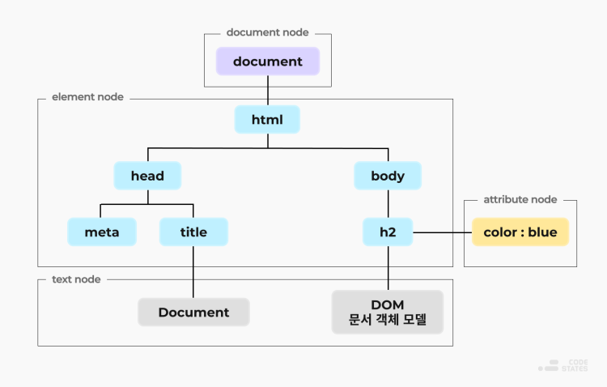

# Learning React

[repository](https://github.com/enshahar/learning-react-kor/tree/seconded)

## 1. 들어가기 전에

### 1-1. Tool
#### Node.js
- 브라우저 없이 JavaScript 실행할 수 있게 해준다.

#### npm
- Node를 설치하면 자동으로 같이 설치되는 노드 패키지 관리자이다.
######
    // pacakge.json 파일이 있는 경로에서
    $ npm install     // npm이 프로젝트에 필요한 모든 패키지 설치

    // 만약 새로운 프로젝트를 밑바닥 부터 시작하려면
    $ npm init -y     // 프로젝트를 초기화하고 package.json 파일 생성
    $ npm install [패키지이름]
    $ npm remove [패키지이름]

#### yarn
    $ npm install -g yarn      // 얀설치
    $ yarn add [패키지이름]      // 패키지 설치
    $ yarn remove [패키지이름]   // 패키지 삭제

#### 리엑트 개발자도구
- 리액트는 컴포넌트 트리를 들여다볼 수 있고, 심지어 프로덕션에서 리액트를 실행하는 경우도 내부를 살펴볼 수 있게 해준다. 
- 이런 도구는 다른 프로젝트에서 리액트가 어떻게 쓰이는지 배우거나 디버깅 할 때 아주 유용하다.

 

## 2. JavaScript

### 2-1. 변수 선언하기
#### var : ES2015 이전에 변수를 선언하는 유일한 방법
- var는 호이스팅(hoisting)을 지원해서 스코프 안에 존재하는 모든 선언들을 해당 스코프의 최상단으로 끌어올린다.  
- 또한 **var는 스코프의 제한을 받지 않아서 조건문 내에서 변경하면 조건문 밖의 변수에도 영향을 미친다.**
######
    // if 블록 안의 topic을 변경하면 if 블록 바깥의 topic도 바뀜 (for문도 마찬가지)
    var topic = "자바스크립트";

    if (topic) {
        var topic = "리액트";
        console.log('블록', topic); // 리전 리액트
    }

    console.log('글로벌', topic);   // 글로벌 리액트

#### const : 변경할 수 없는 변수
- 상수(constant)는 갑을 변경할 수 없는 변수다.
######
    // 상수를 변경하려고할 때 발생하는 오류
    Uncaught TypeError: Assignment to constant variable.

#### let : 구문적인 변수 영역 규칙 지원되는 변수
- 중괄호({}) 내부에서 지역변수로만 사용가능
######
    // if 블록 안의 topic을 변경해도 if 블록 바깥의 topic에는 영향 없음 (for문도 마찬가지)
    var topic = "자바스크립트";

    if (topic) {
        let topic = "리액트";
        console.log('블록', topic); // 리전 리액트
    }

    console.log('글로벌', topic);   // 글로벌 자바스크립트

### 2-2. 함수 만들기
#### 함수 선언
- 함수 선언으로 작성된 함수는 호이스팅 된다.
######
    function funcName1() {
        console.log("함수1");
    }

    // 함수 호출
    funcName1();

#### 함수 표현식(function expression)
- 함수 표현식은 이름없는 함수를 만들며, 변수에 값을 대입할 수 있다.
- 표현식으로 작성된 함수는 호이스팅 되지 않는다.
######
    const funcName2 = function() {
        console.log("함수2");
    }

    // 함수 호출
    funcName2();

#### 디폴트 파라미터
- 함수를 호출하면서 인자값을 지정하지 않으면 디폴트 값이 사용되도록 설정할 수 있다.  
- 문자열 뿐만아니라 어떤 타입의 값이라도 디폴트 값으로 사용할 수 있다.
######
    fucntion funcName3(name="최윤규", activity="유도") {
        console.log(`${name}은 ${activity}를 좋아합니다.`)
    }

#### 화살표 함수(Arrow Function)
- function 키워드 없이 함수 표현식을 작성할 수 있다.
######
    // 파라미터가 1개면 ()를 사용하지 않을 수 있다. (2개 이상부턴 괄호로 파라미터 감싸줘야한다.)
    // 함수 동작이 return 포함 1줄이면 중괄호{}와 return을 생략할 수 있다.
    const funcName4 = name => `${name}아 안녕!`;

#### 객체 반환하기(화살표 함수에서)
- **객체를 반환하려면 객체를 괄호로 둘러싸야 한다.** (중괄호를 객체영역이 아닌 함수 영역으로 착각할 수 있기 때문)
######
    const person = (firstName, lastName) => 
        (
            {
                fist: fistName,
                last: lastName.
            };
        )

#### 화살표 함수와 영역
- **화살표 함수는 새로운 this 영역을 만들어내지 않는다**.
######
    // 일반 함수는 this를 새로 바인딩한다. 예를 들어 다음에서 this는 gangown 객체가 아닌 그 어떤 것이다.
    const gaongwon = {
        resorts: ["용평", "평창", "강촌", "강릉", "홍천"],
        print: function(delay=1000) {
            setTimeout(function() {
                console.log(this.resoprts.join(","));
            }, delay);
        }
    }

    gangwon.print(this);    // Cannot read property 'join' of undefined 라는 오류 발생

- 이 오류는 this.resorts의 join메서드를 호출하려고 했기 때문이다. 
- 이 경우 this를 콘솔에 찍어보면, this가 window 객체임을 알 수 있다.

> function(delay=1000){...} 안에서는 this가 gaongwon인 반면,  
> setTimeout(function(){...}) 안에서는 this가 window 객체이다.  
> 이문제를 해결하기 위해 화살표 함수를 사용하면 this의 영역이 유지된다.

    var gangwon = {
        resorts: ["용평", "평창", "강촌", "강릉", "홍천"],
        print: function(delay=1000) {
            setTimeout(() => {
                console.log(this.resorts.join(","));
            }, delay);
        }
    }

    gangwon.print();    // 용평, 평창, 강촌, 강릉, 홍천

- 만약 function(delay=1000){...} 을 화살표 함수로 만들면 새로운 this 영역을 만들지 않기 때문에 this는 window 객체를 가르키게 된다.

### 2-3. 컴파일하기
- 가장 유명한 자바스크립트 컴파일링 도구는 [바벨](http://www.babeljs.io/)이다.  
- 자바스크립트에서 컴파일링은 바이너리로 변환하는 것이 아니라 더 많은 브라우저가 이해할 수 있도록 다른 버전의 자바스크립트 구문으로 변환하는 것을 뜻한다. 
- 자바스크립트 컴파일은 보통 웹 팩이나 파슬과 같은 자동화된 빌드 도구에 의해서 차리된다.

### 2-4. 객체와 배열
#### 구조 분해(destructuring)
- 객체 안에 있는 필드값을 원하는 변수에 대입할 수 있다.  
- 구조분해로 데이터를 할당 받은 변수를 변경해도 원래의 필드값은 바뀌지 않는다.(call by value 인듯)
######
    const sandwich = {
        bread: "더치 크런치",
        meat: "참치",
        cheese: "스위스",
        toppings: ["상추", "토마토", "머스타드"]
    };

    const { bread, meat } = sandwich;

    console.log(bread, meat);   // 더치 크런치 참치

    // 객체를 분해해서 함수의 인자로 넘길 수 있다.
    const lordify = regularPerson => {
        console.log(`켄터베리의 ${regularPerson.firstname}`)
    };

    var regularPerson = {
        firstname: "윤규",
        lastname: "최",
    };

    lordify(regularPerson); // 켄터베리의 윤규

######
    // 객체 필드에 접근하기 위해 점(.)과 필드 이름을 사용하는 대신, 필요한 값을 구조분해 해서 가져올 수 있다.
    const lordify = {firstname} => {
        console.log(`켄터베리의 ${regularPerson.firstname}`)
    };

    var regularPerson = {
        firstname: "윤규",
        lastname: "최",
    };

    lordify(regularPerson); // 켄터베리의 윤규

######
    // 객체안의 객체의 필드에 접근하기
    const regularPerson = {
        firstname: "윤규",
        lastname: "최",
        spouse: {
            firstname: "지민"
            lastname: "유"
        }
    };

    const lordify = ({ spuse: { firstanme } }) => {
        console.log(`켄터베리의 ${firstname}`);
    };
    lordify(regularPerson); // 켄터베리의 지민
######
    // 리액트에서 props 를 받을 때 구조분해를 사용하지 않는 경우
    const Component1 = (props) => {
        console.log(props.a)
        console.log(props.b)
    }
    
    // 구조분해를 사용한 경우 
    const Copoment2 = ({a, b}) => {
        console.log(a)
        console.log(b)
    }

#### 배열 구조 분해
- 배열을 구조분해해서 값을 뽑아낼 수도 있다.
######
    const [firstAnimal] = ["캥거루", "웜뱃", "코알라"];
    console.log(firstAnimal);   // 캥거루

    // 리스트 매칭 : 불필요한 값 콤마(,)를 활용해 생략
    const [,,thirdAnimal] = ["캥거루", "웜뱃", "코알라"];
    console.log(thirdAnimal);   // 코알라

#### 객체 리터럴 개선(object literal enhancement)
- 객체 리터럴 개선은 구조 분해의 반대라 할 수 있다.  
- 객체 리터럴 개선을 사용하면 현재 영역에 있는 변수를 객체의 필드로 묶을 수 있다.
######
    const name = "무등산";
    const elevation = 1187;
    const funHike = {name, elevation}

    console.log(funHike);   //  {name: "무등산", elevation: 1187}

    // 객체 리터럴 개선과 재구축을 통해 객체 메서드를 만드는 것도 가능하다.
    // 이때 객체 메서드는 객체의 key값에 접근하기 위해 this를 사용한다
    const name = "무등산";
    const elevation = 1187;
    const print = function() {
        console.log(`${this.name}의 높이는 ${this.elevation}m 입니다.`)
    }
    const funHike = {name, elevation, print};

    funHike.print();    // 무등산의 높이는 1187m 입니다.

######
    // 객체 메서드를 정의할 때는 function 키워드를 사용하지 않아도 된다.
    // 옛날 방식
    var skier = {
        name: name,
        sound: sound,
        powderYell: function() {
            var yell = this.sound.toUpperCase();
            console.log(`${yell} ${yell}!!!`);
        },
        speed: function(mph) {
            this.speed = mph;
            console.log('속력(mph):', mph);
        }
    }

    // 새로운 방식
    var skier = {
        name: name,
        sound: sound,
        powderYell() {
            var yell = this.sound.toUpperCase();
            console.log(`${yell} ${yell}!!!`);
        },
        speed(mph) {
            this.speed = mph;
            console.log('속력(mph):', mph);
        }
    }

#### 스프레드 연산자(spread operator)
- 3개의 점(...)으로 이뤄진 연산자로 몇가지 역할을 담당한다.
######
    (1) 배열 내용을 조합할 수 있다.
    const peaks = ["대청봉", "중청봉", "소청봉"];
    const canyons = ["천불동계곡". "가야동계곡"];
    const seoraksan = [...peaks, ...cayons];

######
    (2) 원본을 변형시키지 않고 마지막 변수 접근할 수 있다.
    // 위에서 정의한 peaks배열의 마지막 원소를 변수에 담고 싶은 경우,
    // 아래처럼하면 reverse메소드는 inplase 적용되어 원본 배열을 변형시킨다.
    const peaks = ["대청봉", "중청봉", "소청봉"];
    const [last] = peaks.reverse();

    // 스프레드를 사용하면 복사본을 만들어서 뒤집을 수 있다.
    const peaks = ["대청봉", "중청봉", "소청봉"];
    const [last] = [...pekas].reverse();

######
    (3) 배열의 나머지 원소들을 얼을 수 있다.
    const lakes = ["경포호", "화진포", "송지호", "청초호",];
    const [ first, ...rest ] = lakes;

    console.log(rest.join(","));    // 화진포, 송지호, 청초호

######
    (4) 세 점(...) 구문을 사용해 함수의 인자를 배열로 모을 수 있다.
    // 함수 파라미터 정의에서 스프레드 연산자가 쓰인 경우 레스트 파라미터(rest parameters)라고 한다.
    function directions (...args) {
        let [start, ...remaining] = args;
        let [finish, ...stops] = remaining.reverse();

        console.log(`${ args.length } 도시를 운행합니다.`);
        console.log(`${start}에서 출발합니다.`);
        console.log(`목적지는 ${finish}입니다.`);
        console.log(`중간에 ${stops.length} 군데를 들립니다.`)
    }

    directions(
        "서울",
        "수원",
        "천안",
        "대전",
        "대구",
        "부산",
    );

######
    (5) 스프레드 연산자를 객체에도 사용할 수 있다.
    const morning = {
        breakfast: "미역국",
        lunch: "삼치구이와 보리밥"
    };

    const dinner = "스테이크 정식";

    const backpackingMeals = {
        ...morning,
        dinner
    };

    console.log(backpackingMeals);
    // {breakfast: "미역국", lunch: "삼치구이와 보리밥", dinner: "스테이크 정식"}

### 2-5. 비동기(asynchronous) 자바스크립트
#### Ajax 통신
- XMLHttpRequest 라는 객체를 통해 웹페이지 일부를 비동기적으로 통신할 수 있다.  
- 그러나 요즘엔 fetch 함수나 axios 패키지로 비동기통신 많이한다.
######
    const xhr = new XMLHttpRequest();
    xhr.open('GET', 'https://learn.codeit.kr/api/members');
    xhr.onload = function () {
        console.log(xhr.response);
    };
    xhr.onerror = function () {
        alert('Error!');
    };
    xhr.send();

#### 프로미스
- Promise : 작업에 관한 '상태 정보'를 가지고 있는 객체  
- 작업이 성공하면, 프로미스 객체는 그 성공 결과도 함께 가진다.  
- 작업이 실패하면, 프로미스 객체는 작업 실패 이유도 함께 가진다.

  -   pending : 작업 진행중
  -   fulfiled : 작업 성공
  -   rejected : 작업 실패

######
    // randomuser.me API로부터 데이터 가져오기
    console.log(fetch("https://api.randomuser.me/?nat=US&results=1));

-   fetch함수는 Promise 객체를 리턴한다.
-   콘솔 로그를 보면 대기 중인 프로미스(promise)를 볼 수 있다.
-   프로미스는 자바스크립트에서 비동기적인 동작을 잘 처리할 수 있게 해준다.
-   대기중인 프로미스는 데이터가 도착하기 전의 상태를 표현한다.
-   .then()이라는 함수를 대기 중인 프로미스에 연쇄 호출 해야한다.
-   then은 콜백 함수를 인수로 받으며, 바로 앞에 이는 연산(프로미스)이 성공하면 콜백이 호출된다.
-   fetch로 데이터를 가져오면 then이 그 데이터로 다른 일을 하는 것이다.

#### then 메소드

    fetch("https://api.randomuser.me/?nat=US&results=1")
        .then(res => console.log(res.json()));

-   then은 프로미스가 정상적으로 완료되면(pending -> fulfiled) 콜백 함수를 한 번만 호출한다.
-   이 콜백 함수가 반환하는 값은 그다음에 오는 then 함수의 콜백에 전달되는 인자가 된다. (promise chaining)
-   then이 프로미스 객체를 리턴하는 경우 : 콜백이 리턴한 프로미스와 동일한 상태와 결과를 갖게 된다.
-   then이 프로미스 객체가 아닌 것을 리턴하는 경우 : then 메소드가 리턴했던 프로미스 객체는 fulfiled가 되고, 콜백의 리턴값을 작업 성공 결과로 갖게된다.  
    (.json()과 .text()는 프로미스 객체를 리턴하는 메소드이다.)

######
    fetch("https://api.randomuser.me/?nat=US&results=1")
        .then(res => res.json())
        .then(json => json.results)
        .then(console.log)
        .catch(console.error); // fetch가 성공하지 못한 경우 콜백

#### reject
- .then 에 두개의 콜백이 들어 있는 경우,  
- 첫번째 콜백은 프로미스 객체가 fulfiled 되었을 때 실행되고,  
- 두번째 콜백은 프로미스 상태가 rejected 되었을 때 실행된다.
######
    fetch('https://jsonplaceholder.typicode.com/users')
        .then((response) => response.text(), (error) => { console.log(error); })
        .then((result) => { console.log(result); });

#### catch 메소드
- 프로미스 객체가 rejected 상태가 되면 실행할 콜백함수 넣는 메소드이다.
- catch 메소드는 마지막에 써야한다. catch 다음에 있는 then 메소드에서 에러가 발생하면 처리할 수 없기 때문이다.
######
    fetch('https://jsonplaceholder.typicode.com/users')
        .then((response) => response.text())
        .then((result) => { console.log(result); })
        .catch((error) => { console.log(error); });

#### finally 메소드
- 프로미스 상태에 상관없이 항상 실행하고 싶은 코드가 있을때 사용한다.
######
    fetch('https://jsonplaceholder.typicode.com/users')
        .then((response) => response.text())
        .then((result) => { console.log(result); })
        .catch((error) => {
        console.log(error);
        throw new Error('from catch method');
        })
        .finally(() => { console.log('exit'); } );

#### 프로미스 만들기
    const getPeople = count =>
        new Promise((resolves, rejects) => {
            const api = `https://api.randomuser.me/?nat=US&results=${count}`;
            // AJAX : 웹페이지 일부를 비동기 통신하는 것 XMLHttpRequest로 구현
            const request = new XMLHttpRequest();
            request.open("GET", api);
            request.onload= () =>
                requnest.status === 200
                    ? resolves(JSON.parse(request.response).results)
                    : reject(Error(request.statusText));
            request.onerorr = err => rejects(err);
            request.send();
        });

        getPeople(5)
            .then(members => console.log(members))
            .catch(error => console.erros(`getPeople failed: ${error.message}`));

    // 이미 상태가 결정된 프로미스 객체 만들기
    const p = Promise.resolve('success');           // fulfiled 상태의 Promise 객체 만들기
    const p2 = Promise.reject(new Error('fail'));   // rejected 상태의 Promise 객체 만들기

#### 프로미스와 all, race 메소드
- all 메소드 : 배열 안에 있는 모든 Promise 객체가 fulfilled 상태가 될 때까지 기다린 fulfilled 상태가 된다.
######
    const p1 = fetch('https://learn.codeit.kr/api/members/1').then((res) => res.json());
    const p2 = fetch('https://learn.codeit.kr/api/members/2').then((res) => res.json());
    const p3 = fetch('https://learn.codeit.kr/api/members/3').then((res) => res.json());
    Promise
        .all([p1, p2, p3])
        .then((results) => {
            console.log(results); // Array : [p1, p2, p3]
        });

- race 메소드 : race 메소드 내 배열 중 가장 먼저 fulfilled 상태 또는 rejected 상태가 된 Promise 객체와 같은 상태가 된다.
######
    const p1 = new Promise((resolve, reject) => {
        setTimeout(() => resolve('Success'), 1000);
    });
    const p2 = new Promise((resolve, reject) => {
        setTimeout(() => reject(new Error('fail')), 2000);
    });
    const p3 = new Promise((resolve, reject) => {
        setTimeout(() => reject(new Error('fail2')), 4000);
    });
    Promise
        .race([p1, p2, p3])
        .then((result) => {
        console.log(result); // hello 출력
        })
        .catch((value) => {
        console.log(value);
        });

#### async/await
- 비동기 함수를 실행하는 다른 방법
######
    const getFakePerson = async () => {
        try {
            let res = await fetch("https://api.randomuser.me/?nat=US&results=1");
            let { results } = res.json();
            console.log(results);
        } catch(error) {
            console.error(error);
        }
    };

    getFakePerson();

### 2-6. 클래스
- 자바스크립트는 프로토타입을 사용한 상속이라 불리는 방법을 사용한다.  
- 이 기법은 객체지향처럼 느껴지는 구조를 만들어내기 위한 기법이다.
######
    function Vacation(destination, length) {
        this.destination = destination;
        this.length = length;
    }

    Vacation.prototype.print = function() {
        console.log(this.destination + "은(는) " + this.length +" 일 걸립니다.");
    };

    const maui = new Vacation("마우이", 7);

    maui.print();   // 마우이은(는) 7 일 걸립니다.

######
- ES2015에는 클래스 선언이 추가되었다. (하지만 작동 방식은 위와 같다.)
######
    class Vacation {
        constructor(destination, length) {
            this.destination = destination;
            this.length = length;
        }

        print() {
            console.log(this.destination + "은(는) " + this.length +" 일 걸립니다.");
        }
    }

    const trip = new Vacation("칠레 산티아고", 7);

    console.log(trip.print());  // 칠레 산티아고은(는) 7 일 걸립니다.

#### 추상 클래스
    // Expedition은 Vaction 클래스를 상속받는다.
    class Expedition expends Vacation {
        constructor(destination, length, gear) {
            super(destination, length);
            this.gear = gear;
        }

        print() {
            super.print();
            console.log(`당신의 ${this.gear.join("와(과) 당신의 ")}를(을) 가져오십시오.`)
        }
    }

    const trip2 = new Expedition("한라산", 3,
                        ["선글라스", "오색 깃발", "카메라"]);
    tirp2.print();

### 2-7. ES6 모듈
#### export와 import
- 선언문 앞에 export 키워드로 다른 파일에서도 사용가능하게 할 수 있다.
######
    export const 변수명 = 'value';

    // 단, 사용하고자 하는 js 파일에서 import도 해줘야한다.
    import { 변수명, 함수명 } from '경로.js';

    # 이름 바꾸기 : 임포트한 함수나 변수의 이름을 변경하기
    import { 변수명 as 변경할이름, 함수명 } from '경로.js';

    # 한꺼번에 다루기
    export { 변수명, 함수명 }; // export 할 때 as 키워드로 이름 미리 바꿀 수 있다.

    import * as 모듈이름 from '경로.js';
    모듈이름.변수명
    모듈이름.함수명

#### export default
- export 키워드 뒤에 default를 붙이면 반드시 하나의 대상만 내보낼 수 있게 된다.  
- 주의할점은 default 키워드는 js파일 내부에서 단 한번만 사용가능하다는 것이다.
######
    export default 'codeit';

#### 커먼 JS
- 커먼JS(CommonJS)는 모든 버전의 노드에서 지원하는 일반적인 모듈 패턴이다.  
- 커먼JS를 사용하면 module.exports를 사용해 자바스크립트 객체를 익스포트할 수 있다.
######
    const print(message) => log(message, new Data());

    const log(message, timestamp) =>
        console.log(`${timestamp.toString(): ${message}}`);

    module.exports = {print, log};

######
- 커먼JS는 import 문을 지원하지 않는다. 대신 require 함수를 통해 모듈을 임포트 할 수 있다.
######
    const { log, print } = require('./txt-helpers')

 

## 3. JavaScript를 활용한 함수형 프로그래밍

### 3-1. 함수형이란?
- 함수형 프로그래밍을 하기 위해서는 함수가 1급 시민이어야 한다.
  - 해당 언어에서 변수나 객체, 배열에 함수를 넣을 수 있고,
  - 함수를 다른 함수의 인자로 넘길 수 있으며,
  - 함수에서 함수를 만들어서 반환할 수 있어야한다. (고차함수)
- 이제부터는 함수를 선언할 때 사용한 화살표의 개수에 주의를 기울일 필요가 있다.  
- 만약 2개 이상의 화살표가 있다면, 고차함수를 사용하고 있다는 뜻이다.

### 3-2. 명령형 프로그래밍과 선언적 프로그래밍 비교
- **명령형 프로그래밍**: 코드로 원하는 결과를 달성해 나가는 과정에만 관심을 둔다.  
  (조건문과 반복문을 사용해서 목적을 달성해나가는 과정을 볼 수 있다.)
######
- 함수형 프로그래밍은 선언적 프로그래밍이라는 더 넓은 프로그래밍 패러다임의 한가지 이다.
- **선언적 프로그래밍**: 필요한 것이 어떤 것인지를 기술하는 것에 방점을 두고 애플리케이션의 구조를 세운다.
- 함수형 프로그래밍은 함수를 사용해 추상적인 개념을 표현하고 실제 그 작업을 처리하는 방법은 추상화를 통해 아랫단에 감춰진다. 
- 이로 인해 더 깔끔해지고 작성자의 의도를 더 파악하기 쉽다.

### 3-3. 함수형 프로그래밍 개념
- 불변성: Call by Value 처럼 써서 원본 데이터를 유지한다. (inplace=false)
- 순수성: 부수 효과(side effect)가 없다.
- 데이터 변환: 원본을 변경한 복사본을 만들고 순수 함수를 통해 데이터를 변경 한다.
  - **filter()**: 인자로 boolean을 반환하는 함수를 받아 새로운 배열 구성
  - **map()**: 인자로 변환 함수를 받아 모든 원소에 적용해 반환 값으로 새로운 배열 구성  
    (map은 각 원소의 인덱스를 변환함수의 두번째 인자로 넘겨준다.)
  - **Object.keys(객체).map()**: 객체를 배열로 변환하고 싶을 때 사용   
  - **reduce(callback, initialValue)**: 배열을 하나의 값으로 축약, (배열 -> 객체 or 집합)   
    (객체 -> 수, 문자열, 불린, 객체, 함수 등으로 변환 가능)  
    (reduceRight 도 기본 매커니즘은 동일하지만 마지막 원소부터 축약) 
- 고차 함수: 다른 함수를 조작하거나, 함수를 인자로 받거나, 함수를 반환할 수 있다.
- 재귀: 자기 자신을 호출하는 함수 
- 합성: 함수형 프로그램은 로직을 구체적인 작업을 담당하는 여러 작은 순수 함수로 나눈다.  
  그 과정에서 언젠가는 모든 작은 함수를 한데 합칠 필요가 있다. 
  - 체이닝은 가장 낯익은 방법으로 연쇄 호출하는 것이다. 

#### 불변성(immutable), inplace false라는 말
- 함수형 프로그래밍에서는 데이터가 변할 수 없다.
- 원본 데이터 구조를 변경하는 대신에 그 데이터 구조의 복사본을 만들고 그 중 일부를 변경한다.  
- Call by Reference 를 사본을 만들어서 Call by Value 처럼 쓴다.
- 그리고 원본 대신 변경한 복사본을 사용해 필요한 작업을 진행한다.
######
    (예제1) 잔디 색
    let color_lawn = {
        title: "잔디",
        color: "#00FF00",
        rating: 0,
    }:

    // 색에 평점을 메기는 함수, 원본도 같이 바뀜
    function rateColor(color, rating) {
        color.rating = rating;
        return color;
    }

    consolo.log(rateColor(color_lawn, 5).rating); // 5
    console.log(color_lawn.rating);               // 5

- 자바스크립트에서 함수의 인자는 실제 데이터에 대한 참조다.  
- rateColor 함수 안에서 color의 rating을 변경하면 원본 color_lawn객체의 rating도 바뀐다.
######
    // Object.assign을 사용하면 원본은 바뀌지 않음
    var rateColor = function(color, rating) {
        return Object.assign({}, color, {rating:rating});
    };

    console.log(rateColor(color_lawn, 5).rating);   // 5
    console.log(color_lawn.rating);                 // 0

- **Object.assign은 복사기와 같다.** 
- 빈 객체를 받고, color 객체를 그 빈 객체에 복사한 뒤,  
- 복사본에 있는 rating 프로퍼티의 값을 rating 파리미터의 값으로 변경한다.
######
    // 화살표 함수와 스프레드 연산자를 활용해 같은 함수 구현
    const rateColor = (color, rating) => ({
        ...color,
        rating,
    });

######
    (예제2) 색 이름 배열
    let list = [
        { title: "과격한 빨강" },
        { title: "잔디" },
        { title: "파티 핑크" },
    ]

    // 이 배열에 색을 추가하는 push함수는 불변성 함수가 아니다.
    const addColor = function(title, colors) {
        colors.push({ title: title });
        return colors;
    }

    console.log(addColor("화려한 녹색", list).length);  // 4
    console.log(list.length);                        // 4

- **원래의 list 배열을 변화시키지 않고 유지하기 위해서는 Array.concat 을 사용**해야 한다.
######
    const addColor = (title, array) => array.concat({title});

    console.log(addColor("화려한 녹색", list).length);  // 4
    console.log(list.length);                        // 3

- Array.concat은 두 배열을 붙여준다. 여기서는 Array.concat이 새로운 객체를 받는다.  
- 그 객체에는 새로운 색의 이름이 title이라는 이름의 프로퍼티로 들어 있다.  
- Array.concat은 그 객체를 원래의 배열을 복사한 새로운 배열 뒤에 추가한다.
######
    // 화살표 함수와 스프레드 연산자를 활용해 같은 함수 구현
    const addColor = (title, list) => [...list, {title}];

#### 순수성
- 순수 함수(Pure Functions)는 파라미터에 의해서만 반환값이 결정되는 함수를 뜻한다.
- 순수 함수는 최소한 하나 이상의 인수를 받고, 인자가 같으면 항상 같은 값이나 함수를 반환한다.  
- 순수 함수에는 부수 효과(side effect)가 없다. 부수 효과란 전역 변수를 설정하거나, 함수 내부나 애플리케이션에 있는 다른 상태를 변경하거나 입출력하는 것을 말한다.  
- 순수 함수는 인수를 변경 불가능한 데이터로 취급한다.

#### 데이터 변환
- 함수형 프로그래밍은 함수를 사용해 원본을 변경한 복사본을 만들고 순수 함수를 통해 데이터를 변경한다.
- Array.join : 배열의 모든 원소를 인자로 받아서 구분자로 연결한 문자열 반환 (inplace=false)
######
    const schools = ["Yorktown", "Washington & Lee", "Wakefield"];
    console.log( schools.join(",") ); // "Yorktown, Washington & Lee, Wakefield"

- Array.filter : 인자로 술어(boolean반환 하는 함수)를 받아 새로운 배열을 구성한다.
######
    const wSchools = schools.filter(school => school[0] === 'W');
    console.log( wSchools );            // ["Washington & Lee", "Wakefield"]
    // 배열에서 원소를 제거해야한다면 Array.pop이나 Array.slice보다 Array.filter( !== ) 사용 권장

- Array.map : 인자로 변환 함수를 받아 모든 원소에 적용해 반환받은 값으로 새로운 배열을 구성한다.
######
    const highSchools = schools.map(school => `${school} High School`);
    console.log(highSchools.join("\n"));    // Yorktown High School
                                            // Washington & Lee High School
                                            // Wakefield High School

- map 함수는 객체, 값, 배열, 다름 함수등 모든 자바스크립트 타입으로 이뤄진 배열을 만들 수 있다.
######
    const highSchools = schools.map(school => ({name: school}));
    console.log( highSchools );     // [
                                    //  { name : "Yorktown" },
                                    //  { name : "Washington & Lee" },
                                    //  { name : "Wakefield" }
                                    // ]

- 배열의 원소중 하나만 변경하는 순수 함수가 필요할 때도 map을 사용할 수 있다.
######
    let schools = [
        { name: "Yorktown" },
        { name: "Stratford" },
        { name: "Washington & Lee" },
        { name: "Wakefield" }
    ];

    const editName = (oldName, name, arr) =>
        arr.map(item => (item.name === oldName ? { ...item, name} : item)); // {...item, name}은 객체의 속성들을 복사하고 새로운 값으로 객체를 생성하는 방법이다. 원래는 {...item, name: name}인데 key값과 value 값이 같아서 한번만 쓴 것이다.

    let updatedSchools = editName("Stratford", "HB Woodlawn", schools);

    console.log( updatedSchools[1] ); // { name: "HB Woodlawn" }
    console.log( schools[1] ); // { name: "Stratford" }

- map은 각 원소의 인덱스를 변환함수의 두번째 인자로 넘겨준다.
- map 메소드의 콜백 함수 매개 변수(현재값, 현재 인덱스, 원본배열)
######
    const editNth = (n, name, arr) =>
        arr.map((item, i) => (i ===n ? {...item, name} : item))

- 객체를 배열로 변환하고 싶을 때는 Array.map과 Object.keys를 함께 사용하면 된다.  
- Object.keys는 어떤 객체의 키로 이뤄진 배열을 반환하는 메서드다.
######
    const schools = {
        "Yorktown" : 10,
        "Washington & Lee" : 2,
        "Wakefield" : 5
    };

    const schoolArray = Obejct.key(schools).map(key => ({
        name: key,
        wins: schools[key]
    })
    );

    console.log(schoolArray);   // [ { name: 'Yorktown', wins: 10 }
                                //   { name: 'Washington & Lee', wins: 2 }
                                //   { name: 'Wakefield', wins: 5 } ]

- reduce와 reduceRight 함수를 사용하면 객체를 수, 문자열, 불린 값, 객체, 심지어 함수와 같은 값으로 변환할 수 있다. 
- reduce(callback, initialValue)는 배열을 하나의 값으로 축하는 역할을 한다.  
- reduceRight도 기본적인 매커니즘은 동일하지만 배열의 맨 마지막 원소부터 축약을 시작한다는 점이 다르다.
######
    const ages = [21, 18, 42, 40, 64, 63, 34];

    const maxAge = ages.reduce((max, age) => {
        if (age > max) {
            return age;
        } else {
            return max;
        }
    }, 0);  // 초기값 : 0

    // 짧게 쓰기
    const max = ages.reduce((max, age) => (value > max ? value : max), 0);

- 배열을 객체로 변환해야할 때가 있다. 다음 예제는 reduce를 사용해 값이 들어 있는 배열을 해시로 변환한다.  
- reduce 메소드의 콜백 함수 매개변수(이전누산값or초기값, 현재 배열의 요소의 값, 현배 배열 요소의 인덱스, 원본 배열)
######
    const colors = [
        {
            id: 'xekare',
            title: "과격한 빨강",
            rating: 3
        },
        {
            id : 'jbwsof',
            title: "큰 파랑",
            rating: 2
        },
        {
            id : 'prigbj',
            title: "회색곰 회색",
            rating: 5
        },
        {
            id : 'ryhbhsl',
            title: "바나나",
            rating: 1
        },
    ];

    const hashColors = colors.reduce(
        (hash, {id, title, rating}) => {    // {id, title, rating} 이 부분은 구조분해
            hash[id] = {title, rating};
            return hash;
        }, {});

    console.log(hashColors);    // { 'xekare': { title: '과격한 빨강', rating: 3 },
                                //   'jbwsof': { title: '큰 파랑', rating: 2},
                                //   'prigbj': { title: '회색곰 회색', rating: 5},
                                //   'ryhbhsl': { title: '바나나', rating: 1} }

- reduce를 사용해 같은 값이 여럿 들어 있는 배열을 서로 다른 값이 한 번씩만 들어 있는 배열로 바꿀 수 있다.
######
    const colors = ["red", "red", "green", "blue", "green"];

    const distinctColors = colors.reduce(
        (unique, color) =>
        unique.indexOf(color) !== -1 ? unique : [...unique, color], // indexOf는 배열을 처음부터 순회하면서 일치하는 요소를 찾는다. 일치하는 요소르 찾으면 해당 요소의 인덱스를 반환한다. 일치하는 요소가 없거나 검색 범위를 벗어난 경우 -1을 반환한다.
        []
    );

    console.log(distinctColors);    // ["red", "green", "blue"]

- map과 reduce는 함수형 프로그래머가 주로 사용하는 무기이며, 자바스크립트도 예외가 아니다.  
- 한 데이터 집합에서 다른 데이터 집합을 만들어내는 능력은 꼭 필요한 기술이며 프로그래밍 패러다임과 관계없이 유용하다.

#### 고차 함수
- 고차한수는 다른 함수를 조작할 수 있다. 또 다른 함수를 인자로 받을 수 있거나 함수를 반환할 수 있다.
######
    const invokeIf = (condition, fnTrue, fnFalse) =>
        (condition) ? fnTrue() : fnFalse();

    const showWelcome = () ->
        console.log("Welcome!!!");

    const showUnautorized = () =>
        console.log("Unauthorized!!!");

    invokeIf(true, showWelcome, showUnautorized);   // "Welcome"
    invokeIf(false, showWelcome, showUnautorized);  // "Unauthorized"

- 다른 함수를 반환하는 고차 함수는 자바스크립트에서 비동기적인 실행 맥락을 처리할 때 유용하다.

- **커링(Currying)**: 고차 함수 사용법과 관련한 함수형 프로그래밍 기법이다.  
- 어떤 연산을 수행할 때 필요한 값 중 일부를 저장하고 나중에 나머지 값을 전달받는 기법이다.
######
    // 외부함수 : 외부함수 userLogs는 userName이라는 매개변수를 받아서 내부함수를 반환, 이함수가 반환하는 내부함수는 또 다른 매개변수인 message를 받아서 사용자 로그 메세지 출력
    // 내부함수 : 외부함수에서 받은 userName과 내부함수에서 받은 message로 콘솔 출력
    const userLogs = userName => message =>
        console.log(`$(userName) -> ${message}`);

    const log = userLogs("grandpa23");  // 외부 함수(고차함수) 호출

    log("attempted to load 20 fake mebmers");   // 내부 함수 호출
    // userLogs를 호출해 만들어지는 log함수를 호출할 때마다 메시지 맨 앞에 grandpa23이 덧붙여진다.

    getFakePerson(20).then(
        members => log(`successfully loaded ${members.length} members`),
        error => log("encountered an error loading members")
    );

    // grandpa23 -> attempted to load 20 fake members
    // grandpa23 -> successfully loaded 20 members

    // grandpa23 -> attempted to load 20 fake members
    // grandpa23 -> encountered an error loading members

#### 재귀
- 재귀는 자기 자신을 호출하는 함수를 만드는 기법이다.  
- 루프는 모두 재귀로 바꿀 수 있고, 일부 루프는 재귀로 표현하는 쪽이 더 쉽다.
######
    // 10부터 0까지 거꾸로 세는 경우
    const countdown = (value, fn) => {
        fn(value);
        return (value>0) ? countdown(value-1, fn) : value
    };

    countdown(10, value => console.log(value));

#### 합성
- 함수형 프로그램은 로직을 구체적인 작업을 담당하는 여러 작은 순수 함수로 나눈다.  
- 그 과정에서 언젠가는 모든 작은 함수를 한데 합칠 필요가 있다.  
- 합성의 경우 여러 다른 구현과 패턴과 기법이 있다.
######
- **체이닝**: 가장 낯익는 방법으로 (.)을 사용해서 연쇄 호출 하는 것이다.
######
    const template = "hh:mm:ss tt";
    const clockTime = template.replace("hh", "03")
        .replace("mm", "33)
        .replace("ss", "33")
        .replace("tt", "PM");
    console.log(clockTime);     // "03:33:33 PM"
- 여기서 **both 사용자 함수**는 서로 다른 두 함수에 값을 흘려 넣는 함수다.  
- civilianHours의 출력은 appendAMPM의 입력이 된다.  
- 따라서 날짜 값을 이 두 함수를 사용해 처리하는 대신 both를 사용하면 한 함수로 처리할 수 있다.  
- 하지만 이런 구문은 이해하기 어렵고 유지보수나 대규모 확장이 어렵다.
######
    const both = date => appendAMPM(civilianHours(date))
- 여기서 **compose 사용자 함수**는 함수를 더 큰 함수로 조합해준다.  
-또한 원하는 위치에 언제든지 함수를 추가할 수 있으므로 더 쉽게 확장할 수 있다.
######
    const both = compose(
        civilianHours,
        appendAMPM
    );

    both(new Date());

    // 몇 개인지 모를 함수를 받으니까 스프레드 연산자 ...fns 사용, compose는 인자로 받은 함수를 배열로 저장
    const compose = (...fns) => (arg) =>    
        // 함수 배열 fns의 모든 함수를 순차적으로 실행하고 결과를 누적
        fns.reduce((composed, f) => f(composed), arg);  
    // 결과적으로 both는 civilianHours 함수를 먼저 실행하고 그 결과를 appendAMPM 함수에 전달하여 두 함수를 조합한다.

- compose 함수는 여러 함수를 인자로 받아서 한 함수의 결과로 내놓는다.  
- 이 구현은 스프레드 연산자를 사용해 인자로 받은 함수들을 fns라는 배열로 만든다.  
- 그후 compose는 arg라는 인자를 받는 함수를 반환한다.  
- 이렇게 반환된 화살표 함수에 나중에 누군가 인자를 전달해 호출하면,  
- fns 배열의 reduce가 호출되면서 arg로 받은 값이 전달된다.  
- arg값은 reduce의 초기 값이 되고,  
- 각 이터레이션 마다 배열의 각 원소와 이전 값을 변환 함수를 사용해 축약한 값을 전달한다.  
- 이때 reduce의 변환 하무는 이전 이터레이션의 결과값인 composed와 f를 인자로 받아서  
- f에 composed를 적용해 반환한다.  
- 마지막 함수가 호출되면 최종 결과를 반환한다.

 

## 4. 리액트 작동원리
### 4-1. 페이지 설정
- 리액트를 브라우저에서 다루려면 React 와 ReactDOM 라이브러리를 불러와야 한다. 
- React 는 뷰를 만들기 위한 라이브러리이고 ReactDOM 은 UI 를 실제로 브라우저에 렌더링할 때 사용하는 라이브러리이다.
######
    <!DOCTYPE html>
    <html>
      <head>
        <meta charset="utf-8">
        <title> 순수 리액트 예제 </title>
      </head>
      <body>
        <!-- 타겟 컨테이너 -->
        

        
        <!-- React와 ReactDOM 라이브러리(개발 버전) -->
        
        <scropt src="https://unpkg.com/react-dom@16/umd/react-dom.development.js"></script>
      
        
      </body>
    </head>

### 4-2. 리액트 엘리먼트 

- HTML 은 브라우저가 문서 객체 모델(Document Object Model)인 DOM 을 구성하기 위해 따라야하는 절차이다.
- HTML 문서를 이루는 엘리먼트는 브라우저가 HTML 문서를 읽어들이면 DOM 엘리먼트가 되고, 이 DOM이 사용자 인터페이스를 화면에 표시한다.
######
- HTML 에서 엘리먼트는 가계도를 닮은 계층 구조 안에서 서로 관계를 맺는다.
- 전통적으로 웹 사이트는 독립적인 HTML 페이지들로 만들어 졌다.  
  - 사용자가 페이지 사이를 내비게이션 함에 따라 브라우저는 매번 다른 HTML 문서를 요청해서 로딩할 수 있었다.
- AJAX 라는 기술에 의해 SPA 이 가능하게 되었다. 자바스크립트에 의해 UI 를 갱신 할 수 있게 된 것이다.
  - SPA 에서 처음에 브라우저는 HTML 문서를 하나 적재한다. 
  - 자바스크립트는 사용자가 애플리케이션과 상호작용하는 것에 맞춰 표시중이던 인터페이스를 없애고 새로운 UI 를 만든다.
  - 사용자는 사이트를 내비게이션 하지만 실제로는 같은 페이지 안에 계속 머문다.
######
- DOM API 는 브라우저의 DOM 을 변경하기 위해 자바스크립트가 사용할 수 있는 객체 모음이다.  
  (document.createElement 나 document.appendChild 등이 있다.)
- 리액트는 브라우저 DOM을 갱신해주기 위해 만들어진 라이브러리다. 
  - 리액트가 모든 처리를 대신 해주기 때문에 더 이상 SPA 를 더 효율적으로 만들기 위해 여러 복잡한 내용을 신경쓸 필요가 없다.
  - 리액트에서는 DOM API 를 직접 조작하지 않는다.
  - 대신 리액트에게 어떤 UI 를 생성할지 지시하면, 리액트가 우리 명령에 맞춰 엘리멘트 렌더링을 조절해준다.
######
- 브라우저 DOM 이 DOM 엘리먼트로 이뤄지는 것 처럼, 가상 DOM 은 리액트 엘리먼트로 이뤄진다.
  - 리액트 엘리먼트는 개념상 HTML 엘리먼트와 비슷하지만 실제로는 자바스크립트 객체이다.
  - 리액트 엘리먼트는 실제 DOM API 를 직접 다루는 것보다 가상 DOM을 다루는 것이 훨씬 빠르다.  
    (우리가 가상 DOM 을 변경하면 리액트는 DOM API를 통해 그 변경 사항을 가장 효율적으로 렌더링 해준다.)
######
    // 예제 React.createEelement 를 사용해서 h1 태그를 표현하는 리액트 엘리먼트를 만들 수 있다.  
    React.createElement("h1", { id: "recipe-0" }, "구운 연어")
######
    <h1 id=recipe-0">구운 연어</h1>
- 첫 번째 인자는 만들려는 엘리먼트의 타입을 정의한다. 
- 두 번째 인자는 엘리먼트의 프로퍼티를 표현한다. (id, className 등 태그 프로퍼티)
- 세 번째 인자는 만들려는 엘리먼트를 여는 태그와 닫는 태그 사이에 들어가야할 자식 노드들을 표현한다.
- 렌더링 과정에서 리액트는 이 엘리먼트를 실제 DOM 엘리먼트로 변환한다.
- 리액트 엘리먼트는 단지 리액트에게 DOM 엘리먼트를 구성하는 방법을 알려주는 자바스크립트 리터럴에 불과하다.
######
    {
      $$typeof" Symbol(React.element),
      "type": h1",
      "key": null,
      "ref": null.
      "props": {id: "recipe-0", children: "구운 연어"},
      "_owner": null,
      "_store": {}
    }
- 리액트 엘리먼트는 이렇게 생겼다. 그 안에는 리액트가 사용하는 _owner, _store, $$typeof 같은 필드가 있다.
- type: 만들려는 HTML 이나 SVG 엘리먼트 타입을 지정 한다.
- props: DOM 엘리먼트를 만들기 위해 필요한 데이터나 자식 엘리먼트들을 표현한다.
- key: 나중에 설명
- ref: 나중에 설명 

### 4-3. React DOM
- ReactDOM 에는 리액트 엘리먼트를 브라우저에 렌더링하는 데 필요한 모든 도구가 들어 있다.
- 리액트 엘리먼트와 그 모든 자식 엘리먼트를 함께 렌더링하기 위해 ReactDOM.render를 사용한다.
  - 이 함수의 첫 번째 안자는 렌더링할 리액트 엘리먼트 이다.
  - 두 번째 인자는 렌더링이 일어날 대상 DOM 노드 이다.
  - dish 자리에 배열을 넣어서 여러 리액트 엘리먼트를 렌더링할 수도 있다.
######
    var dish = React.createElement("h1", null, "구운 연어");
    ReactDOM.render(dish, document.getElementById('root'));
######
    <body>
      

        <h1>구운 연어</h1>
      

    </body>
- 리액트는 props.children 을 사용해 자식 엘리먼트들을 렌더링 한다.
- 위에서 h1 엘리먼트의 유일한 자식으로 텍스트 엘리먼트를 렌더링 했기 때문에 props.children 이 "구운 연어"로 설정 됐다.
- 텍스트가 아닌 다른 리액트 엘리먼트들을 자식으로 렌더링할 수도 있고 그렇게하면 엘리먼트 트리가 생긴다.
- createElement에서 네 번째 이후 추가된 인자는 다른 자식 엘리먼트로 취급된다.
######
    const list = React.createElement(
      "ul",                                                   // 첫 번째 인자 
      null,                                                   // 두 번째 인자 
      React.createElement("li", null "연어 900 그램"),          // 세 번째 인자 
      React.createElement("li", null "신선한 로즈마리 5 가지"),   // 네 번째 인자 
      React.createElement("li", null "올리브 오일 2 테이블 스푼"),
      React.createElement("li", null "작은 레몬 2 조각"),
      React.createElement("li", null "코셔 소금 1 티 스푼"),
      React.createElement("li", null "다진 마늘 4쪽"),
    )

#### 데이터를 가지고 엘리먼트 만들기 
- 리액트의 가장 큰 장점은 UI 엘리먼트와 데이터를 분리할 수 있다는 것이다.
- 리액트는 컴포넌트 트리를 더 편하게 구성하기 위한 자바스크립트 로직을 얼마든지 추가할 수 있다.  
  (예를 들어 배열에 재료를 저장해두고 그 배열을 리액트 엘리먼트로 map 할 수 있다.)
######
    React.createElement(
      "ul",                                 
      null,                                 
      React.createElement("li", null "연어 900 그램"),          
      React.createElement("li", null "신선한 로즈마리 5 가지"),  
      React.createElement("li", null "올리브 오일 2 테이블 스푼"),
      React.createElement("li", null "작은 레몬 2 조각"),
      React.createElement("li", null "코셔 소금 1 티 스푼"),
      React.createElement("li", null "다진 마늘 4쪽"),
    )
######
    const items = [
      "연어 900 그램",
      "신선한 로즈마리 5 가지",
      "올리브 오일 2 테이블 스푼",
      "작은 레몬 2 조각",
      "코셔 소금 1 티 스푼",
      "다진 마늘 4 쪽" 
    ];

    React.createElement(
      "ul",
      {className: "ingredients" },
      items.map(ingredient => React.createElement("li", { key:i }, ingredient)
    )
- **배열을 이터레이션해서 자식 엘리먼트들을 만드는 경우 각 자식 엘리먼트에 key 프로퍼티를 넣지 않으면 경고를 출력한다.**

### 4-4. 리액트 컴포넌트 
- 사용한 기술, 내용, 크기와 관계없이 모든 사용자 인터페이스는 여러 부분으로 이뤄진다.  
  (버튼, 리스트, 제목 등이 이런 부품이다.)
- 리액트에서 이런 각 부분을 컴포넌트라고 부른다. 
- 컴포넌트를 사용하면 서로 다른 데이터집합에 대해 같은 DOM 구조를 재사용할 수 있다.
- **리액트로 만들고 싶은 사용자 인터페이스에 대해 생각할 때는 엘리먼트를 재사용 가능한 조각으로 나눌 수 있는지 고려해야한다.**  
  (재사용 가능성 -> 확장성)
#### 리액트 컴포넌트의 역사
- createClass (사라짐)
- 클래스 컴포넌트 (곧 사라질 듯)
- 함수 컴포넌트 

 

## 5. JSX
- JSX 는 자바스크립트의 JS 와 XML 의 X 를 합친 말이다. 
- JSX 는 자바스크립트 코드 안에서 바로 태그 기반의 구문을 써서 리액트 엘리먼트를 정의할 수 있게 해준다.
- createElement 함수는 리액트의 동작을 살펴보는 데 좋은 방법이지만 효과적으로 일하기 위해 JSX 를 사용한다.

### 5-1. JSX로 리액트 엘리먼트 정의하기
- JSX 는 태그를 사용해 타입을 지정한다. 
- 태그의 속성은 프로퍼티로 표현한다.
- 여는 태그와 닫는 태그 사이에 엘리먼트의 자식을 넣는다.
- JSX 는 컴포넌트와도 잘 작동한다.
- 프로퍼티로 자바스크립트 변수에 담긴 값을 넘길 때에는 중괄호({ })로 감싸야 한다.  
  이렇게 중괄호로 감싼 코드를 자바스크립트 식 JSX 이라고 부른다.

#### JSX 팁
- JSX 는 HTML 과 문법이 비슷하지만 다른 점도 있다.
- 내포된 컴포넌트: JSX 에서는 다른 컴포넌트의 자식으로 컴포넌트를 추가할 수 있다.
- className: 자바스크립트에서 class 가 예약어 이므로 class 속성 대신 className 을 사용한다.
- 자바스크립트 식: 중괄호로 자바스크립트 식을 감싸면 중괄호 안의 식을 평가해서 결괏값을 사용해야 한다.
- 평가: 중괄호 안에 들어간 자바스크립트 코드는 그 값을 평가 받는다.  
  이는 덧셈이나 문자열 이어붙임 등의 여러 연산이 일어날 수 있다는 뜻이다.   
  또 자바스크립트 식 안에 함수 호출 구문이 있다면 그 함수가 호출된다는 뜻이기도 하다.

### 5-2. 바벨
- 대부분의 소프트웨어 언어는 소스 코드를 컴파일 한다. 
- 자바스크립트는 인터프린터 언어라서 브라우저가 코드 텍스트를 해석하기 때문에 컴파일할 필요가 없다.
- 하지만 모든 브라우저가 최신 자바스크립트 문법을 지원하지는 않는다. 그리고 어떤 브라우저도 JSX 를 지원하지 않는다.
- 따라서 JSX 로 작성한 코드를 브라우저가 해석할 수 있는 코드로 변환해줄 수단이 필요하다.
- 이런 변환 과정을 컴파일링이라고 부르며 [바벨](https://babeljs.io/)이 그런 일을 해준다.

#### 바벨 CDN 링크를 직접 HTML 에 포함시켜서 사용하기
- 이렇게 사용하면 타입이 "text/babel"인 script 블록을 바벨이 컴파일해준다.
- 바벨은 클라이언트가 script 안의 코드를 실행하기 전에 컴파일을 수행한다. 
- 이 방법은 프로덕션에서 사용할 수 있는 가장 좋은 방법은 아니지만 JSX를 처음 시작하기 편한 방법이다.
######
    <!DOCTYPE html>
    <html>
      <head>
        <meta charset="utf-8">
        <title>리액트 예제</title>
      </head>
      <body>
        

        <!-- React 라이브러리와 ReactDOM 라이브러리 -->
        
        
        
        
        

      </body>
    </html>

### 5-3. 리액트 프래그먼트(fragment, 조각)
- 리액트 프래그먼트는 리액트에서 여러 자식 요소를 감싸지 않고 그룹화하는 데 사용되는 특별한 컴포넌트이다.
- 일반적으로 리액트 컴포넌트는 하나의 루트 엘리먼트로 감싸져 있어야 한다.
- 그러나 때로는 불필요한 부모 엘리먼트 없이 여러 자식 엘리먼트를 그룹화 해야하는 경우도 있다. 
- 이 때 
 나  태그로 둘러 싸면 불필요한 HTML 요소가 추가되어 DOM 구조가 복잡해질 수 있다.
- 이를 방지하고자 **<> </>** 를 사용하면 불필요한 부모 엘리먼트 없이 여러 자식 엘리먼트를 그룹화할 수 있다.

### 5-4. 웹팩
- 리액트를 프로덕션에 사용하려고 한다면 고려해야할 것이 많다.
  - JSX 와 ESNext 의 변환을 어떻게 처리 할까?
  - 프로젝트의 의존 관계를 어떻게 관리 할까?
  - 이미지와 CSS를 어떻게 최적화 할까?
  - 이런 질문ㅇ르 해결해주는 여러 도구가 있다 브라우저리파이, 걸프, 그런트, 프리팩, 웹팩
- 웹팩 생태계는 성숙됐으며, create-react-app, 개츠비, 코드 샌드박스와 같은 도구도 포함한다.  
- 이런 도구를 사용할 경우 추상화된 수준에서 사용하기 땜누에 코드를 컴파일하는 방법 등의 세부 정보에 대해 신경 쓸 필요가 없다.
######
- 웹팩은 모듈 번들로로 알려져 있다. 모듈 번들러는 여러 다른 파일들(자바스크립트, LESS, CSS, JSX, ESNext)을 받아서 한 파일로 묶어준다. 
- 모듈을 하나로 묶어서 얻는 2가지 이익은 모듈성과 네트워크 성능이다.
  - 모듈성: 소스 코드를 작업하기 쉽게 여러 부분 또는 모듈로 나눠서 다룰 수 있게 해준다.
  - 네트워크 성능: 의존 관계가 있는 여러 파일들을 묶은 번들을 브라우저가 한 번만 읽기 때문에 네트워크 성능이 좋아진다.
    - 각 script 태그는 HTTP 요청을 만들어 낸다. 그런 HTTP 요청마다 약간의 시간 지연이 발생한다.
    - 모든 의존 관계를 한 파일에 넣으면 모든 파일을 단 한 번의 HTTP 요청으로 가져올 수 있으므로 추가 시간 지연을 방지할 수 있다.
- 컴파일 외에 웹팩이 처리할 수 있는 일은 다음과 같다.
  - 코드 분리: 코드를 여러 덩어리로 나눠서 필요할 때 각각을 로딩할 수 있다. 때로 이를 롤업이나 레이어라고 부른다.  
    코드 분리는 여러 다른 페이지나 디바이스에서 필요한 자원을 따로 나눠서 더 효율적으로 처리하기 위함이다.
  - 코드 축소: 공백, 줄바꿈, 긴 변수 이름, 불필요한 코드 등을 없애서 파일 크기를 줄여준다.
  - 특징 켜고 끄기: 코드의 기능을 테스트해야 하는 경우 코드를 각각의 환경에 맞춰 보내준다.
  - HMR: 소스 코드가 바뀌는지 감지해서 변경된 모듈만 즉시 갱신해준다.

#### 웹팩 모듈 번들러의 장점
- 모듈성: 모듈 패턴을 사용해 모듈을 외부에 익스포트하고 나중에 그 모듈을 필요한 곳에 임포트해서 쓸 수 있으며 애플리케이션 소스 코드를 더 관리하기 쉬운 규모로 나눌 수 있다.   
  각 팀이 서로 다른 파일에 작업을 진행하고 프로덕션으로 보내기 전에 전체를 한 파일로 묶으면서 정적으로 오류를 검사할 수 있으므로 여러 팀이 쉽게 협업할 수 있다.
- 조합: 모듈을 사용하면 애플리케이션을 효율적으로 구축할 수 있는 작고 단순하며 재사용하기 쉬운 리액트 컴포넌트를 구축할 수 있다. 컴포넌트가 작으면 더 이해하거나 테스트하거나 재사용하기 쉽다.  
  또 컴포너트가 작고 단순하다면 애플리케이션을 향상시키기 위해 그 컴포넌트 전체를 완전히 변경하기도 싶다.
- 속도: 모든 애플리케이션 모듈과 의존 관계를 하나의 클라이언트 번들로 묶으면 여러 파일을 HTTP 로 요청함에 따라 발생할 수 있는 시간 지연이 없어져서 애플리케이션 로딩 속도가 빨라진다.  
  애플리케이션을 모둔 한 파일에 패키징하면 클라이언트에서 단 한 번만 HTTP 요청을 보내면 된다. 번들 안에 들어가는 코드를 축소하면 로딩 시간을 더 줄일 수 있다.
- 일관성: 웹팩이 JSX나 자바스크립트를 컴파일해주기 때문에 프로젝트에서 아직 표준화되지 않은 미래의 문법을 사용할 수 있다.  
  바벨은 다양한 ESNext 문법을 지원하므로 부라우저가 여러분이 작성한 코드를 지원하지 않을까 염려할 필요가 없다. 따라서 웹팩(그리고 바벨)을 사용하면 개발에 계속 최신 자바스크립트 문법을 활용할 수 있다.

### 5-5. 프로젝트 설정하기
- 이 프로젝트는 다음과 같은 단계를 거친다
  - 프로젝트를 생성한다.
  - 조리법 앱을 컴포넌트로 나눠서 서로 다른 파일에 넣는다.
  - 바벨을 사용하는 웹팩 빌드를 설정한다.
- create-react-app
  - 모든 설정이 미리 정의된 create-react-app 이란 도구가 있다. 
  - 하지만 도구를 사용해 이 모든 설정 과정을 추상화 하기 전에 각 단계를 좀 더 자세히 살펴볼 것이다.

#### 프로젝트 생성하기
- 리액트 프로젝트를 처음 설정하는 법을 보여주기 위해, recipes-app이라는 새로운 폴더를 만들고 진행한다.  

      % mkdir recipes-app
      cd recipes-app

- 다음으로 npm을 사용해 프로젝트와 package.json 파일을 만든다. 
- 이때 -y 플래그를 사용해 모든 디폴트 값을 사용한다. 
- 그리고 webpack, webpack-cli, react, react-dom 패키지를 설치한다.
- npm 5 를 사용한다면 --save 플래그를 지정하지 않아도 된다. 

      % npm init -y
      % npm install react react-dom serve

- 다음으로는 각 컴포넌트를 담기 위해 폴도 구조를 만든다.  
  (리액트 프로젝트에서 파일과 폴더를 구성하는 방법이 딱 하나 정해져 있지는 않다.)
    
      recipes-app
      ├── node_modules          // npm install 명령으로 자동 추가 됨
      ├── package.json          // npm init 명령으로 자동 추가 됨 
      ├── package-lock.json     // npm init 명령으로 자동 추가 됨
      ├── index.html
      └── src 
          ├── index.js
          ├── data
          │   └── recipes.json
          └── components    
              ├── Recipes.js
              ├── Instructions.js
              └── ingredients.js

#### 컴포넌트를 모듈로 나누기
- 조리법 제목을 표시하고, 재료들의 ul을 만들고, 조리 절차의 각 단계를 p 엘리먼트로 만들어서 표시하는 컴포넌트를 만들어보자.
- JSX 를 사용하는 파일마다 맨 위에 react를 임포트 하는 문장이 필요하다.

      // ./src/components/Recipes.js
    
      import React from "react";

      export default function Recipe({ name, ingredients, steps }) {
        return (
          <section id="baked-salmon">
            <h1>{name}</h1>
            <ul className="ingredients">
              {ingredients.map(()ingredient, i) => (
                <li key={i}>{ingredient.name}</li>
              ))}
            </ul>
            <section className="instructions">
              <h2>조리 절차</h2>
                {steps.map((step, i) -> (
                  
{step}

                ))}
            </section>
          </section>
        );
      }
- 그런데 Recipe 컴포넌트는 상당히 많은 일을 한다. 더 작고 담당하는 기능이 더 좁은 상태가 없는 여러 함수 컴포넌트로 분리한 다음  
  그런 컴포넌트들을 합성하는 방식으로 처리하면 더 함수적인 접근 방식이 될 것이다.

      // ./scr/components/Intructions.js

      import React from "react";
      export default function Instructions({ title, steps }) {
        return (
          <section className="instructions">
            <h2>{title}</h2>
            {steps.map((s, i) => (
              
{s}

            ))}
          </section>
        );
      }

      // ./src/components/Ingredient.js
      
      import React from "react"; 

      export default function Ingredient({ amount, measurement, name}) {
        return (
          <li>
            {amount} {measurement} {name}
          </li>  
        );
      }

    
      // ./src/compoments/ingredientsList.js
  
      import React from "react";
      import Ingredient from "./Ingredient";

      export default function IngredientsList({ list }) {
        return (
          <ul className="ingredients">
            {list.map((ingredient, i) => (      
              <Ingredient key={i} {...ingredient} />
            ))}
          </ul>
        );
      }

      
      // ./src/components/Recipe.js
  
      import React from "react";
      import IngredientsList from "./IngredientsList";
      import Instructions from "./Instructions";

      function Recipe({ name, ingredients, steps }) {
        return (
          <section id={name.toLowerCase().replace(/ /g, "-")}>
            <h1>{name}</h1>
            <IngredientsList list={ingredients} />
            <Instructions title="조리절차" steps={steps} />
          </section>
        );
      }   

- 위와 유사한 방식으로 Recipe 컴포넌트를 Menu 컴포넌트와 합쳐준다.

      // ./src/conponents/Menu.js

      import React from "react";
      import Recipe from "./Recipe";

      function Menu({ recipes }) {
        return (
          <article>    
            <header>
              <h1>맛있는 조리법</h1>
            </header>
            

              {recieps.map((recipe, i) => (
                <Recipe key={i} {...recipe} />
              ))}
            

          </article>
        );
      }
      export default Menu;

- Menu 컴포넌트를 렌더링할 때도 여전히 ReactDOM 을 사용해야 한다.
- 프로젝트의 주 파일은 여전히 index.js이다. 이 파일이 DOM 에 컴포넌트를 렌더링 한다.
- 맨 앞의 네 문장은 이 앱이 작동하는데 필요한 모듈을 임포트한다.
- react 와 react-dom 을 script 태그에서 임포트하는 대신 여기서 그 둘을 임포트해서   
  웹팩이 번들에 그 두 라이브러리를 추가하도록 만든 것이다.

      // ./src/index.js

      import React from "react";
      import { render } from "react-dom";
      import Menu from "./components/Menu";
      import data from "./data/recipes.json";

      render(<Menu recipes={data} />, document.getElementsById("root"));

- 코드를 여러 모듈로 분리 했으므로, 이제는 웹팩으로 빌드 프로세스를 만들어서 모든 구성 요소를 한 파일에 넣게 만들 것이다.
- 방금 모든 요소를 여러 부분으로 나눴는데 왜 다시 전체를 한 부분으로 묶는 도구를 사용하는지 의문을 가질 수 있다.
- 프로젝트를 여러 파일로 나누면 여러 팀원들이 서로 겹치는 일 없이 각자 요소를 따로 처리할 수 있기 때문에 관리가 쉬워진다.
- 그리고 각 파일을 분리해두면 각 파일을 더 쉽게 테스트할 수 있다.

#### 웹팩 빌드 만들기 
- 웹팩으로 정적인 빌드 프로세스를 만들려면 몇몇 모듈을 설치해야 한다.
  
      npm installl --save-dev webpack webpack-cli

- 모듈화한 조리법 앱이 작동하게 만들려면 소스 코드를 어떻게 한 번들 파일로 만들 수 있는지 웹팩에게 알려줘야 한다.
- 웹팩 버전 4.0 부터는 프로젝트를 번들하기 위해 설정 파일을 만들 필요가 없어졌다.
- 설정 파일이 없으면 웹팩이 코드를 패키징하기 위한 디폴트 방식을 사용한다.
- 하지만 설정 파일을 사용하려면 설정을 원하는대로 커스텀화 할 수 있다.
- 게다가 설정 파일이 있으면 웹팩의 마법을 감추는 대신 명시적으로 볼 수 있다.   
  (디폴트 웹팩 설정 파일은 항상 webpack.config.js 이다.)
######
- 조리법 앱의 시작 파일은 index.js 이다. index.js 는 React, ReactDOM, Menu.js 파일을 임포트 한다.  
  브라우저에서 가장 먼저 실행해야 하는 부분이 바로 이 부분이다.
- 웹팩은 import 문을 반결할 때마다 파일 시스템에서 해당 모듈을 찾아서 번들에 포함시켜준다.  
  - index.js 는 Menu.js 를 임포트 하고
  - Menu.js 는 Recipe.js 를 임포트 하며 
  - Recipe.js 는 Instructions.js 와 IngredientsList.js 를 임포트하고,
  - Ingredient.js 는 Ingredient.js 를 임포트한다.
- 웹팩은 이런 임포트 트리를 쫓아가면서 필요한 모듈을 모두 번들에 넣어준다.
- 이 모든 파일을 순회하면 의존 관계 그래프가 생긴다.  
  (의존 관계는 컴포넌트 파일이나 리액트와 같은 라이브러리 파일, 이미지 등 앱에게 필요한 요소를 뜻한다.)
- 그래프에서 각각의 파일을 원으로 표현한다면, 웹팩은 그래프를 만들기 위해 원과 원 사이에 선을 그어준다.
- 그리고 이렇게 만들어진 그래프 전체가 번들이다.
######
- 웹팩이 번들을 빌드할 때, JSX 를 순수 리액트 코드로 변환하라고 지정할 필요가 있다.
- webpack.config.js 파일은 웹팩이 수행해야 하는 동작을 기술하는 자바스크립트 리터럴을 익스포트 하는 모듈에 지나지 않는다.
- 이 설정파일은 index.js 파일이 있는 프로젝트 루트 폴더에 저장되야 한다. 

      // ./webpack.config.js

      var path = require("path");
    
      module.exports = {
        entry: "./src/index.js",
        output: {
          path: path.join(__dirname, "dist", "assets"),
          filename: "bundle.js",
        }
      }
     
- 우선 웹팩에게 클라이언트의 시작파일이 ./src/index.js 라는 사실을 지정한다.
- 웹팩은 그 파일 안에 있는 import 문 부터 시작해서 모든 의존 관계 그래프를 자동으로 만든다. 
- 다음으로 번들을 ./dist/bundle.js 라는 자바스크립트 파일에 출력하라고 지정한다.
- 웹팩은 이 위치에 패키징한 자바스크립트 파일을 넣어준다.
######
- 다음으로 필요한 바벨 의존 관계를 설치하자. 

      % npm install babel-loader @babel/core --save-dev

- 이 다음에 웹팩에게 필요한 명령은 특정 모듈을 실행할 때 사용할 로더 목록이다. 설정 파일에서  
  module 이라는 필드 안에 이런 정보를 추가한다.
- rules 필드는 웹팩에 사용할 여러 유형의 로더를 포함해야하기 때문에 배열이다.
- 각 로더는 자바스크립트 객체다.
- test 필드는 각 모듈에서 로더가 작용해야 하는 파일 경로를 찾기 위한 정규식이다.
      
      module.exports = {
        entry: "./src/index.js",
        output: {
          path: path.join(__dirname, "dist", "asserts"),
          filename: "bundle.js",
        }
        module: {
          rules: [{ test: /\.js$, exclude: /node_modules/, loader: "babel-loader" }]
        }
      };

- 이 시점에서 바벨을 실행할 때 사용할 프리셋을 지정해야한다. 
- 프리셋을 지정하면 바벨에게 어떤 식으로 파일을 변환할지 알려주게 된다. 

      % npm install @babel/preset-env @babel/preset-react --save-dev

- 추가로 프로젝트 루트에 .babelrc 라는 파일을 만든다.

      {
        "presets": [@babel/preset-env", "@babel/preset-react"]
      }

- 이제 웹팩을 실행할 수 있다.
      
      % npx webpack --mode development

- 웹팩은 성공해서 번들을 만들거나 실패해서 오류 메시지를 표시한다. 
- 대부분은 오류는 임포트 참조가 잘못된 경우 발생한다.
- 웹팩 오류를 디버깅할 때는 import 문에 사용한 파일 이름과 파일 경로를 자세히 살펴봐야 한다.
######
- package.json 파일에 npm 스크립트를 추가해서 npm을 통해 웹팩을 간편하게 실행하는 지름길을 만들 수도 있다.

      "scripts": {
        "build": "webpack --mode production"
      },
- 지름길 스크립트를 추가한 다음에는, 이 지름길을 사용해 번들을 생성하는 명령을 내릴 수 있다.

      npm run build

#### 번들 로딩하기 
- 번들을 만들면 웹팩은 번들을 dist 폴더에 넣는다. 이 폴더에는 웹 서버에서 번들을 실행할 때 필요한 파일이 들어 있다. 
- dist 폴더에는 index.html 파일이 포함되야 한다. 
- index.html 파일이 있어야 리액트 Menu 컴포넌트를 마운트 시킬 대상 div 엘리먼트를 찾을 수 있기 때문이다.
- index.html 페이지가 bundle.js 에 대한 HTTP 요청을 보냄으로써 필요한 모든 자원을 로딩한다.
- dist 에 있는  파일들을 웹 서버에 배포하거나 노드나 웹 서버 애플리케이션을 통해 파일을 HTTP 프로토콜로 서비스 해야한다.

#### 소스 맵
- 소스를 한 번 번들 파일로 만들면 브라우저에서 앱을 디버깅할 때 약간 곤란해진다. 
- 이런 문제를 소스 맵을 통해 해결할 수 있다. 소스 맵은 번들과 원 소스 파일을 연결해주는 파일이다.
- 웹팩에서는 webpack.config.js 파일에 몇 줄을 추가하면 이런 소스 매핑을 추가할 수 있다.

      // 소스 맵이 포함된 webpack.config.js
      module.exports = {
        ...
        devtool: '#source-map'  // 소스 맵을 추가하려면 이 옵션을 덧붙여야 한다.
      }

- devtool 프로퍼티를 #source-map으로 설정하면 웹팩이 소스 매핑을 사용하게 할 수 있다.
- 다시 웹팩을 실행하려면 assets 폴더에 bundle.js 와 bundle.map 이라는 두 파일이 생긴다.
- 소스 맵은 디버깅 시 원 소스 코드를 사용할 수 있게 해준다.
- 브라우저의 개발자 도구에 있는 소스 탭에서 webpack:// 이라고 쓰인 폴더를 찾을 수 있다  
  그 폴더 안에는 버들에 들어 있는 모든 소스 파일이 보여야 한다.
- 브라우저 디버거의 단계별 실행 기능을 활용해 이런 소스 파일ㅇ르 디버깅할 수 있다.
- 소스 코드 옆의 행 번호를 클릭하면 중단점을 설정할 수 있다. 
- 브라우저를 새로고침하면 자바스크립트를 새로 실행하다가 아무 중단점이나 만나면 실행이 일시 중단된다.
- 영역 패널에서 각 영역에 속한 변수를 살펴보거나 감시패널에 변수 이름을 입력해 값을 추적할 수 있다.

#### create-react-app
- 이 도구는 리액트 프로젝트를 생성하는 명령줄 도구이다.
- 앱버 CLI 프로젝트의 영향을 받았으며 개발자들이 직접 웹팩, 바벨, ESLint 등 여러 도구 설정을 손보자 읺아도   
  빠르게 리액트 프로젝트를 시작할 수 있게 해준다.
- create-react-app 을 사용하려면 패키지를 글로벌 설치해야한다.

      % npm install -g create-react-app
- 설치 후  create-react-app 명령과 앱을 생성할 폴더의 이름을 지정하면 앱을 만ㄷ르 수 있다.

      % create-react-app my-project
- 이 명령은 리액트 프로젝트를 my-project 폴더에 만들면서 React, ReactDOM, react-scripts 에 대한 의존 관계를 설정해준다.
######
- react-scripts 바벨, ESLint, 웹팩 등을 설치해서 개발자가 직접 그런 도구를 설정할 필요가 없게 해준다.
- react-scripts 는 바벨, ESLink, 웹팩 등을 설치해서 개발자가 직접 그런 도구를 설정할 필요가 없게 해준다.
- 생성된 프로젝트 폴더 안에는 App.js 파일이 들어 있는 src 폴더가 있다. 
- App.js 파일에서 루트 컴포넌트를 수정하거나 다른 컴포넌트 파일을 임포트할 수 있다.
######
    yarn start  // 애플리케이션을 3000번 포트에서 실행
    yarn test   // 현재 프로젝트 안에 있는 모든 테스트 파일을 대화형 방식으로 실행
    yarn build  // 변환과 축소를 거친 프로덕션에 사용할 수 있는 번들 생성
  

 

## 6. 상태관리
- 데이터는 리액트 컴포넌트가 살아 숨쉬게 하는 생명력과 같다. 
- 사용자 인터페이스는 콘텐츠 생산자가 콘텐츠를 만들어내기 위해 사용하는 도구이다.
- 콘텐츠 생산자에게 최선의 도구를 만들어내기 위해서는 데이터를 효율적으로 조작하고 변경하는 방법을 알아야한다.
######
- 5장 에서는 컴포넌트 트리를 만들었다. 컴포넌트 트리는 프로퍼티를 통해 데이터가 흘러갈 수 있는 컴포넌트 계층 구조를 뜻한다.
- 프로퍼티는 전체 그림에서 절반에 불과하다. 그리고 나머지 절반은 **상태**이다.
- 리액트 애플리케이션의 상태는 데이터에 의해 조종되며 변경될 수 있다.
######
- 리액트 애플리케이션을 사용할 때는 상태와 프로퍼티의 관계에 기반해 컴포넌트들을 부드럽게 합성하고 서로 엮는다.
- 컴포넌트 트리 상태가 바뀌면 프로퍼티도 바뀐다. 
- 새로운 데이터는 컴포넌트 트리를 타고 흐르고, 콘텐츠에 새로 반영되도록 특정 말단이나 가지가 다시 렌더링 된다.

### 6-1. 별점 컴포넌트 만들기
- react-icons 에서 리액트 컴포넌트 형대로 된 수백가지 SVG 아이콘을 제공한다.

      % npm i react-icons

- react-icons 에서 별 다섯 개 랜더링하는 StarRating 컴포넌트를 만든다.
- 앞의 세 별은 빨간색으로 채워지고, 뒤의 두 별을 회색으로 채워진다.
- 별을 먼저 렌더링하는 이유는 앞으로 우리가 만들어나갈 컴포넌트에 대한 길잡이를 제공하기 위해서다.
       
      import React from "react";
      import { FaStar } from "react-icons/fa";
    
      export default function StartRating() {
        return [
            <FaStar color="red" />,
            <FaStar color="red" />,
            <FaStar color="red" />,
            <FaStar color="gray" />,
            <FaStar color="gray" />
          ]}

- 선택된 프로퍼티에 따라 자동으로 별을 만들어내는 컴포넌트를 하나 만든다.
- Star 컴포넌트는 별 하나를 렌더링한다. 이때 selected 프로퍼티에 따라 적절한 색으로 별 안쪽을 채워 넣는다.
- selected 프로퍼티가 컴포넌트에 전달되지 않으면 별이 선택되지 않았다고 가정하고, 디폴트로 회색으로 별 내부를 칠한다.

      const Star = ({ selected = false }) => (
        <FaStar color={selected ? "red" : "grey"} />
      );
- 별의 갯수를 유동적으로 설정하게 할 수 있게 할 수 있다.

      const createArray = length => [...Array(length)];

      export default function StartRating({ totalStarts = 5 }) {
        return createArray(totalStarts).map((n, i) => <Star key={i} />);
      }

- 이제 StarRating 컴포넌트를 클릭할 수 있게 만들어야 한다. 사용자는 컴포넌트를 클릭해서 rating 을 바꿀 수 있다.
- rating 은 변경이 될 수 있는 값이기 때문에, 리액트 상태에 이 값을 저장하고 변경해야 한다.
- 상태를 리액트 함수 컴포넌트에 넣을 때는 훅스(Hooks)라고 부르는 리액트 기능을 사용한다.
- 훅스에는 컴포넌트 트리와 별도로 재사용 가능한 코드 로직이 들어 있다.
- 훅스를 사용하면 우리가 만든 컴포넌트에 기능을 끼워 넣을 수 있다.
- 리액트는 몇가지 훅스를 기본 제공하므로, 즉시 이런 훅을 사용할 수 있다.

### 6-2. useState 훅 
- useState 훅은 상태를 리액트 컴포넌트에 추가하고 싶을 때 사용한다. 
- 이 훅은 react 패키지에 들어 있어서 react 패키지를 임포트 하기만 하면 사용할 수 있다.
- 아래와 같이 하면 컴포넌트와 상태를 서로 엮을 수 있다. 

      import React, { useState } from "react";
      import { FaStar } from "react-icons/fa";

      export default function StartRating({ totalStarts = 5 }) = {
        const [ selectedStarts ] = useState(3);  // 초기값 3으로 설정 
      
        return (
            <>
              {createArray(totalStarts).map((n, i) -> )
                <Start key={i} selected={selectedStarts > i} /> 
              ))}
              

                { selectedStarts } / { totalStarts }
              

            <>
          )
        }      

- 사용자로부터 다른 점수를 얻기 위해서는 사용자가 아무 별이나 클릭할 수 있게 해야 한다.
- 이 말은 onClick 핸들러를 FaStar 컴포넌트에 추가해서 별을 클릭할 수 있게 만들어야 한다는 뜻이다.
- star 를 변경해서 onSelect 라는 프로퍼티를 추가한다.
- 이 프로퍼티가 함수라는 점에서 유의하자. 사용자가 FaStar 컴포넌트를 클릭하면 이 함수가 호출될 것이다.
- 이 함수는 부모 컴포넌트에게 별이 틀릭됐음을 통지한다. 이 함수의 디폴트 값은 f => f  이다. 
- 이 함수는 인자로 받은 값을 그대로 돌려주는 일 외에 아무것도 하지 않는 가짜 함수일 뿐이다.
- 하지만 onSelect 프로퍼티 값은 반드시 함수여야 하므로, onSelect에 함수를 지정하지 않고  
  FaStart 컴포넌트를 클릭하면 오류가 발생한다.

      const Start = ({ selected = false, onSelect = f => f}) => (
        <FaStart color={selected ? "red" : "grey" } onClick={ onSelect }
      )

- StarRating 컴포넌트의 상태를 바꾸려면 selectStarts 의 값을 바꾸는 함수가 필요하다.
- useState 훅이 반환하는 배열의 두 번째 원소는 상태 값을 변경할 때 쓸 수 있는 함수이다.

      export default function StartRating({ totalStarts = 5 }) = {
        const [ selectedStarts, setSelectedStarts ] = useState(3);  // 초기값 3으로 설정 
      
        return (
            <>
              {createArray(totalStarts).map((n, i) -> )
                <Start 
                  key={i} 
                  selected={selectedStarts > i} /> 
                  onSelect={() => setSelectedStarts(i + 1)}
                ))}
                

                  { selectedStarts } / { totalStarts }
                

            </>
        )
      }   
- 사용자가 Star 를 클릭할 때마다 StartRating 컴포넌트가 다시 렌더링 된다.
  - 사용자가 Star 를 클릭하면 해당 Star 의 onSelect 프로퍼티가 호출된다.
  - onSelect 프로퍼티는 setSelectedStars 함수를 호출해서 방금 선택한 별의 개수를 전송한다.
  - map 함수의 i 변수를 사용해 개수를 쉽게 계산할 수 있다.
######
- 리액트 개발자 도구는 어떤 컴포넌트에 어떤 훅이 걸려있는지 보여준다.
- StarRating 컴포넌트를 브라우저에서 렌더링할 때는, 개발자 도구에서 해당 컴포넌트를 선택해 디버깅 정보를 살펴볼 수 있다.

### 6-3. 재사용성을 높이기 위한 리팩터링 
- 이제 Start 컴포넌트를 프로덕션에 넣어도 된다.
- 그러나 이 컴포넌트를 npm에 올려서 세상 누구나 사용자로부터 평점을 받을 때 이 컴포넌트를 활용하게 하고 싶다면,  
  몇 가지 용례를 더 생각해 봐야 한다.
#### style 프로퍼티
- tyle 프로퍼티를 사용하면 CSS 스타일을 엘리먼트에 추가할 수 있다.
- 모든 리액트 엘리먼트는 스타일 프로퍼티를 제공한다. 대부분의 컴포넌트도 스타일 프로퍼티를 제공한다.

      export default function App() {
        return <StarRating sytle={{ backgroundColor: "lightblue" }} />;
      }
- 모든 리액트 엘리먼트는 스타일 프로퍼티를 제공한다. 대부분의 컴포넌트도 스타일 프로퍼티를 제공한다.
- 이전의 코드에서 프래그먼트를 
 엘리먼트로 바꾸고 스타일을 적용해보자.

      export default function StartRating({ style = {}, totalStarts = 5 }) = {
        const [ selectedStarts, setSelectedStarts ] = useState(3);  // 초기값 3으로 설정 
      
        return (
            

              {createArray(totalStarts).map((n, i) -> )
                <Start 
                  key={i} 
                  selected={selectedStarts > i} /> 
                  onSelect={() => setSelectedStarts(i + 1)}
                ))}
                

                  { selectedStarts } / { totalStarts }
                

            

        )
      }   

##### 일반적인 프로퍼티 
- 복제되는 컴포넌트에 디폴트 값처럼 일반적으로 적용될 프로퍼티를 구현할 수 있다.
- 이 예제에서는 double-click 메서드를 전체 StarRating 컴포넌트에 대해 설정하려고 시도한다.
- double click 메서드를 다른 프로퍼티와 함께 컴포넌트 전체를 둘러싸는 div 에게 전달할 수 있다.

      export defualt function App() {
        return (  
          <StarRating          
            style={{ backgroundColor: "lightblue" }}
            onDoubleClick={e => alert("double click")}
          />
        );
      }
- 첫 단계는 사용자가 StarRating 에 추가할 수 있는 모든 프로퍼티를 수집한다.
- 스프레드 연산자 ...props 를 통해 이런 프로퍼티를 모은다. 
- 다음으로 이 모든 프로퍼티를 {...props} 를 사용해 div 엘리먼트에게 내려보낸다. 

      export default function StarRating({ style = {}, totalStars = 5, ...props }) {
        const [selectedStars, setSelectedStars] = useState(0);
        return(
          
            
            ...
          

        );
      }
- 다음 2가지 가정이 있을 때 이렇게 작성할 수 있다.
- 첫째, 사용자가 div 엘리먼트가 지원하는 프로퍼티만 추가할 것이라는 가정이다.
- 둘째, 사용자가 컴포넌트에 악의적으로 나쁜 프로퍼티를 추가하지 않는다는 가정이다.
- 하지만 우리가 만든 모든 컴포넌트에 대해 이런 가정을 똑같이 적용할 수 없다. 
- 실제로 구체적인 필요에 따라 이런 수준의 지원을 컴포넌트에 추가하는 편이 낫다.

### 6-4. 컴포넌트 트리 안의 상태 
- 모든 컴포넌트에 상태를 넣는 것은 좋은 생각이 아니다.
- 상태 데이터가 너무 많은 컴포넌트에 분산되면 버그를 추적하거나 애플리케이션의 기능을 변경하기 어려워진다. 
- 이런 일이 어려워지는 이유는 컴포넌트 트리에서 어느 부분에 상태가 존재하는지 제대로 알기 어려워지기 때문이다.
- 애플리케이션의 상태나 어떤 특성의 상태를 한곳에서 관리할 수 있으면 상태를 이해하기 더 쉬워진다.
- 상태를 한곳에서 관리하는 몇가지 방법이 있다.
  - props: 상태를 컴포넌트 트리에 저장하고, 자식 컴포넌트에게 프롭으로 전달할 수 있다.
  - context provider: 콘텍스트 프로바이더를 만들어 프롭드릴링 없이 다이렉트로 전달할 수 있다.

#### 상태를 컴포넌트 트리의 아래로 내려보내기
- 이번 이터레이션(iteration) 에서는 상태를 색 관리자 앱의 루트인 App 컴포넌트에 저장한다.  
  그리고 색을 자식 컴포넌트로 내려보내서 렌더링 한다. 
- App 컴포넌트는 우리 앱에서 상태를 저장할 유일한 컴포넌트이고 최상위에 있다.

      // App 컴포넌트 
      import React, { useState } from "react";
      import colorData from "./color-data.json";
      import ColorList from "./ColorList.js";

      export default function App() {
        const [colors] = usState(colorData);
        return <ColorList colors={colors} />
      }

      // ColorList 컴포넌트 
      import React from "react";
      import Color from "./Color";
    
      export default function ColorList({ colors = [] }) {
        if(!colors.length) return 
 표시할 색이 없습니다.
;
        return (
          

            {
              colors.map(color => <Color key={color.id} {...color} />)
            }
          

        );
      }

      // Color 컴포넌트 
      export default function Color({ title, color, rating }) {
        return (
          <section>
            <h1>{ title }</h1>
            
 

            <StarRating selectedStars={rating} />
          </section>
        );
      }

    
      // StarRating 컴포넌트 
      export default function StartRating({ totalStarts = 5, selectedStars = 0 }) {
        return (
          <>
            {createArray(totalStarts).map((n, i) => (
              <Star
                key={i}
                selected={selectedStarts > i}
              />
            ))}
            

              {selectedStarts} / {totalStars}
            

          </>
        );
      }

#### 상호작용을 컴포넌트 트리 위쪽으로 전달하기
- 지금까지는 컴포넌트 트리 아래쪽으로 내려보냄으로써 colors 배열을 렌더링 했다. 
- 리액트에서는 자식 컴포넌트에서 벌어진 상호작용을 수집해서 트리 위로 올릴 수도 있다.
- 예를 들어 각 색의 이름 옆에 상태로부터 해당 색을 제거하는 삭제 버튼을 붙일 수 있다.
- 삭제할 색의 id 정보를 알아야 하기 때문에 id 프로퍼티를 추가해야한다.

      // Color 컴포넌트       
      import { FaTrash } from "react-icons/fa";

      export default function Color({ id, title, color, rating, onRemove = f => f }) {
        return (
          <section>
            <hi>{title}</h1>
            <button onClick={() => onRemove(id)}>
              <FaTrash />
            </button>
            

            <StarRating selectedStars={rating} />    
          </section>
        );
      }

  > onRemoveColor = f => f 는 입력된 함수 프로퍼티를 그대로 반환하는 익명의 함수이다.  
  > 매개 변수가 전달되지 않으면 기본적으로 아무 동작도 하지 않는 함수를 사용하겠다는 것을 나타낸다.  
  > 이렇게 하면 함수가 전달되지 않거나 undefined 일 때 코드가 오류를 발생시키지 않고 정상적으로 실행될 수 있다. 

- **이런 방식의 장점은 Color 컴포넌트를 순수 컴포넌트로 유지할 수 있다는 것**이다.
- **순수 컴포넌트에는 상태가 없기 때문에 앱의 여러 부분이나 다른 애플리케이션에서 자유롭게 재사용할 수 있다**.
- Color 컴포넌트는 사용자가 삭제 버튼을 누를 때 벌어지는 일에 대해 신경쓰지 않는다.   
  신경쓰는 것은 이벤트가 발생했다는 사실과 제거될 색에 대한 정보를 부모 컴포넌트에 전달하는 것이다.
- 이렇게 이벤트와 정보를 전달하고 나면, 이벤트를 처리할 책임은 이제 부모 컴포넌트의 몫이 된다.

      // ColorList 컴포넌트 
      export default function ColorList({ colors = [], onRemoveColor = f => f }) {
        if (!colors.length) return 
No Colors Listed. (Add a Color) 
;

        return (
          
 
            colors.map(color => (
              <Color key={color.id} {...color} onRemove={onRemoveColor} />
            )
          

        );
      }

- ColorList 컴포넌트도 상태에 접근할 수 없다. color 를 제거하는 대신, ColorList 도 이벤트를 부모에게 전달한다.
- 상태와 엮여 있는 컴포넌트는 App 컴포넌트 이다. 따라서 여기서 id 를 사용해 상태에서 색을 제거한다.
- 예제에서는 filter 메소드를 사용하여 인자로 받은 id 와 같지 않은 것들만 남겼다.

      // App 컴포넌트 
      export default function App() {
        const [colors, setColors] = useState(colorData);
        return (
          <ColorList
            colors={colors}
            onRemoveColor={id => {
              const newColors = colors.filter(color => color.id !== id);
              setColors(newColors);
            }}
          />
        );
      }

- **colors 배열의 상태를 바꾸면 App 컴포넌트가 새로운 색 목록에 맞춰 다시 렌더링 된다.**
- 이 새로운 목록은 ColorList 컴포넌트에 전달되며, 그에 따라 ColorList컴포넌트도 다시 렌더링 된다.
- ColorList 는 전달받은 색에 맞춰 Color 컴포넌트를 다시 렌더링 한다.

### 6-5. 폼 만들기
- DOM에서 사용할 수 있는 HTML 폼 엘리먼트 모두는 리액트 엘리먼트로도 제공된다.

      // JSX 를 활용한 폼 태그 예시
      <form>
        <input type="text" placeholder="color title..." required />
        <input type="color" required />  
        <button>ADD</button>
      </form>

#### 참조 사용하기 (useRef)
- 리액트에서 폼 컴포넌트를 만들어야할 때는 몇 가지 패턴을 사용할 수 있다. 
- 이런 패턴 중에는 참조라는 리액트 기능을 사용해 직접 DOM 에 접근하는 방법이 포함된다.
- **리액트에서 참조는 컴포넌트의 생명주기 값을 저장하는 객체**이다.
- 리액트는 참조를 제공할 때 쓸 수 있는 useRef 훅을 제공한다.
######
- 컴포넌트를 만들 때 useRef 훅을 사용해 2가지 참조를 만든다.
- txtTitle 참조는 색의 이름을 수집하기 위해 폼에 추가한 텍스트 입력에 대한 참조에 쓰인다. 
- hexColor 참조는 HTML 색 입력의 16진 색 값에 접근하기 위한 참조에 쓰인다.
- ref 프로퍼티를 사용하면 이런 ㅊ마조의 값을 직접 JSX 에서 설정할 수 있다.

      import React, { useRef } from "react";
  
      export default function AddColorForm({ onNewColor = f => f }) { 
        const txtTitle = useRef();
        const hexColor = useRef();
  
        const submit = e => { ... };
  
        return ( ... );
      }

- 여기서 JSX의 입력 엘리먼트에 ref 속성을 추가해서 txtTitle 과 hexColor 참조의 값을 설정한다.   
- 이렇게 하면 DOM 엘리먼트를 직접 참조하는 참조 객체에 대한 current 필드를 생성한다. 
- 이 필드를 사용해 DOM 엘리먼트에 접근할 수 있고, DOM 엘리먼트에 접근할 수 있으므로 엘리먼트의 값을 얻을 수 있다.

        return (
          <form onSubmit={submit}>
            <input ref={txtTitle} type="text" placeholder="color title..." reauired />
            <input ref={hexColor} type="color" required />            
            <button>ADD</button>
          </form>
        );

- 사용자가 ADD 버튼을 클릭해 폼을 제출하면 submit 함수를 호출한다.
- HTML 폼을 제출할 때 디폴트 동작은 현재 URL로 폼 엘리머느테 저장된 값이 본문에 들어 있는 POST 요청을 보내는 것이다.
- 이런 디폴트 동작을 원치 않는 경우 submit 함수의 첫번째 코드는 e.preventDefault() 로 제출을 막을 수 있다.
- 다음으로 참조를 통해 폼 엘리먼트들의 현재 값을 얻어온다.
- 이 값을 onNewColor 함수 프로퍼티를 통해 컴포넌트의 부모에게 전달한다. 
- 마지막으로 두 입렵의 value 속성 값을 재설정해서 데이터를 지우고 다른 색을 폼이 입력 받을 수 있게 준비한다.

      const submit = e => {
        e.preventDefault();  
        const title = txtTitle.current.value;
        const title = hexColor.current.value;
        onNewColor(title, color);
        txtTitle.current.value = "";
        hexColor.current.value = "";
      };

- 참조를 사용하면 미묘하게 패러다임이 바뀐다. DOM 노드의 value 값을 직접 ""로 설정함으로써 DOM 노드의 속성을 변경했다.
- 이런 코드는 명령형 코드다. AddColorForm 은 이제 DOM 을 통해 폼 값을 저장하기 때문에 제어되지 않는 컴포너트가 된다.

#### 제어가 되는 컴포넌트 
- 제어가 되는 컴포넌트에서는 폼 값을 DOM이 아니라 리액트로 관리한다.
- 제어가 되는 컴포넌트를 쓸 때는 참조를 사용할 필요도 없고, 명령형 코드를 작성할 필요도 없다.   
  제어가 되는 컴포넌트를 사용하면 튼튼한 폼 컴증 기능 등을 추가하여 훨씬 더 쉬워진다.
- 먼저 useRef 를 사용하는 대신 useState의 값을 리액트 상태를 통해 저장한다.

      import React, { useState } from "react";
    
      export default function AddColorForm({ onNewColor = f => f }) {
        const [title, setTitle] = useState("");    
        const [color, setColor] = useState(#000000");

        const submit = e => { ... };

        return ( ... );
      }

- 이제 컴포넌트가 title 과 color 의 값을 제어하므로 form 의 input 엘리먼트 안에 있는 value 속성을 설정하면 더이상 폼 안에서는 이 값을 변경할 수 없다.
- 현 시점에서 이 값을 변경할 수 있는 유일한 방법은 사용자가 input 엘리먼트에 문자를 입력할 때마다 상태 변수를 변경하는 것 뿐이다.
- 이 제어가 되는 컴포넌트는 이제 title 과 color 폼 상태를 사용해 두 input 엘리먼트의 value를 제어한다.
- 두 엘리먼트에서 onChange 이벤트가 발생하면 event 인자를 보고 새로운 값을 알 수 있다.
- event.target 에는 DOM 엘리먼트에 대한 참조가 들어가 있다.
- 따라서 event.target.value 를 통해 엘리먼트의 현재 value를 알 수 있다.
- title이 바뀌면 setTilte 을 호출해 상태의 title 값을 바꾼다.
- 이 상태 값을 바꾸면 컴포넌트가 다시 렌더링 되기 때문에 input 엘리먼트가 다시 새로운 title 값을 표시할 수 있다.

      <form onSubmit={submit}>
        <input
          value={title}
          onChange={event => setTitle(event.target.value)}
          type="text"
          placeholder="color title..."
          required
        />
        <input
          value={color}
          onChange={event => setColor(event.target.value)}
          type="color"
          placeholder="color title..."
          required
        />      
        <button>ADD</button>
      </form>

- 폼을 제출할 때는 onNewColor 함수의 프로퍼티를 호출하면서 그냥 title 과 color 의 상태값을 넘기면 된다.
- 새로운 색을 부모 컴포넌트에 전달한 다음에는 setTitle, setColor 함수를 사용해 입력 값을 재설정할 수 있다.
- 리액트가 폼의 상태를 모두 제어하기 때문에 이런 컴포넌트를 제어가 되는 컴포넌트라고 부른다.
- 여기서 제어가 되는 컴포넌트가 아주 여러 번 다시 렌더링 된다. 하지만 리액트는이런 부하를 처리할 수 있도록 설계되었다.  
  다만 **여러번 재 렌더링되니까 이 컴포넌트 안에는 오랜 시간이 걸리는 비용이 많이 드는 처리를 추가하지 않는 것이 좋다.**

      const submit = e => {
        e.preventDefault();
        onNewColor(title, color);
        setTitle("");
        setColor("");
      };

#### 커스텀 훅 만들기 
- input 엘리먼트가 많이 들어 있는 큰 폼을 만든다면 아래 코드를 넣고 싶을 수 있다.
- 프로퍼티를 모든 폼 입력에 대해 빠르게 복사해 넣으면서 이름만 적절히 바꾸면 빠르게 컴포넌트를 완성할 수 있을 것 같아 보인다.

      value={title}
      onChange={event => setTItle(event.target.value)}

- 하지만 코드를 복사해 붙여 넣으면 함수에서 추상화 할 수 있는 중복이 발상한다는 것이다.
- 제어가 되는 폼 컴포넌트를 만들 때 필요한 세부 사항을 커스텀 훅으로 묶을 수 있다.
- 제어가 되는 폼 입력을 만들 때 필요한 중복을 추상화해 없애 주는 우리만의 useInput 훅을 만들 수 있다.

      import { useState } from "react";
      
      export const useInput = initialValue => {
        const [value, setValue] = useState(initialValue);
        return [
          { value, onChange: e => setValue(e.target.value) },
          () => setValue(initialValue)
        ];
      };
- 위 훅은 커스텀 훅이다. 훅 안에서는 여전히 useState 훅을 사용해 상태 value를 만든다.

#### 색을 상태에 추가하기 
- 제어가 되는 폼 컴포넌트나 제어가 되지 않는 폼 컴포넌트 모두 title 과  color 의 값을 onNewColor 함수를 통해 부모 컴포넌트에 전달한다.
- 부모는 제어가 되는 폼 컴포넌트나 제어가 되지 않는 폼 컴포넌트 중 어떤 것을 사용했는지에 대해 관심이 없다. 단지 새로운 색의 값을 알고 싶을 뿐이다.
- 이제 제어가 되는 폼을 껏든 그렇지 않든 관계없이 AddColorForm 을 App 에 추가해보자.

      import React, { useState } from "react";
      import colorData from "./color-data.json";
      import ColorList from "./ColorList.js";
      import AddColorForm from "./AddColorForm";
      import { v4 } from "uuid";

      export default function App() {
        const [colors, setColors] = useState(colorData);
        return (
          <>
            <AddColorForm
              onNewColor={(title, color) => {
                const newColors = [
                  ...colors,  
                  {
                    id: v4(),
                    rating: 0,    
                    title,
                    color
                  }
                ];
                setColors(newColors);
              }}
            />
            <ColorList ... />
        );
      }
- 새 색이 추가되면 onNewColor 프로퍼티가 호출된다. 새 color 에 대한 title 과 hexadecimal 값이 onNewColor 의 인자로 전달된다.
- 이 인자를 사용해 새색의 배열을 새로 만든다. 새 색이 들어 있는 색 배열이 생기면 setColors 를 호출해서 색 배열을 상태에 저장한다.
- 이제 새 배열이 UI 를 갱신할 때 쓰인다. 그에 따라 새로운 색을 리스트의 맨 밑에서 볼 수 있다.

### 6-6. 리액트 콘텍스트
- 트리 루트의 한 위치에 상태를 저장하는 패턴은 리액트의 초기 버전이 더 성공할 수 있는 이유 였다.  
  상태를 프롭을 통해 컴포넌트 트리의 위아래로 전달할 수 있다는 사실은 리액트 개발자들에게 필수 통과 의례 같은 것이다.
- 하지만 리액트가 진화하고 컴포넌트 트리가 커짐에 따라 상태를 한 군데 유지한다는 원칙을 따르는 것이 점점 비현실적이게 되었다.  
  복잡한 애플리케이션에서 수많은 개발자가 상태를 한 위치에 유지하기 어렵다. (버그가 발생하기 쉽다.)
- 상태 데이터를 그 데이터가 필요한 컴포넌트에 도달할 때까지 프롭 형태로 모든 중간 컴포넌트를 거쳐서 전달하는 과정은 비효율적이다.  
- 리액트 콘텍스트와 콘텍스트 프로바이더를 사용하면 더 효율적으로 전달할 수 있다.

#### 콘텍스트에 색 넣기 
- 리액트에서 콘텍스트를 사용하려면 먼저 콘텍스트 프로바이더에 데이터를 넣고 프로바이더를 컴포넌트 트리에 추가해야 한다.
- 리액트에는 새로운 컨텍스트를 말들 때 사용하는 createContext 라는 함수가 있다. 
- 만들어진 콘텍스트 객체에는 콘텍스트 Provider 와 콘텍스트  Consumer 라는 2가지 컴포넌트가 들어 있다.

      import React, { createContext } from "react";
      import colors from "./color-data";
      import { render } from "react-dom";
      import App from "./App";

      export const ColorContext = createContext();

      render(
        <ColorContext.Provider value={{ colors }}>
          <App />
        </ColorContext.Provider>,
        document.getElementBtId("root")
      );

- ColorContext 에는 ColorContext.Provider 와 ColorContext.Consumer 라는 2가지 컴포넌트가 들어 있다.
- 색을 상태에 넣기 위해서는 Provider 를 사용해야한다. Provider 의 value 를 설정하면 콘텍스트에 데이터를 추가할 수 있다.
- 전체 App 컴포넌트를 프로바이더로 감쌋기 때문에 컴포넌트 트리 안의 모든 컴포넌트에서 colors 배열을 볼 수 있다.
- 여기서 ColorContext 를 export 해야 colors 데이터가 필요한 컴포넌트에서 ColorContext.Consumer 를 사용할 수 있다.
- 그리고 이제 App 컴포넌트는 단지 AddColorForm 과 ColorList 를 렌더링만 하고 더 이상 데이터에 대해 신경쓰지 안흔다.

      import React from "react";
      import ColorList from "./ColorList.js";
      import AddColorForm from "./AddColorFrom";

      export default function App() {
        return (
          <>
            <AddColorForm />
            <ColorList />
          </>
        );
      }

#### useContext를 통해 색 얻기 
- 훅스를 추가하면 콘텍스트를 편하게 다를 수 있다. useContext 훅을 사용해 콘텍스트에서 값을 얻을 수 있다.
- useContext 는 콘텍스트 Consumer 로부터 필요한 값을 얻는다. 
- 이제 ColorList 컴포넌트는 프로퍼티에서 colors 배열을 얻을 필요가 없다.

      import React, { useContext } from "react";
      import { ColorContext } from "./";
      import Color from "./Color";

      export default function ColorList() {
        const { colors } = useContext(ColorContext);
        if (!colors.length) return 
No Colors Listed. (Add a Color)

        return (
          

            {
              colors.map(color => <Color key={color.id} {...color} />)
            }
          

        );
      }
- 콘텍스트에서 colors 를 가져오기 때문에, ColorList 컴포넌트를 변경해서 colors=[] 프로퍼티를 없앴다.
- 값을 가져오기 위해서는 콘텍스트 인스턴스를 useContext 훅에게 제공해야 한다.

#### 상태가 있는 콘텍스트 프로바이더 
- 콘텍스트 Provider 는 객체를 콘텍스트에 넣을 수 있다. 하지만 콘텍스트 Provider 자체로는 콘텍스트 상에 들어있는 값을 변경할 수 없다.
- 부모 컴포넌트의 도움을 받아야 값을 변경할 수 있다. 이때 사용하는 트릭은 콘텍스트 Provider 를 렌더링하는 상태가 있는 컴포넌트를 만드는 것이다. 
- 상태가 있는 컴포넌트의 상태가 변경되면 컴포넌트가 새로운 컨텍스트 데이터를 가지고 콘텍스트 Provider 를 다시 렌더링 한다.  
  콘텍스트 Provider 의 자식도 새 데이터에 맞춰 다시 렌더링 된다.
- 콘텍스트 Provider 를 렌더링하는 상태가 있는 컴포넌트는 우리가 만드는 커스텀 프로바이더 이다.
- 이 말은 Provider 와 함께 App 을 감싸야 할 때 이 컴포넌트를 사용해야 한다는 뜻이다. 

      import React, { createContext, useState } from "react";
      import colorData from "./color-data.json";

      const ColorContext = createContext();

      export default function ColorProvider ({ children }) {
        const [colors, setColors] = useState(colorData);
        return(
          <ColorContext.Provider value={{ colors, setColors }}>
            {children}
          </ColorContext.Provider>
        );
      }
- ColorProvider 는 ColorContext.Provider 를 렌더링하는 컴포넌트다.
- 이 컴포넌트 안에서는 useState 훅을 사용해 colors 라는 상태 변수를 만든다. colors 의 초기 데이터는 color-data.json 에서 가져온다.
- 다음으로 ColorProvider 는 상태에서 얻은 colors 를 ColorContext.Provider 의 value 프로퍼티를 통해 컨텍스트에 설정한다.
- ColorProvider 안에서 렌더링 되는 모든 자식 컴포넌트를 ColorContext.Provider 가 감싸기 때문에 모든 자식이 콘텍스트로부터 colors 를 얻을 수 있다.
- 콘텍스트에 setColors 함수가 추가되어 콘텍스트 Consumer 가 colors 값을 바꿀 수 있게 해준다.
- setColors 가 호출될 때마다 colors 배열이 변경된다. 이로 인해 ColorsProvider 가 다시 렌더링되고 UI 도 새 colors 배열의 값에 맞춰 갱신된다.
######
- setColors 를 콘텍스트에 추가하는 것이 가장 좋은 선택지가 아닐 수 있다. 콘텍스트에 setColors 를 추가하면 나중이 이 함수를 사용하면서 실수할 여지가 있다.
- colors 배열의 값을 바꿀 수 있는 방법은 사용자가 색을 추가하거나, 색을 제거하거나, 색에 평점을 메기는 3가지 경우 뿐이다.
- 각각의 경우에 대한 함수를 콘텍스트에 추가하는 편이 더 낫다. 이렇게 하면 setColors 함수를 Consumer 에게 노출하지 않아도 된다.

      export default fucntion ColorProvider ({ children }) {
        const [colors, setColors] = useState(colorData);

        const addColor = (title, color) => 
          setColors([
            ...colors,
            {
              id: v4(),
              rating: 0,
              title,
              color
            }
          ]);
            
        const rateColor = (id, rating) =>
          setColors(
            colors.map(color => (color.id === id ? { ...color, rating } : color))
          );

        const removeColor = id => setColors(colors.filter(color => color.id !== id));

        return (
          <ColorContext.Provider value={{ colors, addColor, removeColor, rateColor }}>          
            {children}
          </ColorContext.Provider>
        );
      }

#### 콘텍스트와 커스텀 훅
- 소스 코드를 더 멋지게 변경할 수 있는 방법이 한 가지 더 있다. 훅스를 도입하면 콘텍스트를 Consumer 컴포넌트에게 노출시킬 필요가 전혀 없어진다.
- 콘텍스트를 커스텀 훅으로 감싸면 이런 문제를 더 손 쉽게 해결할 수 있다. 
- ColorContext 인스턴스를 노출하는 대신, 콘텍스트에서 색 을 반환해주는 useColor 훅을 만들 수 있다.

      import React, { createContext, useState, usetContext } from "react";
      import colorData from "./color-data.json";
      import { v4 } from "uuid";

      const ColorContext = createContext();
      export const useColors = () => useContext(ColorContext);

- 이런 간단한 변경이 앱의 아키텍처에 큰 영향을 끼친다. 상태에 들어 있는 색을 처리하고 렌더링하는데 필요한 모든 기능을 한 자바스크립트 모듈로 감쌌다.
- 이 모듈이 작동할 수 있는 이유는 콘텍스트를 useContext 훅을 통해 반환하기 때문이다. 
- useContext 훅은 파일 안에서만 지역적으로 ColorContext 에 접근할 수 있다.  
  (이 모듈의 이름을 color-hooks.js로 바꾸고 커뮤니티에서 사용할 수 있게 널리 배포해도 된다.)
- 이 훅을 현재의 색관리 앱에서 돌아갈 수 있게 하려면 먼저 App 컴포넌트를 ColorProvider 로 감싸야한다. index.js 파일에서 이런 일을 할 수 있다. 

      import React from "react";
      import { ColorProvider } from "./color-hooks.js";
      import { render } from "react-dom";
      import App from "./App";

      render(
        <ColorProvider>
          <App />
        </ColorProvider>,
        document.getElementById("root")
      );

- 이제  App 의 자식 컴포넌트는 useColors 훅으로부터 colors 를 얻을 수 있다.
- ColorList 컴포넌트는 화면에 색을 표시하기 위해 colors 배열에 접근해야한다.

      import React from "react";
      import Color from "./Color";
      import { useColors } from "./color-hooks";

      export default function ColorList() {
        const { colors } = useColors();
        return ( ... );
      }

- 이 컴포넌트에 있던 콘텍스트에 대한 참조를 완전히 없앴다. 이 컴포넌트에 필요한 모든 정보는 훅을 통해 공급된다.
- Color 컴포넌트는 훅을 사용해 색을 제거하고 색의 평점을 메기는 함수를 직접 얻을 수 있다.

      import React from "react";
      import StarRating from "./StarRating";
      import { useColors } from "./color-hooks";

      export default function Color ({ id, title, color, rating }) {
        const { rateColor, removeColor } = useColors();
        return (
          <section>          
            <h1></h1>
            <button onClick={() => removeColor(id)}>X</button>
            

            <StarRating
              selectedStars={rating}
              onRate={rating => rateColor(id, rating)}
            />
          </section>
        );
      }

- 이제 Color 컴포넌트는 더 이상 함수 프롭을 통해 부모에게 이벤트를 전달하지 않아도 된다.
- Color 컴포넌트는 콘텍스트에서 rateColor 와 removeColor 함수를 직접 얻을 수 있다. useColors 훅을 사용하려면 이런 함수를 쉽게 얻을 수 있다.
- 하지만 아직 끝나지 않았다 AddColorFrom 도 useColor 훅으로부터 이익을 얻을 수 있다.

      import React from "react";
      import { useInput } from "./hooks";
      import { useColors } from  "./color-hooks";

      export default function AddColorForm() {
        const [titleProps, resetTitle]
        const [colorPorps, resetColor]
        const { addColor } = useColors();
      
        const submit = e => {
          e.preventDefault();
          addColor(titleProps.value, colorProps.value);
          resestTitle();
          resetColor();
        };

        return ( ... );
      }

- AddColorForm 컴포넌트는 addColor 함수를 통해 색을 직접 추가할 수 있다.
- 색이 추가되거나 색에 평점이 메겨지거나, 색이 제거되면 콘텍스트의 colors 값 상태가 바뀐다.
- 이렇게 상태가 바뀌면 ColorProvider 의 자식들은 새 콘텍스트 데이터를 가지고 다시 렌더링된다.
- 이 모든 과정은 간단한 훅을 통해 벌어진다.

 

## 7. HOOK
- 렌더링은 리액트 애플리케이션의 심장 박동과도 같다. 프롭 또는 상태가 바뀌면 컴포넌트 트리가 다시 렌더링되고, 최신 데이터를 사용자 인터페이스에 반영한다.
- 지금까지는 useState 가 컴포넌트를 재렌더링해야만 하는 순간을 기술했다. 하지만 더 많은 일을 할 수 있다.
- 렌더링이 일어나야 하는 원인과 시점을 정하는 여러 규칙을 정의하는 훅스가 더 존재한다. 
- 렌더링 성능을 개선하는 훅스도 있다. 언제나 도움이 될 수 있는 훅스를 항상 찾을 수 있다. 

### 7-1. useEffect
- 컴포넌트는 단순히 사용자 인터페이스를 렌더링하는 함수일 뿐이다. 렌더링은 앱이 처음 적재될 때 일어나고, 프롭이나 상태가 변경될 때 일어난다.
- 하지만 렌더링이 끝난 다음에 무언가를 하고 싶으면 어떻게 할까? 이런 경우 useEffect 를 사용하면 된다.
- Checkbox 라는 간단한 컴포넌트를 생각해보자. 사용자는 박스를 체크하거나 체크를 해제할 수 있다.  
  하지만 박스가 체크된 다음에 사용자에게 알림창을 띄워야 한다면 어떻게 해야할 까? 스레드를 블록해주는 alret 을 사용해보자.

      import React, { useState } from "react";

      function Checkbox() {
        const [checked, setChecked] = useState(false);

        alert(`checked: ${checked.toString()}');

        return (
          <>
            <input
              type="checkbox"
              value={checked}  
              onChange={() => setChecked(checked => !cheched)}
            />
            {checked ? "cheched" : "not checked"}
          </>
        );
      }

- 이 코드에서는 alert 을 렌더러 직전에 삽입해서 렌더러를 블록한다. 사용자가 알림 창의 OK 버튼을 클릭하기 전에는 컴포넌트가 렌덜이 되지 않는다.
- alert 이 블러킹 함수이기 때문에 OK 를 누르기 전에는 체크박스의 다음 상태가 렌더링된 모습을 볼 수 없다. 하지만 이런 동작은 우리가 원하는 목표가 아니다.
- 이런 경우 useEffect 를 사용해야한다. useEffect 함수 안에 alert 을 넣는 다는 것은 이 함수가 렌더링 한 직후 부수 효과로 alert 을 실행한다는 뜻이다.

      function Checbokx {
        const [checked, setChecked] = useState(false);

        useEffect(() => {
          alert(`checked: ${checked.toString()}`);
        });

        return (
          <>        
            <input
              type="checkbox"
              value={checked}                
              onChange={() => setChecked(checked => !checked)}
            />
            {checked ? "checked" : "not checked"}
          </>
        );
      }

- 렌더러가 부수 효과로 무언가를 수행하게 하고 싶을 때 useEffect 를 사용한다. 부수 효과를 함수가 반환하는 값에 속하지 않는 어떤 것이라고 생각하자.
- alert, console.log, 브라우저나 네이티브 API 와의 상호작용은 렌더링에 속하지 않는다. 이들은 컴포넌트 함수의 반환값에 포함되지 않는다.
- 리액트 앱에서 렌더링은 이런 이벤트들에게도 영향을 끼친다. useEffect를 사용하면 렌더링이 끝나기를 기다렸다가 alert이나 console.log 등에 값을 제공할 수 있다.

      useEffect(() => {
        console.log(checked ? "Yes, checked" : "No, not checked")
      });

- 비슷하게 렌더링 된 checked 값을 검사해서 localStorage 의 값을 설정할 수도 있다.

      useEffect(() => {
        localStorage.setItem("checkbox-value", checked);
      })

- useEffect 를 사용해 DOM 에 추가된 특정 텍스트 입력에 초점을 맞츨 수 있다.  
  리액트는 출력을 렌더링한 다음에 useEffect 를 호출해서 엘리먼트로 초점을 이동시킨다.
- 렌더링이 이뤄지고 나면 txtInputRef에 값이 설저된다. useEffect 안에서 이 값에 접근해 포커스를 적용할 수 있다.
- 렌더링이 이뤄질 때마다 useEffect 는 렌더링된 프롭, 상태, 참조 등의 최종 값에 접근할 수 있다.  
  (useEffect 를 렌더링이 끝난 다음에 발생하는 함수라고 생각해도 좋다.)

      useEffect(() => {
        txtInputRef.current.focus();
      })

#### 의존 관계 배열
- useEffect 는 useState 나 아직 언급하지 않은 useReducer 등의 다른 상태가 있는 훅스와 함께 작동한다.  
  리액트는 상태가 바뀌면 컴포넌트 트리를 다시 렌더링한다. useEffect 는 이런 렌더링이 끝난 다음에 호출된다.

      import React, { useState, useEffect } from "react";
      import "./App.css";

      function App() {
        const [val, set] = useState("");
        const [phrase, setPhrase] = useState("example phrase");

        const createPhrase = () => {
          setPhrase(val);
          set("");
        };

        useEffect(() => {
          console.log(``typing "${val}");
        });

        useEffect(() => {
          console.log(``saed phrase: "${phrase}");
        });

        return (
          <>
            <label>Favorite phrase:</label>
            <input
              value={val}
              placeholder={phrase}
              onChange={e => set(e.target.value)}
            />
            <button></button>
          </>
        );
      }
- 이렇게 하면 쓸데없이 useEffect 가 많이 호출된다. 렌더링이 끝날 때마다 두 useEffect 가 모두 호출된다.
- 이 문제를 해결하기 위해 의존 관계 배열을 사용한다. 의존 관계 배열은 이펙트가 호출되는 시점을 제어한다.
- 의존 관계 배열을 추가하면 의존 배열에 속한 요소가 바뀔 때만 호출된다.
    
      useEffect(() => {
        console.log(`typing "${val}"`);
      }, [val]);

      useEffect(() => {
        console.log(`saved phrase: "${phrase}"`);
      }, [phrase]);

- 의존 관계 배열도 배열이기 때문에 여러 값을 검사하도록 여러 요소를 가질 수 있다. val 또는 phrase 이 변경되었을 때 효과를 실행한다.

      useEffect(() => {
        console.log("either val or phrase has changed");
      }, [val, phrase]);

- 의존 관계 배열을 빈 배열로 할 수 있다. 이런 경우 렌더링 직후 이펙트가 단 한 번만 호출된다.

      useEffect(() => {
        console.log("either val or phrase has changed");
      }, []);

- 의존 관계가 없다는 말은 변경에 반응하지 않는다는 뜻이므로 최초 렌더링시에만 호출되는 효과는 초기화에 아주 유용하게 쓰일 수 있다.

      useEffect(() => {
        welcomeChime.play();
      }, []);

- **useEffect 가 return 을 반환하면 컴포넌트가 트리에서 제거될 때 호출되는 정리 함수가 호출된다**.

      useEffect(() => {
        welcomeChime.play();
        return () => goodbyeChime.play();
      })

- 이 말은 useEffect 를 컴포넌트 생성과 제거에 따른 설정과 정리에 사용할 수 있다는 뜻이다.
- 빈 배열은 최초 렌더링시 환영한다는 벨소리가 한 번만 플레이된다는 뜻이다. 그 후에 컴포넌트가 트리에서 제거될 때 이별의 벨소리를 울리는 함수를 반환한다.
######
- 첫 번째 렌더링시 뉴스 피드를 구독할 수도 있다. 그 후 정리 함수에서 뉴스 피드 구독을 취소할 수 있다.
- 구체적으로 말하자면, 첫 번째 렌더링 시 posts 라는 상태 변수를 만들고 이 변수의 상태를 변경하는 setPosts 라는 함수를 만들 수 있다.
- 그 후 addPosts 라는 함수를 만들어서 최신 뉴스를 얻어서 배열에 추가한다.
- 그 후 useEffect 를 사용해 뉴스 피드를 구독하고, 벨을 울린다. 그리고 정리 함수를 반환한다. 이 함수는 이별의 벨소리를 울리고 뉴스 구독을 취소한다.

      const [posts, setPosts] = useState([]);
      const addPost = post => setPosts(allPosts => [post, ...allPosts]);

      useEffect(() => {
        newFeed.subscribe(addPost);
        welcomeChime.play();
        return () => {
          newsFeed.unsubscribe(addPost);
          goodbyeChime.play();
        };
      }, []);

- 위 코드의 뉴스 피드 이벤트와 벨소리 관련 이벤트에 대해 서로 다른 useEffect를 사용할 수도 있다. 기능을 여러 useEffect 로 나눠 담는 것이 좋다. 

      useEffect(() => {
        newFeed.subscribe(addPost);
        return () => newFeed.unsubscribe(addPost);
      }, []);

      useEffect(() => {
        welcomeChime.play();
        return () => goodbyeChime.play();
      }, []);
  
- 위의 기능을 더 개선해 뉴스 피드를 구독하면서 뉴스를 그독할 때와 뉴스를 구독을 취소할 때, 그리고 새로운 뉴스가 도착할 때 서로 다른 소리를 낼 수 있다.
- 이 경우 커스텀 훅을 도입할 수 있다. 

      const useJazzyNews = () => {
        const [posts, setPosts] = useState([]);
        const addPost = post => setPosts(allPosts => [post, ...allPosts]);

        useEffect(() => {
          newsFeed.subscribe(addPost);
          return () => newFeed.unsubscribe(addPost);
        }, []);

        useEffect(() => {
          welcomeChime.play();
          return () => goodbyeChime.play();
        }, []);

        return posts;
      }

- 이 커스텀 훅에는 뉴스 피드를 처리하는 모든 기능이 들어 있다. 이 말은 이 기능을 다른 컴포넌트와 쉽게 공유할 수 있다는 뜻이다. 
- NewsFeed 라는 새 컴포넌트에서 이 커스텀 훅을 사용할 것이다.

      function NewsFeed({ url }) {
        const posts = useJazzyNews();

        return (
          <>
            <h1>{posts.length} articles</h1>
            {posts.map(post => (
              <Post key={post.id} {...post} />
            ))}
          </>
        );
      }

#### 의존 관계 깊이 검사하기
- 지금까지 배열에 추가한 의존 관계는 문자열뿐이었다. 문자열, 수 등의 자바스크립트 기본 타입은 비교가능하다.

      if ("gnar" === "gnar") {
        console.log("gnarly!");
      }

- 하지만 객체, 배열, 함수 등을 비교하려고 하면 비교 방법이 달라진다. 길이나 원소가 모두 같더라도 서로 다른 배열 인스턴스는 다르다고 인식한다.

      if ([1, 2, 3] !== [1, 2, 3]) {
        console.log("but they are the same");
      }

- 배열의 값을 저장하는 변수를 만들고 비교하면 같은 결과를 얻을 수 있다.
- 자바 스크립트에서 배열, 객체, 함수는 서로 같은 인스턴스 일 때만 서로 같다고 인식한다.

      const array = [1, 2, 3];
      if (array === array) {
        console.log("because it's the exact same instance");
      }

- 그렇다면 이 사실이 useEffect 의존 관계 배열과 어떤 관계가 있을까? 
- 컴포넌트가 최초로 렌더링될 때 keydown 이벤트를 리슨한다. 키가 눌리면 forceRender 를 호출해서 컴포넌트를 강제로 렌더링한다.
- 이전에 한 것처럼 정리 함수를 반환하는데 이 함수는 keydown 이벤트를 리슨하는 일을 중단한다. 
- 이 훅을 컴포넌트에 추가함으로써 단지 키를 누르기만 하면 컴포넌트를 다시 렌더링 할 수 있다.

        const useAnyKeyToRender = () => {
          const [, forceRender] = useState();

          useEffect(() => {
            window.addEventListener("keydown", "forceRender");
            return () => window.removeEventListener("keydown", forceRender);
          }, []);
        }

- 커스텀 훅을 만들고 나면 App 컴포넌트에서 이 훅을 사용할 수 있다.

      function App() {
        useAnyKeyToRender();

        useEffect(() => {
          console.log("fresh render)
        })

        return <h1>Open the console</h1>;
      }

- 키를 누를 때마다 App 컴포넌트가 렌더링 된다. useEffect는 App 이 렌더링될 때마다 "freshrender" 를 콘솔에 출력한다.
- useEffect 를 변경해서 word 값을 참조하게 하면 word 가 변경되면 App 컴포넌트를 다시 렌더링 한다.

      const word = "gnar";
      useEffect(() => {
        console.log("fresh render");
      }, [word])

- 한 단어 대신 단어로 이루어진 배열을 사용하면 어떻게 될까?

      const words = ["sick", "powder", "day"];
      useEffect(() => {
        console.log("fresh render")
      }, [words]);

- words 라는 변수는 배열을 가리킨다. 렌더링이 이뤄질 때마다 새로운 배열이 선언되기 때문에, 자바스크립트는 words 가 변경됐다고 가정하고 매번 호출된다.
- 배열이 매번 새로 생성된 인스턴스 이기 때문에, 이 인스턴스는 매번 새로운 렌더링을 발생시키는 변경을 등록하게 된다.
- words 를 App 영역 밖에서 정의하면 이 문제가 해결된다.

      const words = ["sick", "powder", "day"];

      function App() {
        useAnyKeyToRender();

        useEffect(() => {
          console.log("fresh render");
        }, [words]);

        return <h1>component</h1>;
      }

- 이 경우 의존 관계 배열은 함수 밖에 선언된 words 라는 한 인스턴스를 가리킨다. words가 항상 최초 렌더링 될때와 똑같은 인스턴스를 가리키기 때문에 최초 한번을 제외하면  
  "fresh render" 효과가 호출되지 않는다. 그러나 항상 함수 영역 밖에 변수를 정의하는 해법을 사용할 수 있는 것은 아니다.
- 때로는 의존 관계 배열에 전달할 값으로 함수 영역 안의 변수가 필요할 수 있다 예를 들어 children 과 같은 리액트 프로퍼티를 위해 words 배열을 만들어야 할 수도 있다.

      function WordCount({ children = "" }) {
        useAnyKeytoRender();

        const words = children.split(" " );

        usEffect(() => {
          console.log("fresh render");
        }, [words]);

        return (
          <>
            
{children}

            

              <strong>{words.length} - words</strong>
            

          </>
        );
      }

      function App() {
        return <WordCount>You are not going to believe this but ... </WordCount>
      }

- App 컴포넌트에는 WordCount 컴포넌트의 자식으로 단어들이 들어 있다. 
- WordCount 컴포넌트는 children 을 프로퍼티로 그 단어들을 받는다. 
- 그 후 컴포넌트의 words 를 split 을 호출해 문자 배열로 분할하고 개수를 센다.

### 7-2. useMemo
- 그러나 words 가 변경될 때만 컴포넌트를 다시 렌더링하고 싶지만 키를 누를 때마다 재렌더링 되는 것을 알 수 있다.
- 리엑트에는 이런 추가적인 렌더링을 피할 수 있는 방법으로 useMemo 라는 훅을 제공한다.
- **useMemo 는 메모화된(memoized) 값을 계산하는 함수를 호출한다.** 컴퓨터 과학에서 메모라이즈는 주로 성능 향상을 위해 사용되는 기법이다.
- 메모화된 함수는 함수 호출 결과를 저장하고 캐시한다. 그 후 함수에 같은 입력이 들어오면 캐시된 값을 반환한다.
- 리액트에서 useMemo 를 사용하면 캐시된 값과 계산한 값을 비교해서 실제 값이 변경됐는지 검사해준다.
- useMemo 는 우리가 useMemo 에 전달한 함수를 사용해 메모화할 값을 계산함으로써 작동한다.
- useMemo 는 의존 관계가 바뀐 경우에만 이 값을 재 계산한다.

      import React, { useEffect, useMemo } from "react";

      const words = useMemo(() => {
        const words = children.split(" ");
        return words;
      }, []);

      useEffect(() => {
        console.log("fressh render");
      }, [words]);

- useMemo 는 자신에게 전달된 함수를 호출해서 받은 값을 가지고 words 를 설정한다.
- useEffect 와 마찬가지로 useMemo 도 의존 관계 배열에 의존한다.
- useMemo 에 의존 관계 배열을 전달하지 않으면 렌더링이 일어날 때마다 값을 재계산 한다.
- 의존 관계 배열이 콜백 함수가 호출되어야 하는 때를 결정하는 것이다.

      function WordCount({ children =  "" }) {
        useAnyKeyToRender();
        const words = useMemo(() => children.split(" "), [children]);

        useEffect(() => {
          console.log("fresh render");
        }, [words]);

        return (...);
      }

- words 배열은 children 프로퍼티에 의존한다. children이 바뀌면 그에 맞춰 words 의 값도 재계산해야한다.
- 이 코드에서 useMemo 는 컴포넌트가 최초로 렌더링 될 때와 children 프로퍼티가 바뀔 때 words 를 재계산 한다.

### 7-3. useCallback
- useCallback 도 useMemo 와 비슷하게 사용할 수 있다. 하지만 useCallback 은 값 대신 함수를 메모라이즈 한다.

      const fn = () => {
        console.log("hello");
        console.log("world");
      };

      useEffect(() => {
        console.log("fresh render");
        fn();
      }, [fn]);
- 위 예제에서 fn은 "hello"를 로그에 찍고 "world"를 다시 직는 함수이다. 이 함수는 useEffect 의존 관계에 포함된다.
- 하지만 words 와 마찬가지로 자바스크립트는 렌더링이 새로 될 때마다 이 함수가 서로 다른 함수라고 가정한다.  
  그에 따라 렌더링이 이뤄질 때마다 fn 이 바뀌었따고 인식하여 useEffect 를 실행한다.
- 이런 문제는 의존성 배열에 들어가는 fn 함수를 useCallback으로 감싸므로 해결할 수 있다.

      const fn = useCallback(() => {
          console.log("hello");
          console.log("world");
      }, [])

      useEffect(() => {
        console.log("fresh render");
        fn();
      }, [fn]);
- useMemo 나 useEffect와 마찬가지로 useCallback 도 두 번째 배열로 의존성 배열을 받는다.  
  여기서는 의존성 배열이 비어 있기 대문에 메모화된 콜백을 단 한 번만 만든다.

#### useJazzyNews 커스텀 훅 개선 
- useMemo 와 useCallback 을 바탕으로 위에서 만든 커스텀 훅을 개선해보자.
- 새로운 포스트가 들어올 때마다 newPostChime.play() 를 호출할 것이다.
- 이 훅에서 posts 는 배열이다. 따라서 useMemo 를 사용해서 배열의 값을 메모화 해야한다.

      const useJazzNEws = (() => {
        const [_posts, setPosts] = useState([]);
        const addPost = post => setPosts(allPosts => [post, ...allPosts]);
        const posts = useMemo(() => _posts, [_posts]);

        useEffect(() => {
          newPostChime.play();
        }, [posts]);

        useEffect(() => {
          news.Feed.subscribe(addPost);
          return () => newFeed.unsubscribe(addPost);
        }, []);        

        useEffect(() => {
          welcomeChime.play();
          return () => goodbyeChime.play();
        }, []);

        return posts;
      };
- 이렇게 작성하면 새 포스트가 도착하여 posts 값이 바뀔 때마다 벨이 울린다.

### 7-4. useLayoutEffect
- useEffect 의 효과가 발생하기 전에 항상 렌더링이 이뤄지다는 사실을 이해했다.
- **렌더링이 먼저 일어나고 렌더링된 모든 값에 접근할 수 있는 상태에서 효과가 순서대로 발생한다.**
- **그러나 useLayoutEffect 는 렌더링 사이클의 특정 순간에 호출된다.** 이벤트가 발생하는 순서는 다음과 같다.
  1. 렌더링
  2. useLayoutEffect 호출
  3. 브라우저의 화면 그리기: 이 시점에 컴포넌트에 해당하는 엘리먼트 실제로 DOM 에 추가
  4. useEffect 호출 
- 몇 가지 간단한 콘솔 메시지를 추가해서 이런 이벤트를 관찰할 수 있다.

      import React, { useEffect, useLayoutEffect } from "react";
      
      function App() {
        useEffect(() => console.log("useEffect"));
        useLayoutEffect(() => console.log("useLayoutEffect"));
        return 
ready

      }

- useLayoutEffect 는 렌더링 다음에 호출되지만 브라우저가 변경 내역을 화면에 그리전에 호출된다.
- 대부분의 경우 useEffect 로 원하는 작업을 수행하기에 충분하다.  
  그러나 사용할 효과가 브라우저의 화면 그리기에 필수적인 경우에는 useLayoutEffect 를 사용한다.
- 예를 들어, 창의 크기가 바뀐 경우 엘리먼트의 너비와 높이를 얻고 싶을 수 있다.
- 창의 width 와 height 는 브라우저가 화면을 그리기 전에 여러분의 컴포넌트에 필요한 정보이다.
- useLayoutEffect 를 사용해서 화면ㅇ르 그리기 전에 창의 width 와 height 를 계산한다.

      function useWindowSize {
        const [width, wetWidth] = useState(0);
        const [height, setHeight] = useState(0);
        
        const resize = () => {
          setWidth(window.innerWidth);
          setHeight(window.innerHeight)
        };

        useLayoutEffect(() => {
          window.addEventListener("resize", resize);
          resize();
          return () => window.removeEventListener("resize", resize);
        }, []);

        return [width, heigth];
      };

- useLayoutEffect 를 사용할 때 보여주는 다른 예제로는 마우스 위치를 추적하는 경우를 들 수 있다.

      function useMousePosition {
        const [x, setX] = useState(0);
        const [y, setY] = useState(0);
  
        const setPosition = ({ x, y }) => {
          setX(x);
          setY(y);
        };
  
        useLayoutEffect(() => {
          window.addEventListener("mousemove", setPosition);
          return () => window.removeEventListener("mousemove", setPosition);
        }, []);

        return [x, y];
      }

### 7-5. useReducer
- 리듀서의 간단한 정의는 현재 상태를 받아서 새 상태를 반환하는 것이다. 
- 간단한 상태를 포함하는 Checkbox 컴포넌트는 checked 가 상태 값이며 setChecked 는 상태를 변경하는 함수이고 초기값은 flase 다.

      function Checkbox() {
        const [checked, setChecked] = useState(false);
        
        return (
          <>
            <input            
              type="checkbox"
              value={checked}
              onChange={() => setChecked(checked => !checked)}
            />
            {checked ? "checked" : "not checked"}
          </>
        );
      }
- 위의 코드는 잘 작동하지만 한가지 위험한 부분이 있다. 

      onChange={() => setChecked(checked => !checked)}
- 여기서 checked 의 현재 값을 가지고 반대값인 !checked 를 반환하는 함수를 보낸다.
- 이 코드는 필요보다 너무 복잡하다. 이런 식으로 checked 를 처리하는 대신 toggle 같은 함수를 제공할 수 있다.

      function Checkbox() {
        const [checked, setChecked] = useState(false)l;
        
        function toggle() {
          setChecked(checked => !checked);
        }
        
        return(
          <>
            <input type="checkbox" value={checked} onChange={toggle}/>
            {checked ? "checked" : "not checked"}
          </>
        );
      }
- 이 코드가 더 낫다. onChange 는 예측 가능한 값인 toggle 로 설정된다.
- 한 단계 더 나아가 Checkbox 컴포넌트를 사용할 때마다 좀 더 예측 가능한 결과를 내놓게 할 수도 있다.
- toggle 함수 안의 **setChecked(checked => !checked)** 이 부분을 _리듀서(reducer)_ 라고 부를 것이다.
- 리듀서 함수의 가장 간단한 정의는 현재 상태를 받아서 새 상태를 반환하는 함수라고 할 수 있다.  
- checked 가 false 이면 true 를 반환해야한다. 이런 동작은 onChange 를 하드코딩 하는 대신,  
  이 로직을 리듀서 함수로 추상화해서 항상 같은 결과를 내넣게 한다. 
- 이제 컴포넌트에서 useState 를 사용하는 대신 useReducer 를 사용하자.

      function Checkbox() {
        const [checked, toggle] = useReducer(checked => !checked, false);

        return (
          <>
            <input type="checkbox" value={checked} onChange={toggle}/>
            {checked ? "checked" : "not checked"}
          </>
        );
      }
- 여기서 useReducer 는 리듀서 함수와 초기 상태 false 를 받는다.
- 그 후 onChange 함수를 리듀서가 반환하는 두 번째 값인 toggle 로 설정한다. (이 함수는 리듀서 함수를 호출해준다.)

#### Array.reduce
- Array.reduce 는 함수와 초깃 값을 받고 한 값을 반환한다. (이는 함수가 모든 값을 단일 값으로 축약하는 함수여야 한다.)
- 아래 코드는 numbers 배열의 각 값에 대해 최종적인 값이 남을 때까지 리듀서가 호출된다.

      const numbers = [28, 34, 67, 68];
      numbers.reduce((number, nextNumber) => number + nextNumber, 0); //197

- Array.reduce 에 전달된 리듀서는 인자를 2개 받는다. 원하면 리듀서 함수에 여러 인자를 전달할 수도 있다.

      function Numbers() {
        const [number, setNumber] = useReducer(
          (number, newNumber) => number + nuewNumber,
           0
          );

        return <h1 onClick={() => setNumber(30)}>{number}</h1>        
      }

- 이렇게 하면 h1을 클릭할 때마다 전체 합계에서 30이 추가될 것이다.

#### useReducer로 복잡한 상태 처리하기
- useReducer 를 사용하면 상태가 더 복잡해질 때 상태 갱신을 더 예측 가능하게 처리하는데 도움이 된다.
- 아래와 같은 사용자 데이터가 들어 있는 객체를 생각해보자.
  
      const firstUser = {
        id: "0391-3233-3201",
        firstName: "Bill",
        lastname: "Wilson",        
        city: "Missoula",
        state: "Montana",
        email: "bwilson@mtnwilsons.com",
        admin: false
      };

- firstUser 를 초기 상태로 설정한 User 라는 컴포넌트가 있다. 이 컴포넌트는 적절한 데이터를 표시해준다.

      function User() {
        const [uset, setUser] = useState(firstUser);

        return (
          <>
            

              <h1>
                {user.firstName} {user.lastName} - {user.admin? "Admin" : "User"}
              </h1>
              
Email: {user.email}

              

                Location: {user.city}, {user.state}
              

              <button>Make Admin</button>
            

          </>
        );
      }

- 상태를 관리할 때 자주 저지르는 실수는 상태를 덮어쓰는 것이다.
- 아래 코드 처럼 하면 firstUser 의 상태를 덮어써서 방금 setUser 함수에 전달한 {admin:true} 로 변경한다.

      <button
        onClick={() => {
          setUser({ admin: ture});
        }}
      >
        Make Admin
      </button>

- 현재 값을 사용자와 분리하고, admin 값을 덮어쓰면 이런 일을 방지할 수 있다.

      <button
        onClick={() => {
          setUser({ ...user, admin: ture});
        }}
      >
        Make Admin
      </button>

- 위의 코드처럼 하면 초기 상태를 받아서 새로운 키/값 쌍을 넣는다. 모든 onClick에 대해 코드를 이런 식으로 바꿔야한다.
- 그러나 리듀서를 쓰면 조금더 쉽게 관리할 수 있다.
- 아래 처럼 작성하면 새 상태 값 newDetails 를 리듀서에게 보내면 프로퍼티가 객체에 추가되거나 기존 프로퍼티가 갱신된다.

      function User() {
        const [user, setUser] = useReducer(
          (user, newDetails) => ({ ...user, ...newDetails }),
           fristUser
        );

        return (
          ...
          <button
            onClick={() => {
              setUser({ admin: ture});
            }}
              >
            Make Admin
          </button>
        );
      }

- 상태가 여러 하위 값으로 구성되거나 다음 상태가 이전 사앹에 의존적일 때 이런 패턴이 유용하다.

### 7-6. 훅스의 규칙
- 훅스를 사용할 때는 버그나 예기치 못한 동작을 방지하기 위해 염두해둬야하는 몇가지 규칙이 있다.
- 리액트 프로젝트를 create-react-app 으로 생성하면 eslint-plugin-react-hooks 라는 ESLint 플러그인으로   
  아래 규칙을 위반한 경우 경로를 볼 수 있다.

#### 1) 훅스는 컴포넌트의 영역 안에서만 작동한다.
- 리액트 컴포넌트 내부에서만 훅스를 호출해야한다. 커스텀 훅 역시 컴포넌트에 추가되어야 한다.
- 훅스는 일반 자바스크립트가 아니라 리액트 패턴이다. 하지만 다른 라이브러리에서도 훅을 모델링하고 훅과 협력하는 경우도 있다.

#### 2) 기능을 여러 훅으로 나누면 좋다.
- 앞선 예제의 JazzyNews 컴포너트의 경우 구독과 관련된 모든 기능을 한 효과에 넣었다.
- 이렇게 관련 기능을 한 효과에 몰아넣는 경우 코드를 읽기 쉽다. 그러나 효과를 분리하면 각 훅이 순서대로 호출되는 이점이 있다. 

#### 3) 최상위 수준에서만 훅을 호출해야 한다.
- 리액트 함수의 최상위 수준에서만 훅을 사용해야 한다. 조건문이나 반복문, 내포된 함수 안에서 훅을 사용해서는 안된다.
- 조건문, 반복문 그리고 비동기적인 동작을 사용하고 싶으면 훅 안에 포함시키면 된다.

### 7-7. 컴포넌트 성능 개선 
- 리액트 애플리케이션에서는 컴포넌트가 일반적으로 아주 많이 렌더링 된다.
- **불필요한 렌더링을 피하고 렌더링이 전파되는 데 걸리는 시간을 줄이는 등의 활동이 성능 개선에 포함된다.**
- 리액트는 불필요한 렌더링을 방지할 때 도움이 되는 memo, useMemo, useCallback 등의 도구를 제공한다.
- 이런 훅을 사용해 앞에서 다룬 것보다 더 좋게 성능을 개선하는 방법이 있다.

#### memo 로 순수 컴포넌트 성능 개선 
- 순수한 컴포넌트를 만들 때 memo 함수가 쓰인다. 인자가 같으면 순수 함수는 항상 같은 결과를 내놓는다. 순수 컴포넌트도 같은 방식이다.
- 리액트에서 순수 컴포넌트는 같은 프로퍼티에 대해 항상 같은 출력으로 렌더링되는 컴포넌트를 말한다. Cat 이라는 컴포넌트를 만들어 보자.

      const Cat = ({ name }) => {
        console.log(`rendering ${name}`);
        return 
{name}
;
      }

- Cat 은 순수 컴포넌트이다. 출력은 항상 name 프로퍼티를 표시하는 
 엘리먼트이다. 
- 따라서 프로퍼티로 제공되는 이름이 같으면 출력도 항상 같다.

      function App() {
        const [cats, setCats] = useState(["Biscuit", "Jungle", "Outlaw"]);

        return (
          <>
            {cats.map((name, i) => )
              <Cat ket={i} name={name} />
            )}
            <button onClick={() => setCats([...cats, prompt("Name a cat")])}>
              Add a Cat
            </button>
          </>
        );
      }
- 이 앱은 Cat 컴포넌트를 사용한다. 최초 렌더링 이후 콘솔은 다음과 같은 값을 출력한다.

      rendering Biscuit
      rendering Jungle
      rendering Outlaw
- Add a Cat 버튼을 클릭하면 모든 Cat 컴포넌트를 다시 렌더링한다는 메시지가 콘소렝 표시된다.

      rendering Biscuit
      rendering Jungle
      rendering Outlaw
      rendering Ripple
- 고양이를 추가할 때마다 모든 Cat 컴포너트가 다시 렌더링 된다. 
- 하지만 Cat 컴포넌트는 순수 컴포넌트이다. prop 이 같으면 출력에서 바뀌는 부분은 없다.
- 따라서 다른 고양이를 추가히도 기존 고양이가 다시 렌더링되면 안된다. 프로퍼티가 바뀌지 않았는데 순수 컴포넌트를 다시 렌더링하고 싶지는 않다.
- 이럴 때 memo 함수를 사용하면 프로퍼티가 변경될 때만 다시 렌더링되는 컴포넌트를 만들 수 있다.

      import React, { useState, memo } from "react";

      const Cat = ({ name }) => {
        console.log(`rendering ${name}`)
        return 
{name}

      };

      const PureCat = memo(Cat);

- 여기서 PureCat 이라는 새 컴포넌트를 만들었다. PureCat 은 프로퍼티가 변경됐을 때만 Cat을 다시 렌더링하게 해준다.
- 그리고 App 컴포넌트 안에서 Cat 을 PureCat 컴포넌트로 바꿀 수 있다.

      cats.map((name, i) => <PureCat key={i} name={name} />);
- 이제 새로운 Pancake 처럼 새 고양이 이름을 추가하면 콘솔에서 추가된 PureCat 컴포넌트만 렌더링 된다.
      
      rendering Pancake

#### 컴포넌트에 함수가 포함된 경우 
- Cat 컴포넌트에 함수 프로퍼티를 도입하면 어떻게 될까?
  
      const Cat = memo(({ name, meow = f => f }) => {
        console.log(`rendering ${name}`);
        return  
 meow(name)}>{name}
;
      });
- 이 프로퍼티를 사용하면 코양이를 클릭할 때마다 meow를 표시할 수 있다.

      <PureCat key={i} name={name} meow={name => console.log(`${anme} has meowed`)} />;
- 그러나 이렇게 코드를 바꾸고 나면 PureCat 이 예상과 다르게 작동한다. name 프로퍼티가 동일한데도 Cat 이 매번 다시 렌더링 된다.
- 이유는 meow 프로퍼티 때문이다. 함수는 정의할 때마다 새로운 함수가 생긴다. 리액트 입장에서는 meow 가 변경되어 재렌더링 한다.  
  (**useCallback 을 사용해 함수가 바뀌지 않았다는 것을 알려주는 방법도 있다!!**)
- 그러나 다행히도 memo 함수는 컴포넌트를 다시 렌더링 해야하는 규칙을 좀 더 구체적으로 지정할 수 있게 해준다.

      const RenderCatOnce = memo(Cat, () => true);
      const AlwaysRenderCat = memo(Cat, () => false);

- memo 함수에 전달되는 두 번째 인자는 술어(predicate)이다. 술어는 항상 true 난 false 를 반환하는 함수를 말한다.
- 이 함수는 고양이를 렌더링할지 여부를 결정한다. 이 술어 함수가 false 를 반환하면 Cat 이 다시 렌더링 된다.  
  반대로 술어 함수가 true 를 반환하면 Cat 이 다시 렌더링 되지 않는다. 
- 이 함수가 어떤 값을 반환하더라도 Cat 은 최소한 한 번은 렌더링 된다.
- 그래서 RenderCatOnce 는 단 한번만 렌더링되고 결코 다시 렌더링 되지 않는다.
- 보통 술어함수는 실제 값을 검사해 true/false 를 반환한다.

      const PureCat = memo(
        Cat,
        (preProps, nextProps) => preProps.name === nextProps.name)
      );
- 이 두 번째 인자를 사용해 프로퍼티를 비교해서 Cat을 다시 렌더링해야만 하는지 결정할 수 있다.
- 술어는 이전 프로퍼티와 다음 프로퍼트를 인자로 받는다. 이 두 객체의 name 프로퍼티를 비교할 수 있다.
- name 이 바뀌면 컴포넌트를 다시 렌더링한다. name 이 같으면 meow 프로퍼티 변경 여부와 관계없이 다시 렌더링 하지 않는다.

### 7-8. shouldComponentUpdate 와 PureComponent
- 방금 설명한 개념은 리액트에서 새로운 개념이 아니다. memo 함수는 리액트에서 흔히 발생하는 문제를 해결하는 새로운 해법이다.
- 이전 버전의 리액트에서는 shouldComponentUpdate 라는 메서드가 있었다.  
  컴포넌트 안에서 컴포넌트를 갱신해야하는 경우를 알려주기 위해 사용했다.
- shouldComponentUpdate 는 컴포넌트를 다시 렌더링하기 위해 어떤 프롭이나 상태가 바뀌어야 하는지 묘사한다.
- PureComponent 는 React.memo 와 같은 역할을 한다. 하지만 PureComponent 는 클래스 컴포넌트에만 사용할 수 있다.
- 반면 React.memo 는 함수 컴포넌트에서만 사용할 수 있다.

### 7-9. 언제 리팩터링 할까?
- useMemo 또는 useCallback 이 과용되는 경향이 있다. 아무 데서나 사용하면 오히려 성능이 떨어진다.
- 리액트는 빨리 작동하게 설계됐다. 리액트 설계는 컴포넌트가 많이 렌더링되도록 되어 있다.
- 리액트는 빠르기 때문에 성능 최적화를 위한 다른 리팩터링은 개발 단계의 마지막에 이뤄져야만 한다.

 

## 8. 데이터 포함시키기

### 8-1. 데이터 요청하기 

### 8-2. 렌더 프롭

### 8-3. 가상화된 리스트 

### 8-4. 그래프QL

 

## 9. Suspense

### 9-1. 오류 경계 

### 9-2. 코드 분리하기

 

## 10. 리액트 테스트

### 10-1. ESLint

### 10-2. 프리티어 

### 10-3. 타입 검사 

### 10-4. 테스트 주도 개발(TDD)

### 10-5. 제스트 

### 10-6. 리액트 컴포넌트 테스트

 

## 11. 리액트 라우터

### 11-1. 라우터 사용하기

### 11-2. 라우터 프로퍼티

### 11-3. 리디렉션 사용하기

 

## 12. 리액트와 서버

### 12-1. 아이소모피즘과 유니버셜리즘 비교

### 12-2. 서버 렌더링 리액트 

### 12-3. Next.js 를 사용한 서버 렌더링 

### 12-4. 개츠비 

### 12-5. 리액트의 미랙 
